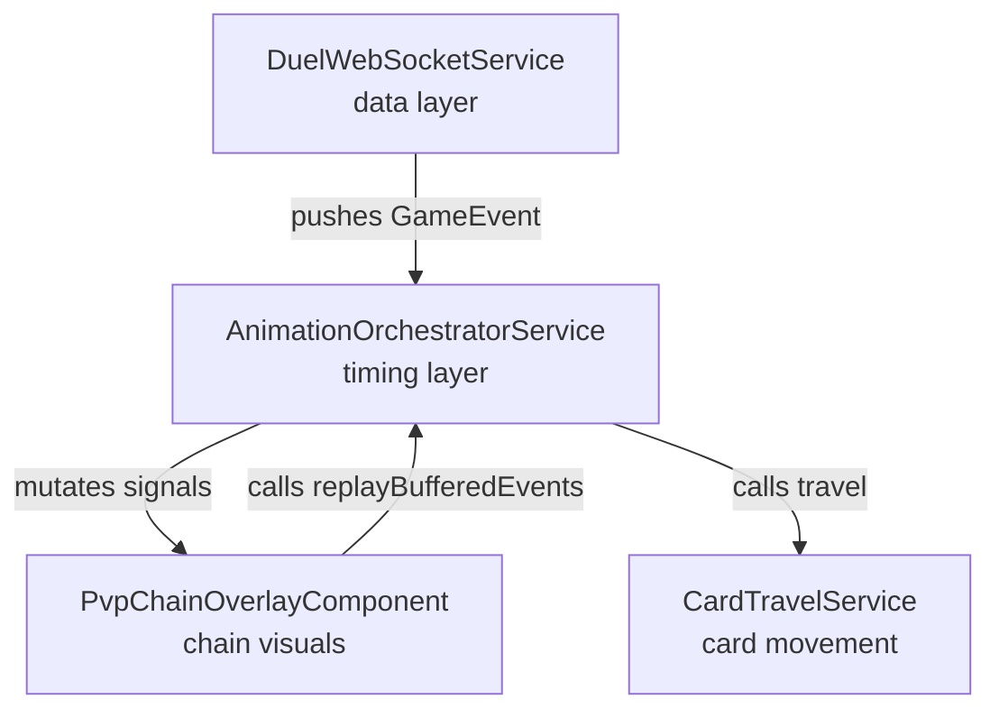
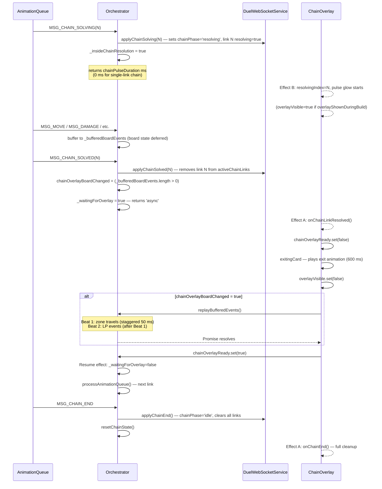

# PvP Animation Architecture

## Overview

The PvP animation system uses a three-layer architecture:



| Layer | Responsibility |
|-------|---------------|
| **DuelWebSocketService** (`duel-web-socket.service.ts`) | Parses WebSocket messages, pushes `GameEvent` objects into `animationQueue`; owns chain/board state signals |
| **AnimationOrchestratorService** | Dequeues events, controls timing, mutates signals at the right moment |
| **PvpChainOverlayComponent** | Reacts to signal changes, drives chain entry/exit CSS animations |
| **CardTravelService** | Creates `position: fixed` floating elements, animates with Web Animations API |

The orchestrator is the single source of truth for animation state. All visual components read its signals; none write to game state directly.

---

## AnimationOrchestratorService

Scoped to `DuelPageComponent` (not root). Requires an explicit `init()` call before processing begins.

### Public signals

| Signal | Type | Description |
|--------|------|-------------|
| `isAnimating` | `Signal<boolean>` | Queue processing active — gates prompt display |
| `animatingZone` | `Signal<{zoneId, animationType, relativePlayerIndex} \| null>` | Single zone receiving a flip or activate glow |
| `animatingLpPlayer` | `Signal<LpAnimData \| null>` | LP change with interpolation metadata (fromLp, toLp, durationMs) |
| `chainResolutionAnnounce` | `Signal<boolean>` | Briefly `true` when chain resolution starts — triggers the "Chain Resolution" banner |
| `chainOverlayReady` | `Signal<boolean>` | Async overlay contract: `false` while overlay plays exit animation, `true` when board pause completes |
| `chainOverlayBoardChanged` | `Signal<boolean>` | `true` if board-changing events were buffered during the current chain link resolution |
| `chainEntryAnimating` | `Signal<boolean>` | Gates `SELECT_CHAIN` prompts until entry animation finishes |
| `chainPromptGateActive` | `Signal<boolean>` | `true` while overlay fades out to reveal a mid-resolution prompt |
| `hiddenHandCardCount` | `Signal<[number, number]>` | Cards hidden at end of each hand zone during draw animation `[own, opponent]` |
| `maskedZoneKeys` | `Signal<ReadonlySet<string>>` | Zone keys (e.g. `M3-0`) whose destination card is hidden until travel lands |
| `maskedPileImages` | `Signal<ReadonlyMap<string, string \| null>>` | Pile keys → previous top-card image shown while new card is in-flight |
| `maskedSourceImages` | `Signal<ReadonlyMap<string, CardOnField>>` | Zone keys → ghost card kept visible at source until travel starts |

### Lifecycle methods

| Method | When to call |
|--------|-------------|
| `init(config)` | Once, after Angular injection context is available |
| `startProcessingIfIdle()` | From the queue-watcher effect in `DuelPageComponent` when `animationQueue` changes |
| `syncTrackedLp(playerLp, opponentLp)` | From the board-state reset effect, only when not animating |
| `replayBufferedEvents()` | Called by `PvpChainOverlayComponent` after its exit animation completes |
| `resetForSwitch()` | On solo-mode player switch |
| `onStateSync()` | On WebSocket reconnection / `STATE_SYNC` |
| `destroy()` | On component destroy |

### Queue processing flow

```
DuelPageComponent effect: animationQueue changes
  → startProcessingIfIdle()
    → processAnimationQueue()
      1. AC7 collapse — if queue > 5 and no chain events: instantly apply all but last 3
      2. preMaskQueuedPileDestinations()    — prevent pile flash before travel
      3. preMaskQueuedZoneDestinations()    — prevent zone flash before summon travel
      4. preMaskQueuedSources()             — keep source card visible until travel starts
      5. dequeue event (or _deferredSolvingEvent)
      6. processEvent(event)
         → returns: number (ms) | 'async' | Promise<void>
      7. preMaskQueuedSources() again — re-scan queue for newly unmasked sources
         Apply pending board state (skipped during chain resolution)
      8a. 'async'    → pause until chainOverlayReady=true or draw completes
      8b. Promise    → .then(continueQueue) — waits for travel to finish
      8c. number     → setTimeout(continueQueue, ms × speedMultiplier)
```

`continueQueue` clears `animatingZone` and `animatingLpPlayer`, then recurses into `processAnimationQueue`.

---

## Animation types

### In-place zone animations

Triggered by `setAnimatingZone()`, which sets the `animatingZone` signal for one render cycle.

| Event | Animation | Duration |
|-------|-----------|----------|
| `MSG_FLIP_SUMMONING` | `flip` glow on zone | 300 ms |
| `MSG_CHANGE_POS` (face-down → face-up) | `flip` glow on zone | 300 ms |
| `MSG_CHAINING` | `activate` glow on zone | 400 ms |

### LP animations

`MSG_DAMAGE`, `MSG_RECOVER`, and `MSG_PAY_LPCOST` set `animatingLpPlayer` with a `fromLp / toLp / durationMs` payload. The LP badge interpolates the counter visually. Duration comes from the CSS token `--pvp-transition-lp-counter`.

LP events buffered during chain resolution replay in Beat 2 after card travels complete (see [Chain resolution flow](#chain-resolution-flow)).

### Card shuffle

`MSG_SHUFFLE_HAND` adds `pvp-deck-shuffle` to the deck zone element and sets `--pvp-shuffle-duration`. The class is removed after the animation completes.

### Draw animation (`MSG_DRAW`)

1. `setDrawMaskActive(true)` — board state applies immediately so the hand zone has correct dimensions, but new cards are hidden.
2. `hiddenHandCardCount` is incremented by the draw count.
3. One `CardTravelService.travel()` per drawn card, staggered by `max(50, 100 × speedMultiplier)` ms.
4. Own player cards flip during travel (card back → face-up at the midpoint). Opponent cards travel face-down.
5. Each `travel().then()` calls `revealOneHandCard()`, decrementing `hiddenHandCardCount`.
6. When the last card lands, `_waitingForDraw = false` and queue processing resumes.

The orchestrator returns `'async'` for `MSG_DRAW` — the queue pauses until all cards land.

### Card travel — move events (`MSG_MOVE`)

`CardTravelService.travel()` creates a `position: fixed` floating div at the source rect, animates it to the destination rect, then resolves its Promise. The board component hides the destination card via masks until the travel lands.

**Travel options:**

| Option | Type | Description |
|--------|------|-------------|
| `showBack` | `boolean` | Start with `card_back.jpg` |
| `flipDuringTravel` | `boolean` | Swap image at the 90° midpoint |
| `duration` | `number` | Override duration (ms) |
| `departureGlowColor` | `string` | CSS color glow on source element at departure |
| `impactGlowColor` | `string` | CSS color glow on float at 75% of travel |
| `destAlign` | `'center' \| 'right'` | Landing position inside wide containers (e.g. hand row) |
| `destRotateZ` | `number` | Extra Z-rotation at landing (e.g. 90° for defense position) |
| `baseRotateZ` | `number` | Constant Z-rotation throughout travel (180° for opponent cards) |

**Keyframe phases:**

| Phase | Offset | Transform |
|-------|--------|-----------|
| Start | 0% | `translate(0, 0) scale(1)` |
| Lift | 15% | `translate(0, 0) scale(1.15)` + shadow deepens |
| Midpoint | 45% | Half-travel, arc or flip to 90° |
| Pre-land | 75% | Full translation, scale(1.15) |
| Micro-bounce | 88% | `scale(1.05)` |
| Land | 100% | `scale(1)`, final rotation applied |

**Move type matrix:**

| From | To | Behavior |
|------|----|----------|
| Any pile / HAND / EXTRA | MZONE | Summon travel — green impact glow. Defense position adds `destRotateZ: 90`. Face-down summon uses `showBack: true`. |
| Any pile / HAND / EXTRA | SZONE | Same as summon travel |
| MZONE / SZONE | GY / BANISHED / EXTRA | Destroy travel — red departure glow. Face-down banish flips during travel. |
| MZONE / SZONE | HAND | Bounce — no glow, no mask |
| MZONE / SZONE | DECK | Return to deck — flip during travel, subtle purple glow |
| MZONE → MZONE / SZONE → SZONE | same type | Field-to-field — subtle purple glow |
| HAND | GY / BANISHED | Discard/banish — hidden opponent card starts face-down and flips to reveal in GY |
| HAND | DECK | Return from hand — flip during travel |
| DECK / EXTRA | GY / BANISHED | Mill — face-down flip support |
| GY / BANISHED / EXTRA | HAND | Add from pile — no glow |
| GY / BANISHED / EXTRA | DECK | Return from pile — flip during travel |
| OVERLAY | GY / BANISHED | XYZ detach (see below) |
| MZONE / SZONE token | GY / BANISHED | Token dissolution — in-place fade + scale(0.7), no travel |
| Any | OVERLAY | Re-attach to XYZ — no animation (BOARD_STATE handles indicator update) |

### XYZ material detach (`OVERLAY → GY / BANISHED`)

1. Apply `pvp-xyz-detach` CSS class to the overlay material element + set `--pvp-detach-duration`.
2. After the slide-out completes, remove the class and start a `CardTravelService.travel()` with `showBack: true` and a blue departure glow.
3. Travel resolves → `travelMaskedPile` clears the pile mask.

---

## Masking system

Masks prevent the board from "flashing" the final state before animations finish. Three independent mask types work together.

### Zone destination masks (`maskedZoneKeys`)

- Added by `travelMasked()` before `travel()` starts.
- Removed when the travel Promise resolves.
- Pre-masked for all queued MZONE/SZONE destinations in `preMaskQueuedZoneDestinations()`, skipping zones where a prior queued event sources the same zone (destroy-then-summon sequence).

### Pile masks (`maskedPileImages`)

Maps a pile zone key to the previous top-card image (or `null` if the pile was empty). The pile widget displays this image while the new card is in-flight.

Reference-counted via `_pileFlightCounts` for concurrent parallel travels to the same pile (chain replay stagger). When flight count drops to zero, the mask stays alive if the queue still has events targeting the same pile — the next `travelMaskedPile` call takes over the existing mask.

Source-side pile masks (`_sourcePileMasks`) keep the departing card visible until its travel starts.

### Source zone masks (`maskedSourceImages`)

Maps a MZONE/SZONE key to the `CardOnField` that was there before board state removed it. Created in `preMaskQueuedSources()` while the card is still in state, removed by `_unmaskSourceZone()` the moment the travel starts.

### Hand ghosts (`_handGhostDivs`)

For HAND → * moves, `preMaskQueuedSources()` creates a `position: fixed` ghost div at the card's exact screen position before board state removes it. The ghost holds the card image so `CardTravelService.travel()` can read a valid source rect even after the hand re-renders.

DOM index calculation: `originalIndex = fromSequence + inFlightCount + scanOffset`, accounting for cards already removed from the DOM by earlier animations in the same batch.

---

## Chain resolution flow

### Banner ("Chain Resolution")

For multi-link chains, the first `MSG_CHAIN_SOLVING` triggers a pause before resolution begins:

1. **Pause** (1 s × speedMultiplier) — chain overlay remains visible so the player can see all links.
2. `chainResolutionAnnounce.set(true)` — banner appears. Effect D in `PvpChainOverlayComponent` hides the chain overlay.
3. After 3 s total (from the first solving event), `_deferredSolvingEvent` is re-processed and resolution begins normally.

Single-link chains skip the banner entirely.

### Per-link sequence



### Mid-resolution prompts

When a `SELECT_*` prompt arrives while the overlay is visible during resolution (Effect E):

1. `chainPromptGateActive.set(true)` — gates `visiblePrompt` in the component.
2. `overlayVisible.set(false)` — overlay fades out.
3. After `durations.exit` ms: `chainPromptGateActive.set(false)` — prompt becomes visible.
4. When the prompt closes (`promptActive → false`): if `chainPromptGateActive` is still set, it clears immediately. The overlay re-shows when Effect B detects the next resolving link.

### Negated links

When a chain link is negated (`link.resolving = true` and `link.negated = true`):

- Effect B sets `negatedResolvingIndex` instead of `resolvingIndex`.
- The overlay plays a grey shake animation instead of the gold pulse glow.
- `handleBoardChangePause()` receives `negated=true` and skips the board replay entirely — a negated effect cannot change board state.

---

## PvpChainOverlayComponent

### Visible cards cascade

Only the last 3 active chain links render, mapped to fixed positions:

| Position | Meaning |
|----------|---------|
| `front` | Most recently added / currently resolving |
| `mid` | Second-to-last |
| `back` | Third-to-last |

When a 4th+ card enters, the oldest visible card receives an overflow exit animation before the new card appears.

### Chain-1 behavior

A single-link chain (`activeChainLinks.length < 2`) never shows the chain overlay. The activate glow on the zone (via `animatingZone`) is the only visual feedback. The overlay is not shown during resolution either, since `overlayShownDuringBuild` remains `false`.

### Deferred entry animation

When a cost prompt (`SELECT_EFFECTYN`) is open as a new chain link arrives:

- Effect A sets `hasPendingEntry = true` and stores `pendingPrevCount`.
- Effect C watches `promptActive`. When the prompt closes, it calls `onNewChainLink()` with the stored count.
- If `MSG_CHAIN_SOLVING` arrives in the same tick as the prompt response, Effect A handles the late commit directly and force-clears `chainEntryAnimating`.

### Effects summary

| Effect | Watches | Responsibility |
|--------|---------|---------------|
| **A** | `activeChainLinks`, `chainPhase` | Building: entry animation. Resolving: exit animation. Idle: cleanup. |
| **B** | `activeChainLinks`, `chainPhase` | Sets `resolvingIndex` / `negatedResolvingIndex`. Ensures overlay visible for resolution. |
| **C** | `promptActive` | Plays deferred entry animation when cost prompt closes. |
| **D** | `chainResolutionAnnounce` | Hides overlay and cancels entry timer during the "Chain Resolution" banner. |
| **E** | `promptActive`, `chainPhase` | Hides overlay for mid-resolution prompts; manages `chainPromptGateActive` gate. |

### Animation durations

All durations scale with `speedMultiplier` (0.5× when activation toggle is Off, 1× otherwise).

| Duration | Base value | Used for |
|----------|-----------|---------|
| `pulse` | `chainPulseDuration()` = 600 ms base | Orchestrator wait + overlay CSS pulse glow |
| `exit` | 600 ms | Exit card animation + overlay fade |
| `constructAppear` | 800 ms | Entry animation visible window |
| `constructFadeOut` | 600 ms | Building-phase overlay fade-out after entry |
| `entry` | 600 ms | Card entry animation |
| `overflow` | 600 ms | Overflow card exit when 4th+ link enters |

CSS variables (`--pvp-chain-pulse-duration`, etc.) are kept in sync with JS values via the `cssDurations` computed signal, so CSS transitions and JS timeouts never drift apart.

---

## CardTravelService

Scoped to `DuelPageComponent`. Requires `registerContainer()` and `registerZoneResolver()` before use.

### Key methods

| Method | Description |
|--------|-------------|
| `travel(src, dst, image, opts)` | Animate a card from source to destination. Returns a `Promise<void>` that resolves on landing. |
| `getZoneElement(zoneKey)` | Resolve a zone key to its DOM element via the registered resolver. |
| `clearLandedTravels()` | Remove floating elements whose animations have finished. |
| `clearAllTravels()` | Finish all in-flight animations and remove all floating elements immediately. |

### `travel()` behavior

- Accepts a zone key string or an `HTMLElement` as source and destination.
- Reads `getBoundingClientRect()` on both before creating the floating element.
- For destinations with a CSS `rotate()` transform (e.g. defense-position cards), temporarily strips the transform, reads the untransformed rect, then restores — preventing AABB offset errors.
- Wide destination containers (hand row): targets a card-sized sub-rect aligned by `destAlign`.
- Respects `prefers-reduced-motion`: returns `Promise.resolve()` immediately.
- Glow effects applied as `box-shadow` / `filter: drop-shadow()` via `applyGlow()`.

### Z-index contract

| Layer | z-index | CSS token |
|-------|---------|-----------|
| Card travel floats | 900 | `$z-pvp-card-travel` |
| Chain overlay | 950 | `$z-pvp-chain-overlay` |

Travel floats sit below the chain overlay so overlay animations remain visible during board replay.

---

## Acceleration features

### AC7 — Queue collapse

When `animationQueue.length > 5` and the queue contains no chain resolution events (`MSG_CHAIN_SOLVING`, `MSG_CHAIN_SOLVED`, `MSG_CHAIN_END`), all but the last 3 events are instantly applied via `applyInstantAnimation()`. Chain events are exempt because they require the async overlay contract to function correctly.

### AC8 — Speed multiplier

When the activation toggle is set to **Off**, `speedMultiplier()` returns `0.5`. All durations (travel, LP counter, chain pulse, overlay exit, shuffle, XYZ detach) are multiplied by this value before use. The multiplier is passed into the orchestrator at `init()` time as a function, so the overlay reads the same value via `orchestrator.speedMultiplier()`.

### `prefers-reduced-motion`

Detected once at service construction time via `matchMedia('(prefers-reduced-motion: reduce)').matches`. When active:

- All `CardTravelService.travel()` calls return `Promise.resolve()` immediately.
- Chain replay applies LP events instantly and skips travel stagger.
- Shuffle and XYZ detach return `0` immediately.
- LP duration is read from the CSS token, which should also be `0` under reduced motion.
