# skytrix PvP — Presentation Summary

**Online automated Yu-Gi-Oh! duels powered by OCGCore.**

This document provides a visual overview of the PvP module for developers joining the project. Each section uses a Mermaid diagram as primary content with minimal explanatory text. For full details, refer to the source documents linked in the frontmatter.

---

## Table of Contents

- [1. Product Vision](#1-product-vision)
- [2. Tri-Service Architecture](#2-tri-service-architecture)
- [3. Duel Server Internals](#3-duel-server-internals)
- [4. WebSocket Message Flow](#4-websocket-message-flow)
- [5. Authentication Chain](#5-authentication-chain)
- [6. Angular Component Tree](#6-angular-component-tree)
- [7. Lobby Flow](#7-lobby-flow)
- [8. Core Duel Prompt Loop](#8-core-duel-prompt-loop)
- [9. Prompt Type Mapping](#9-prompt-type-mapping)
- [10. PvP Board Layout](#10-pvp-board-layout)
- [11. Room State Machine](#11-room-state-machine)
- [12. Disconnection & Reconnection](#12-disconnection--reconnection)
- [13. Implementation Phases](#13-implementation-phases)
- [14. Key Design Decisions](#14-key-design-decisions)

---

## 1. Product Vision

skytrix is a Yu-Gi-Oh! deck management app with a solo combo testing simulator. PvP completes the loop: **build → test → duel** without leaving the application.

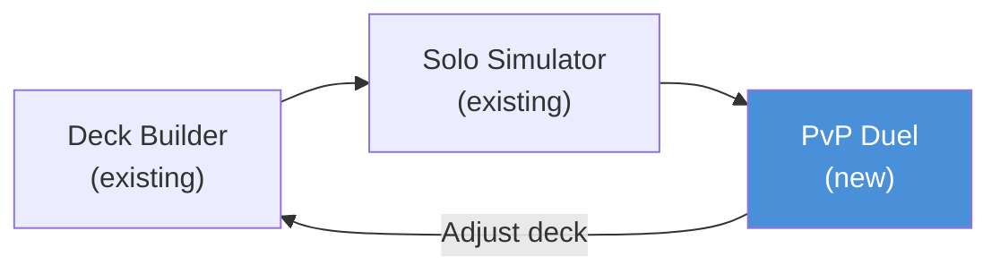

**Core differentiator:** All game rules enforced automatically by OCGCore (the C++ engine used by EDOPro). No manual rule adjudication. The engine handles chain resolution, effect timing, damage calculation, and win conditions.

**Target:** Friends-only PvP (trusted players). No public matchmaking in MVP.

---

## 2. Tri-Service Architecture

Three services communicate via distinct protocols.

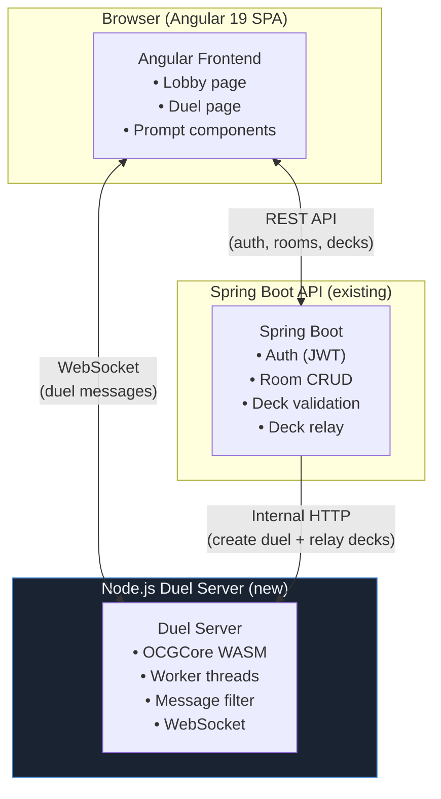

**Anti-cheat principle:** The frontend never sends decklists to the duel server. Spring Boot validates decks and relays them server-to-server. The duel server is the sole authority for game state.

---

## 3. Duel Server Internals

The duel server runs 7 source files. Each duel executes in a dedicated worker thread.

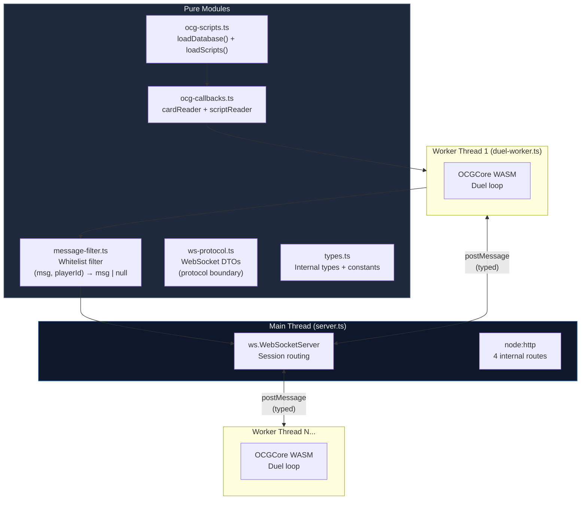

**Why worker threads:** OCGCore runs synchronously (blocks the event loop). Complex chain resolutions can take 100-200ms+. One worker per duel ensures isolation — one slow chain never blocks another duel.

**Transformation chain:** `OCGCore binary → duel-worker.ts (transform) → DTO → message-filter.ts (filter) → server.ts (ws.send)`

---

## 4. WebSocket Message Flow

The duel protocol follows a strict invariant: `MSG_HINT → SELECT_* → SELECT_RESPONSE`.

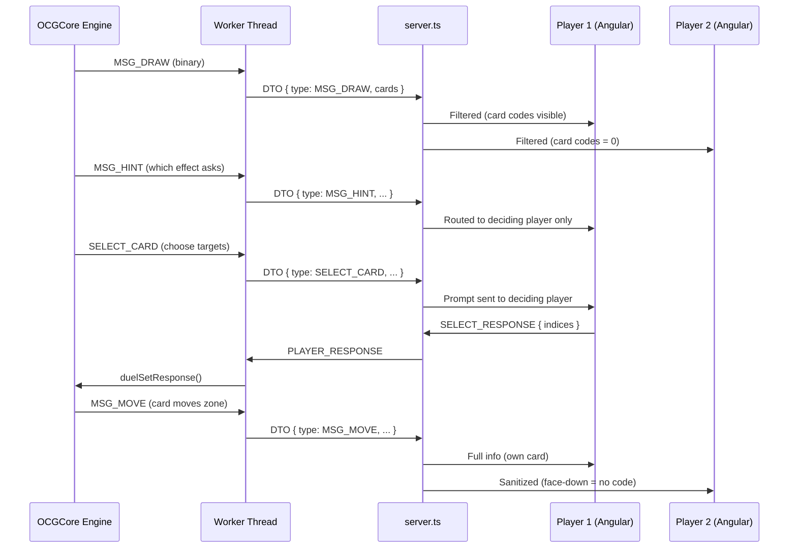

**Message filter policy:** Whitelist per message type. Default = DROP + LOG. Unrecognized messages are never transmitted. Prefer missing display over information leak.

**Wire format:** JSON with type discriminant: `{ "type": "MSG_DRAW", "playerId": 0, "cardCode": 12345 }`. Use explicit `null` for absent values (never field omission).

---

## 5. Authentication Chain

JWT flows through three boundaries. WebSocket auth is one-shot at handshake.

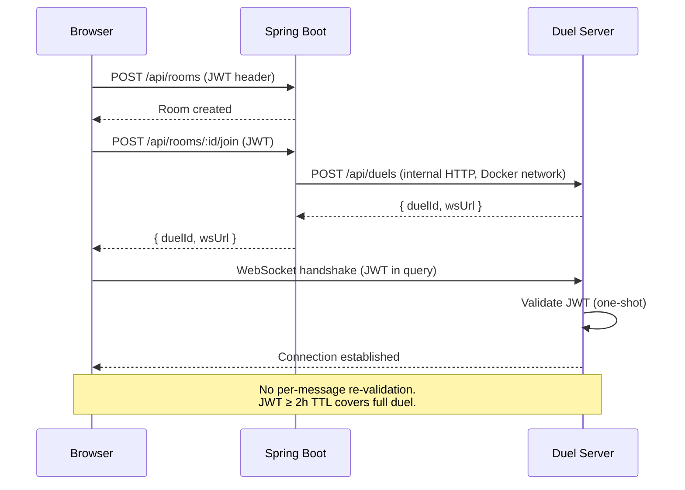

**Internal API auth:** Docker network isolation (no shared secret). Services communicate on internal docker-compose network; duel server port is not exposed externally.

---

## 6. Angular Component Tree

The duel view uses a full-overlay architecture. The board occupies 100% of the viewport; all other elements are positioned overlays.

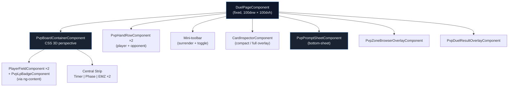

**Prompt sub-components** (injected into `PvpPromptSheetComponent` via CDK Portal):

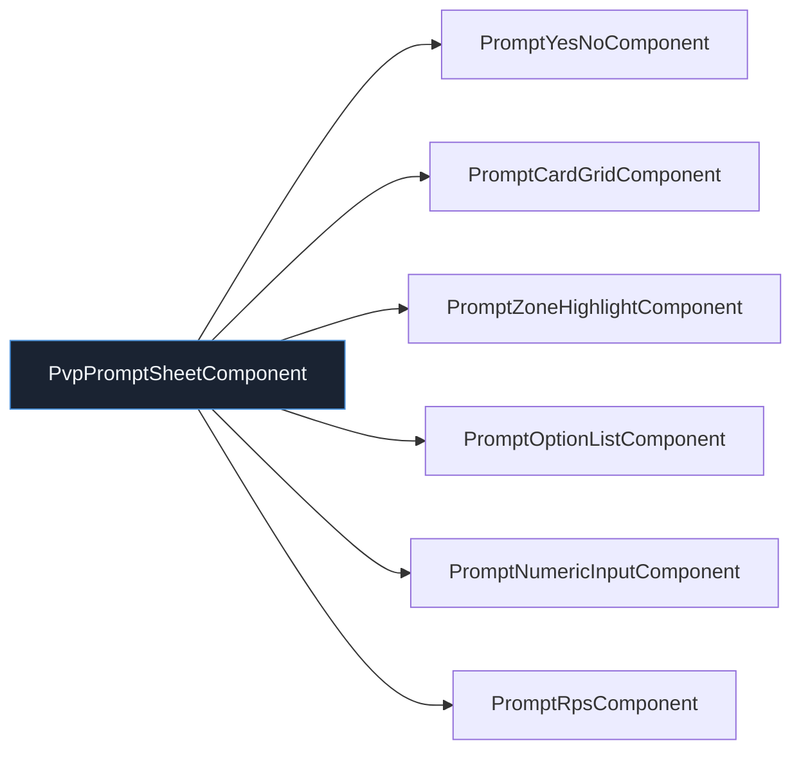

**6 signals** drive the PvP state (all in `DuelWebSocketService`, scoped to `DuelPageComponent`):

| Signal | Type | Purpose |
|--------|------|---------|
| `duelState` | `Signal<DuelState>` | Board, LP, phase, turn, cards |
| `pendingPrompt` | `Signal<Prompt \| null>` | Current SELECT_* awaiting response |
| `hintContext` | `Signal<HintContext>` | MSG_HINT context (which effect asks) |
| `animationQueue` | `Signal<GameEvent[]>` | FIFO queue of events to animate |
| `timerState` | `Signal<TimerState \| null>` | Player timer (server-authoritative) |
| `connectionStatus` | `Signal<ConnectionStatus>` | `connected \| reconnecting \| lost \| resynchronized` |

**Coordination rule:** Prompt display waits for `animationQueue` to drain. `hintContext` is always set before `pendingPrompt`.

---

## 7. Lobby Flow

From decklist to duel in 3 taps.

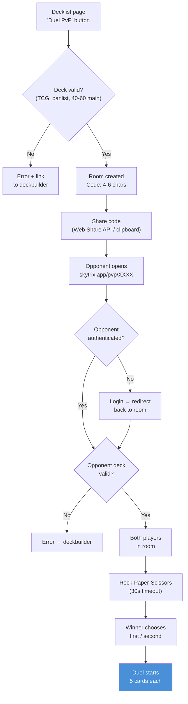

---

## 8. Core Duel Prompt Loop

The PvP experience is a **prompt → response** cycle driven by OCGCore.

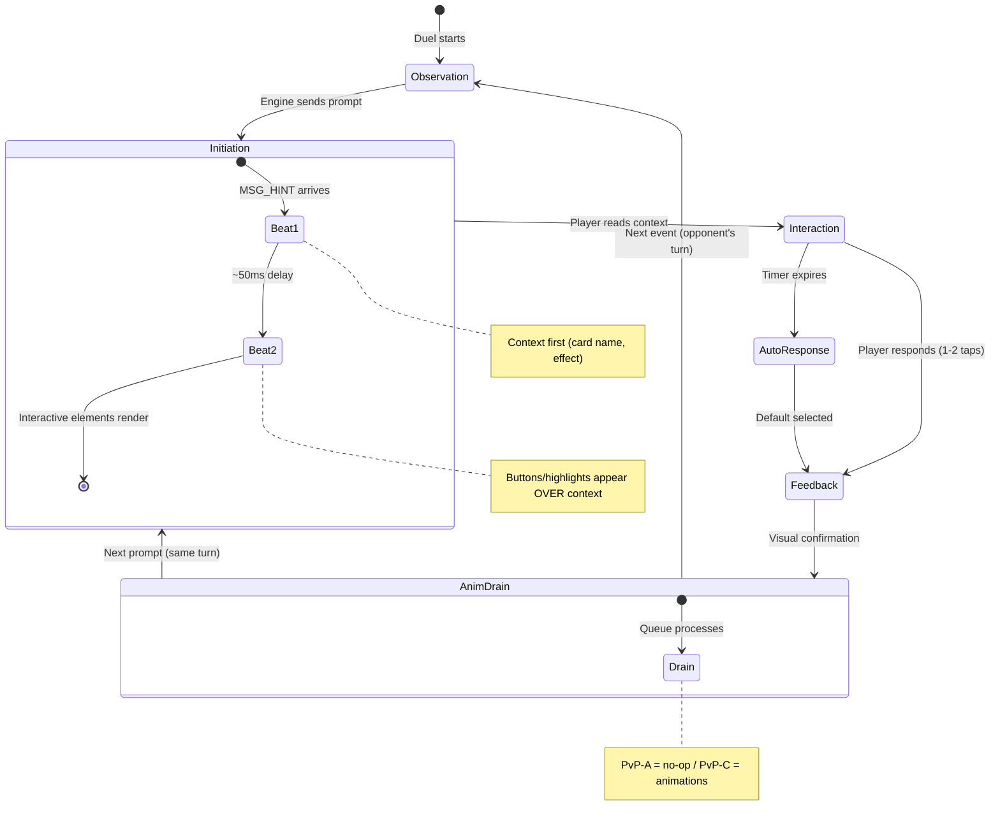

**Activation toggle:** A client-side filter (Auto/On/Off) that determines which optional prompts the player sees. The engine always sends all legal prompts — the client auto-responds when filtered.

| Mode | Behavior |
|------|----------|
| **Auto** (default) | Prompt only on game events (opponent activates, monster summoned, attack declared) |
| **On** | Prompt at every legal priority window |
| **Off** | Auto-respond "No" to all optional prompts |

---

## 9. Prompt Type Mapping

OCGCore sends ~20 SELECT_* types. The Angular client maps them to 3 visual patterns and 6 sub-components.

| Visual Pattern | Sub-Component | SELECT_* Types |
|----------------|---------------|----------------|
| **A — Floating Instruction** (spatial, on board) | `PromptZoneHighlightComponent` | SELECT_PLACE, SELECT_DISFIELD |
| **B — Bottom Sheet** (full) | `PromptCardGridComponent` | SELECT_CARD, SELECT_UNSELECT_CARD, SELECT_CHAIN, SELECT_TRIBUTE, SELECT_SUM, SORT_CARD, SORT_CHAIN |
| **B — Bottom Sheet** (compact) | `PromptOptionListComponent` | SELECT_POSITION, SELECT_OPTION |
| **B — Bottom Sheet** (compact) | `PromptNumericInputComponent` | ANNOUNCE_NUMBER, SELECT_COUNTER |
| **B — Bottom Sheet** (full) | `PromptRpsComponent` | RPS (pre-duel) |
| **C — Yes/No** (compact sheet) | `PromptYesNoComponent` | SELECT_YESNO, SELECT_EFFECTYN |
| **Distributed UI** (no sheet) | Phase badge + card glow + zone browsers | SELECT_IDLECMD, SELECT_BATTLECMD |

**IDLECMD / BATTLECMD** are not rendered as sheets. Instead: actionable cards glow on the board, zone browsers highlight actionable cards, phase transitions go through `PvpPhaseBadgeComponent`. The engine's flat action list is mapped spatially.

---

## 10. PvP Board Layout

The board uses CSS 3D perspective — the opponent's field foreshortens naturally while the player's own field stays full-size and thumb-accessible.

```text
Mobile landscape (~844×390px):

┌──────────────────────────────────────────────────┐
│  Opponent hand (face-down, pointer-events: none)  │
│  🂠 🂠 🂠 🂠 🂠                                       │
├──────────────────────────────────────────────────┤
│                                                    │
│   [ST1][ST2][ST3][ST4][ST5]         LP: 8000      │  ← Opponent
│   [MZ1][MZ2][MZ3][MZ4][MZ5]      (foreshortened) │
│                                                    │
│ ─[EMZ-L]─── ⏱ 04:32 ──[EMZ-R]── (MP1) ────────  │  ← Central strip
│                                                    │
│   [MZ1][MZ2][MZ3][MZ4][MZ5]        (full-size,   │  ← Player
│   [ST1][ST2][ST3][ST4][ST5]   LP: 8000  thumb OK) │
│                                                    │
├──────────────────────────────────────────────────┤
│  Player hand (face-up)                       │ 🏳️ │
│  🃏 🃏 🃏 🃏 🃏 🃏                                │ 🔄 │  ← Mini-toolbar
└──────────────────────────────────────────────────┘

Overlays (contextual):
  • Bottom-sheet prompt (max-height: 55dvh)
  • Card inspector (compact <768px / full ≥768px)
  • Zone browser (GY, Banished, Extra Deck)
  • Duel result overlay
```

**Key CSS:** `perspective: 800px` + `transform: rotateX(15deg)` on the board container (~10 lines of CSS). Both values are tunable tokens. No 3D library needed.

**Solo vs PvP board differences:**

| Aspect | Solo | PvP |
|--------|------|-----|
| Perspective | 2D flat | CSS 3D |
| Interaction | Drag & drop | Click-based prompts |
| Fields visible | 1 (own) | 2 (own + opponent mirrored) |
| Platform priority | Desktop-first | Mobile landscape-first |
| Board state | Local signals (BoardStateService) | Server-pushed (DuelWebSocketService) |
| Reversibility | Undo (CommandStack) | Irreversible |

---

## 11. Room State Machine

Room lifecycle managed by Spring Boot.

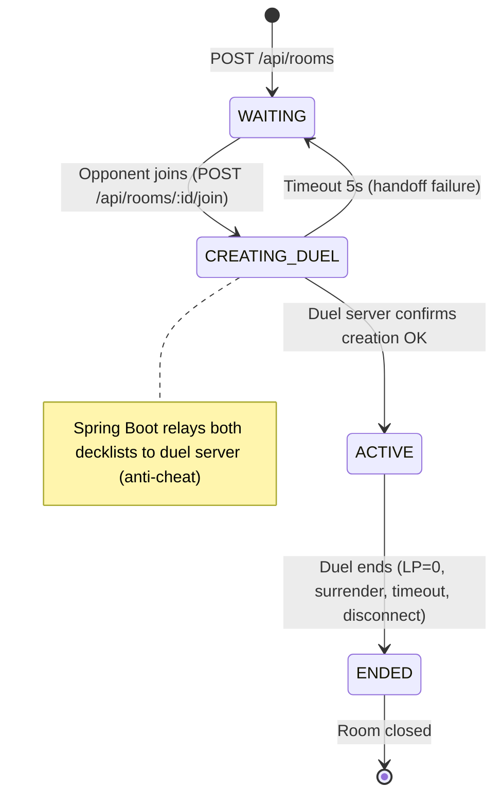

---

## 12. Disconnection & Reconnection

60-second grace period. State snapshot on reconnect (not message replay).

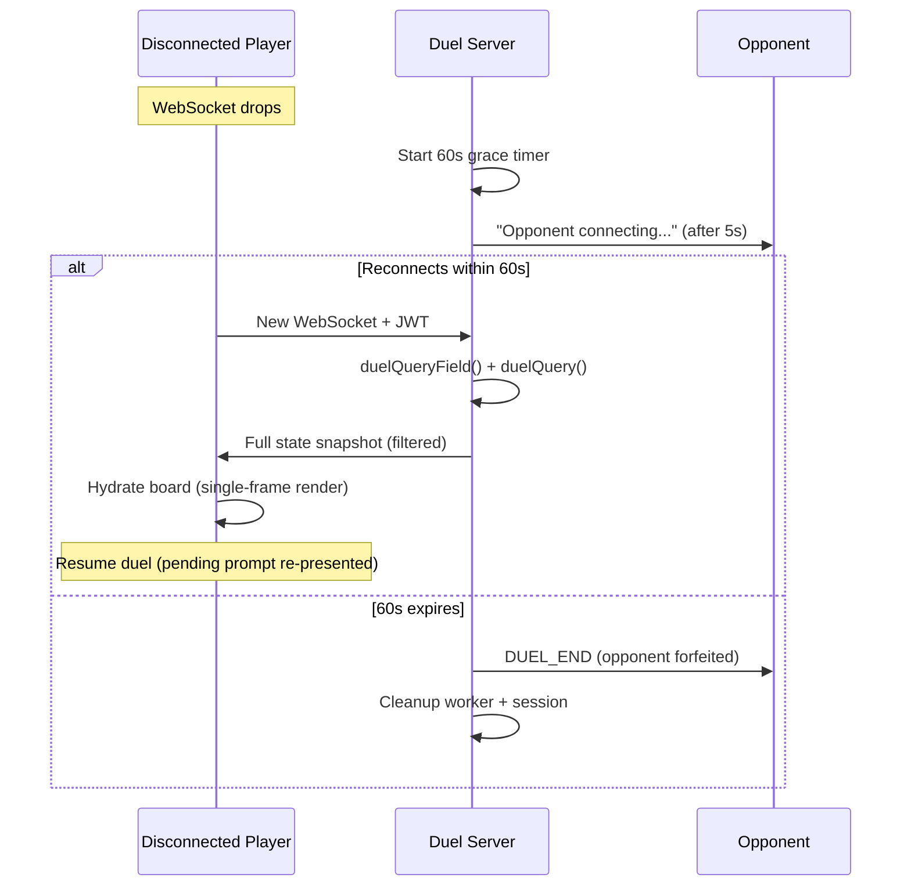

**Snapshot method:** `duelQueryField()` for global state + `duelQuery()` per card. No message log replay — OCGCore lacks save/restore, and replay introduces fragility.

---

## 13. Implementation Phases

Three incremental sub-phases. The protocol gate (`ws-protocol.ts`) unblocks parallel work.

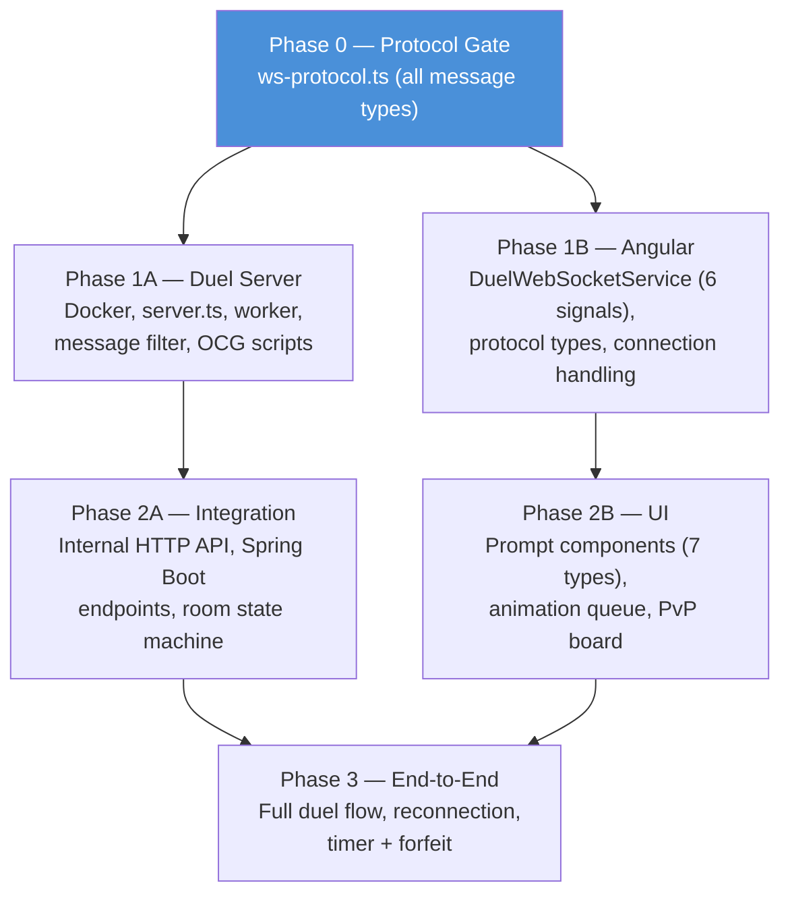

**MVP sub-phases (product scope):**

| Phase | Delivers |
|-------|----------|
| **PvP-A** | Core duel: engine, WebSocket, prompts, board, LP, win detection |
| **PvP-B** | Session: lobby, deck validation, surrender, disconnect handling, timer |
| **PvP-C** | Polish: animations, chain viz, visual feedback per game event |

---

## 14. Key Design Decisions

| Decision | Choice | Rationale |
|----------|--------|-----------|
| Thread model | Worker thread per duel | OCGCore blocks synchronously. Isolation prevents one duel from blocking others |
| Message filter | Whitelist, default DROP | Safety-critical. Explicit, auditable. No private info leakage |
| Type sharing | Independent DTOs (no shared package) | Clean boundary. `ws-protocol.ts` (server) copied manually to `duel-ws.types.ts` (client). Same-commit rule |
| Board layout | CSS 3D perspective | Same visual compression as Master Duel. ~10 lines of CSS. No 3D library |
| Interaction model | Click-based prompts (not drag & drop) | Engine dictates legal actions. Distinct from solo's free-form manipulation |
| Prompt UX | Bottom-sheet (mobile-first) | Thumb zone anchored. Board visible above. Master Duel pattern |
| Lobby | Room code + deep link | 3 taps to duel. Web Share API on mobile. Dueling Nexus simplicity |
| Reconnection | State snapshot (not replay) | OCGCore has no save/restore. Snapshot via `duelQueryField()` is reliable |
| Internal API auth | Docker network isolation | Same compose network, port not exposed. KISS for friends-only MVP |
| Animation strategy | FIFO queue, never blocking | EDOPro speed + Master Duel polish. PvP-A uses no-op slots, PvP-C fills them |

---

## Source Documents

| Document | Scope | Link |
|----------|-------|------|
| PRD | Product requirements, FRs, NFRs, user journeys | [prd-pvp.md](prd-pvp.md) |
| Architecture | ADRs, data model, project structure, patterns | [architecture-pvp.md](architecture-pvp.md) |
| UX Design Spec | Components, layouts, prompts, flows, design tokens | [ux-design-specification-pvp.md](ux-design-specification-pvp.md) |
