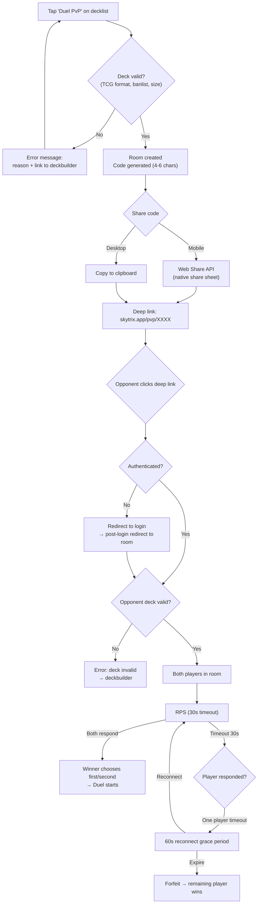
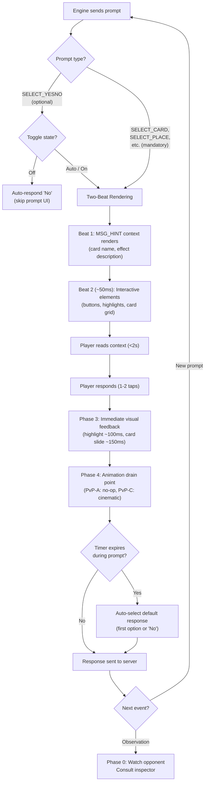
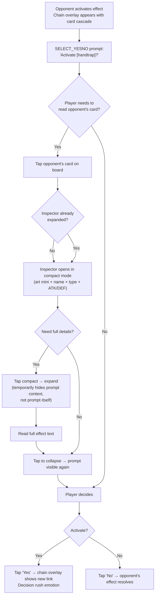
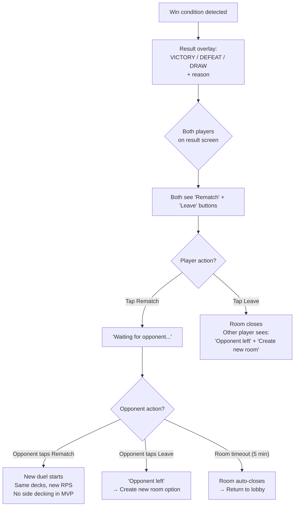
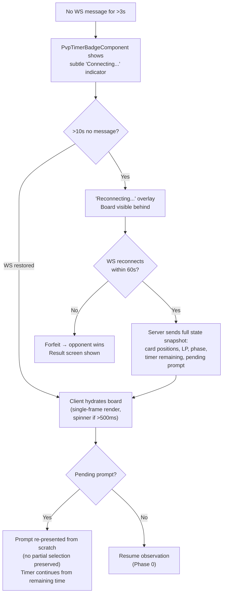

# UX Design Specification skytrix — PvP (Online Automated Duels)

**Author:** Axel
**Date:** 2026-02-24

---

<!-- UX design content will be appended sequentially through collaborative workflow steps -->

## Executive Summary

### Project Vision

An online PvP automated duel mode for skytrix, powered by OCGCore — the open-source C++ duel engine used by EDOPro. PvP completes the build → test → duel loop within a single application. All game rules are enforced automatically by the engine: chain resolution, effect timing, damage calculation, win conditions. Players interact by responding to engine prompts (select cards, confirm effects, choose zones) via a click-based interaction paradigm — fundamentally different from the solo simulator's free-form drag & drop.

The PvP mode reuses the solo simulator's visual components (board zones, card rendering, card inspector) but with a distinct data flow: server-pushed state via WebSocket, read-only board, prompt-driven interaction. Visual polish targets Yu-Gi-Oh! Master Duel quality: animations per game event, chain visualization, turn timer, duel result screen.

MVP scope: PvP between friends (trusted players) in 3 incremental sub-phases — PvP-A (functional duel), PvP-B (lobby & session management), PvP-C (visual polish). **PvP-C is implemented:** card travel animations, chain overlay, LP counter effects, draw animation, XYZ detach, token dissolution, and the full masking system are all in place. This UX spec focuses on PvP-A and PvP-B UX decisions; for the complete animation implementation, see [animation-architecture-pvp.md](./animation-architecture-pvp.md).

### Design North Star

**When in doubt, Master Duel is the reference.** Every UX decision — layout, prompt design, animation style, information display, mobile interaction — defaults to Master Duel's established patterns unless there is a specific, documented reason to diverge. Master Duel has already solved most PvP card game UX problems at scale; skytrix adapts these solutions to a web context rather than reinventing them.

**Mobile-First Interaction Principles:**

- **Thumb Zone Rule:** All interactive prompts anchor to the bottom 40% of the viewport on mobile landscape. The player must never reposition their hand to respond to a prompt.
- **2-Second Prompt Comprehension:** Every prompt must be understandable within 2 seconds — what effect is asking, what the options are, how much time remains. MSG_HINT context is a readability requirement, not a nice-to-have.
- **3-Tap Lobby:** Room creation to duel start in ≤3 taps and ≤30 seconds. A player in transit has no patience for multi-step setup.

### Target Users

**Primary User:** Axel — solo developer and competitive Yu-Gi-Oh! player who builds and optimizes decks in skytrix. Already uses skytrix for deck management and solo combo testing. The PvP mode validates deck performance against a real opponent after solo testing. High technical proficiency. Familiar with Master Duel's PvP interaction model (click-based prompts, chain resolution, turn timer).

**Platform Strategy:** Mobile-first. PvP duels are expected to happen primarily on phone (landscape orientation, like Master Duel mobile). Desktop is a secondary platform. This inverts the solo simulator's desktop-first approach. The mobile constraint drives all PvP UX decisions — touch targets, prompt sizing, information density, board layout.

**Usage Context:** Personal tool for friends-only PvP. Sessions are duel-length (10-30 minutes per game, 20-50 turns). The player transitions from solo combo testing to PvP validation — the seamless build → test → duel loop is the core value proposition. No ranked system, no public matchmaking in MVP.

### Key Design Challenges

1. **Mobile-First Board with CSS 3D Perspective** — The PvP board displays two complete player fields (2× 18 zones = 36 zones) plus LP, timer, phase indicator, and prompt UI — all on a mobile landscape viewport (~844×390px). Master Duel uses Unity 3D perspective to compress the opponent's far field. skytrix achieves the same effect with CSS `perspective` + `transform: rotateX()` on the board container (~10 lines of CSS). The opponent's field naturally foreshortens (appears smaller/recessed) while the player's own field (bottom, closest to "camera") stays full-size and thumb-friendly. This is feasible because PvP is click-based — no CDK DragDrop compatibility concern inside a CSS perspective transform. The solo simulator remains 2D flat (drag & drop). **CSS perspective is PvP-A scope (structural layout decision), not PvP-C polish** — without it, the board is unusable on mobile (Dueling Nexus lesson). **Perspective Container Rule:** Only board zones (the two player fields) live inside the CSS perspective container. Player hand, prompts, card inspector, timer badge, and phase badge are all fixed-position overlays OUTSIDE the perspective. LP badges are the exception — they live INSIDE the perspective container (projected via `ng-content` into `PlayerFieldComponent` for grid alignment) but are styled to remain readable despite the 3D transform — they must remain flat, readable, and thumb-accessible regardless of the 3D transform.

2. **Touch-First Prompt UX for 20 SELECT_\* Types** — OCGCore sends ~20 distinct prompt types requiring ~8-10 UI components: card grid selection, yes/no dialogs, zone highlight, position picker, option lists, ordering interfaces, declaration pickers, counters, phase action menus, and RPS. All must be designed first for touch interaction on mobile: 44px+ touch targets, thumb-reachable positioning, readable card art at small sizes. MSG_HINT context (which effect is asking) must be displayed without consuming precious screen space. Desktop adapts the mobile-first layout, not the reverse. **Floating Dialog Pattern:** Prompts use a centered floating dialog (50% viewport width) overlaid on the board — matching Master Duel's compact prompt style. The board remains fully visible around the dialog, preserving spatial context. On desktop, right-click anywhere dismisses/cancels the active prompt.

3. **Two Interaction Paradigms in One App** — Solo = drag & drop (player is master, full manual control, desktop-first, 2D flat board). PvP = click-based prompts (engine dictates, player responds, mobile-first, CSS 3D perspective board). Same visual components (zones, cards, inspector), completely different interaction handlers, platform priorities, and board rendering. The player must never feel confused about which mode they're in. **No pills in PvP — distributed actions instead:** The solo simulator's pill system (contextual action buttons) is replaced by engine-driven action distribution. During `SELECT_IDLECMD`, cards with available actions glow on the field; GY/Banished/Extra Deck zone browsers highlight actionable cards. The engine controls all legal actions — the UI maps them spatially rather than presenting action menus per zone.

4. **Animation Queue vs Mobile Performance** — OCGCore produces event bursts during chain resolution (10+ messages in <100ms). The client must sequence visual feedback (card movement, highlight, LP change) without blocking the player's next action. On mobile, GPU performance and battery consumption add constraints. Target: EDOPro-level speed with Master Duel-level polish — short (<200ms), interruptible animations. Never blocking.

5. **Information Asymmetry on Small Screens** — The player sees their own field in full detail but only opponent's face-up cards. Face-down = card backs. Opponent hand = count only. On mobile with CSS perspective, the opponent's far field is further compressed — the distinction between face-up (inspectable) and face-down (card back) must remain visually unambiguous even at reduced scale.

### Design Opportunities

1. **Seamless Solo ↔ PvP Visual Continuity** — Same design system (Master Duel Classic), same visual components, same tokens and aesthetics. Two distinct board modes: flat 2D for solo (drag & drop mastery), CSS 3D perspective for PvP (immersive duel). The "Duel PvP" button from a decklist becomes a one-click bridge to online play.

2. **Contextually Rich Prompts + Inspector as #1 PvP Component** — MSG_HINT provides card name, effect description, and selection context before every prompt. Combined with the card inspector, the player always has full context for their decision. This can surpass EDOPro (cryptic prompts) and be clearer than Master Duel (which sometimes overwhelms with animation before showing the choice). **The card inspector is the single most important PvP component on mobile** — players need to read opponent's card effects before deciding whether to activate handtraps. Inspector must be instantly accessible (tap any card) and readable at mobile scale. This is a PvP-A priority, not polish.

3. **Ultra-Simple Lobby** — MVP targets friends only: create room (one click from decklist), share room code, opponent joins, duel starts. Mobile-optimized: the entire lobby flow must work comfortably one-handed on a phone.

4. **Interruptible Animations** — Learn from Master Duel's most criticized UX flaw: slow, unskippable chain animations. skytrix targets EDOPro speed + Master Duel polish: short, interruptible animations. Fast-forward on tab refocus. On mobile, shorter animations also preserve battery.

### Competitive UX Analysis

Comparative Analysis Matrix evaluating Master Duel, EDOPro, and Dueling Nexus across 7 weighted UX criteria (mobile readability ×4, prompt clarity ×3, info density ×3, card inspection ×2, animation ×2, chain viz ×2, lobby ×1):

| Aspect | Master Duel (70/85) | EDOPro (43/85) | Dueling Nexus (49/85) | skytrix PvP Decision |
|---|---|---|---|---|
| **Mobile board** | Best-in-class (3D perspective) | No mobile | 2D flat, cramped | **CSS 3D perspective** — same visual compression as Master Duel, ~10 lines of CSS |
| **Prompts** | Good (contextual buttons, toggle) | Hostile (text menus, codes) | Basic (clickable, no hint) | **Adopt** Master Duel contextual positioning + **surpass** with MSG_HINT rich context |
| **Info density** | Excellent (3D manages depth) | Overloaded | Flat, no hierarchy | **Adopt** Master Duel LP/timer/phase positioning. Perspective provides natural hierarchy |
| **Card inspection** | Good (side panel, long press) | Good (right-click) | OK (popup) | **Adopt** Master Duel pattern (matches solo inspector) |
| **Animations** | Beautiful but blocking (worst score) | Instant (best score) | Fast, minimal | **Hybrid** — EDOPro speed (<200ms) + Master Duel visual feedback. Never blocking |
| **Chain viz** | Rich (overlay cascade, chain connectors) | Text only | Minimal | **Adapt** Master Duel (chain overlay with 3-card cascade + connectors) with condensed timing |
| **Lobby** | Functional, buried in menus | Functional, ugly | Simple, browser-based | **Adopt** Dueling Nexus simplicity (web-native, ultra-fast room creation) |

**Key insight from Dueling Nexus:** A 2D flat web board without visual hierarchy fails on mobile. CSS perspective is the minimum viable solution for mobile board readability in a web context.

### Visual Reference Analysis (Master Duel Screenshots)

| Reference | Key UX Patterns Identified |
|---|---|
| **PvP board mobile** (`simulateur_masterduel.jpg`) | Landscape orientation. Own field bottom, opponent mirrored top. LP on left/right edges (large text). Timer as green numeric badge center-left. Phase indicator center-right. Action buttons (Summon/Set) as large circular touch targets near selected card. Card inspector as overlay panel (left side). Activation toggle (Auto/On/Off) bottom-right. 3D perspective compresses opponent's far field. |
| **PvP board desktop** (`simulateur_masterduel_desktop.jpg`) | Same layout as mobile but with more space. LP in corners (bottom-left you, top-right opponent) with player name. Card inspector panel on left with full card details. Timer badge center-left. Phase badge center-right. |
| **Chain visualization** (`master_duel_chain.jpg`) | Dedicated chain overlay with 3-card cascade (depth scaling, alternating rotateY). Physical chain connectors between cards. Currently resolving card enlarged at front with golden glow. Overlay appears/disappears rhythmically during construction (FIFO) and resolution (LIFO), revealing the board between each step. |
| **Duel result screen** (`master_duel_result.jpg`) | Large stylized "VICTORY" title centered in gold. Win reason subtitle ("Time limit win"). Both player profiles displayed below with icons. Single "OK" button to dismiss. Board visible but blurred behind the overlay. Clean, minimal. |
| **Chain prompt / effect choice** (`events_choice_master_duel.PNG`) | Centered floating dialog on board. Blue banner with contextual text: card name + "Chain another card or effect?". Selectable cards displayed with visible art at readable size. Two action buttons: "Cancel" (left) and "Effect Activation" (right). Board 3D perspective visible around the dialog — spatial context fully preserved. Chain link animation (blue) visible on the board behind the dialog. Timer (285s) and phase badge (Main 1) remain visible. Validates the floating dialog prompt pattern for skytrix PvP. |
| **Optional effect prompt (CAN)** (`can_master_duel.PNG`) | Yes/No floating dialog centered on board for optional effect activation (SELECT_YESNO). Contextual text: "Add the designated card(s) from the Deck to your hand?" with keywords color-highlighted (card(s), Deck, hand). Two large touch-friendly buttons: "NO" (left) / "YES" (right). No card art — text + buttons only. Board 3D perspective, player's hand, timer (295s), phase (Main 1), LP all remain fully visible around dialog. Activation toggle (ON) bottom-right. Demonstrates the simplest prompt pattern — binary choice with clear contextual text. |

## Core User Experience

### Defining Experience

The PvP experience is a **prompt → response loop** driven entirely by the OCGCore engine:

1. Engine sends a prompt (SELECT_CARD, SELECT_YESNO, SELECT_PLACE, SELECT_POSITION...)
2. Player reads context (MSG_HINT card name + effect description + card inspector)
3. Player responds (tap card, tap Yes/No, tap zone) — 1-2 taps max
4. Engine resolves → visual feedback → next prompt

The core action to get right: **reading and responding to a prompt in <2 seconds on mobile**. If the player doesn't understand what the engine is asking, the entire experience fails. Every UX decision serves this single interaction.

### Platform Strategy

- **Primary:** Mobile landscape (touch) — phone held horizontally, like Master Duel mobile. All layouts, touch targets, and interactions designed for ~844×390px viewport first
- **Secondary:** Desktop (mouse/keyboard) — adapts the mobile layout with more space, hover states, keyboard shortcuts
- **Runtime dependency:** WebSocket connection to duel server. No offline mode — PvP is inherently online
- **Board rendering:** CSS 3D perspective for PvP (click-based). Solo simulator remains 2D flat (drag & drop). Two distinct board modes sharing visual components

### Effortless Interactions

1. **Read opponent's card** — Tap any card on board → inspector appears instantly. The player deciding whether to activate a handtrap needs to read the opponent's effect NOW, not after a loading delay. Inspector is the #1 PvP component
2. **Respond to a prompt** — Floating dialog centered on board, contextual text visible, 1-2 taps to confirm. No scrolling, no menu navigation. Desktop: right-click = cancel
3. **Create a duel** — Decklist page → "Duel PvP" button → room code generated → share via any app → opponent joins → duel starts. 3 taps, <30 seconds
4. **Skip irrelevant prompts** — Activation toggle (Auto/On/Off, like Master Duel) lets the engine auto-decline optional effects the player doesn't care about. Reduces prompt fatigue during opponent's turn
5. **First normal summon** — Select monster from hand, choose zone on board, monster appears. The "hello world" of PvP — if this feels natural, everything else follows

### Critical Success Moments

1. **First successful handtrap** — Player reads opponent's effect via inspector, understands the timing window, activates Ash Blossom at the right moment. This is THE "this game works" moment
2. **Chain of 3+ links resolved clearly** — Sequential visual feedback (numbered links, card highlight per resolution step). The player follows the chain without confusion
3. **Lobby in 30 seconds** — "On duel ?" on Discord → duel in progress 30 seconds later. Zero friction from intent to gameplay
4. **Clean match result** — VICTORY/DEFEAT with win reason displayed. No ambiguity about what happened. Single tap to dismiss

### Experience Principles

1. **Thumb Zone Always** — No interaction requires moving the hand on mobile. Prompts as centered floating dialog, inspector via tap, phase actions anchored bottom. The player's thumb never leaves the comfort zone. This is the physical prerequisite — if the player can't reach it, nothing else matters
2. **Prompt First** — The entire experience is prompt-driven. Every prompt must be comprehensible in <2s with full context (MSG_HINT + card name + inspector accessible). Prompt clarity is the product
3. **Board is Contextual Display** — The PvP board is primarily a read-only 3D contextual display the player consults visually while responding to prompts at the bottom. The exception: during SELECT_PLACE prompts, board zones become active tap targets with highlight feedback. Tap any card to inspect, tap highlighted zones to select — nothing more
4. **Speed Over Polish** — EDOPro speed first, Master Duel polish second. Never blocking. An unanswered prompt = timer ticking. The UX must be fast, not pretty. PvP-C visual polish (card travels, chain overlay, LP counter) is implemented and always interruptible — it adds feedback without ever blocking the prompt flow.

## Desired Emotional Response

### Primary Emotional Goals

1. **Comprehension** — "I know exactly what's happening." The player understands every prompt, every resolution, every state change. Zero confusion. This is the foundation — without comprehension, everything else (excitement, satisfaction) is impossible
2. **Control** — "My decisions matter." Even though the engine dictates the pace, the player feels they are making meaningful strategic choices: activate or not, which card to choose, which zone to target. The Auto/On/Off toggle reinforces this — "I CHOOSE when to engage"
3. **Competitive tension** — "The next prompt could change everything." The tension of the opponent's turn (will they activate something?), the handtrap decision moment, the LP race. This is what makes Yu-Gi-Oh! addictive — and the emotion Master Duel captures best

### Emotional Journey

| Phase | Target Emotion | UX That Produces It |
|-------|---------------|---------------------|
| Lobby / pre-duel | **Positive impatience** — "I can't wait to test this deck" | 3-tap lobby, <30s to duel |
| First turns | **Growing confidence** — "the UI is clear, I understand" | Readable prompts, accessible inspector |
| Mid-game (chains) | **Tension + flow** — "I'm in the match" | Chain overlay cascade with rhythmic reveal, timer visible but not oppressive |
| Handtrap moment | **Decision rush** — "now!" | Inspector read, floating dialog prompt, 1 tap to activate |
| Chain resolution | **Satisfaction** — "it worked as planned" | Clear visual feedback of resolution |
| End of match | **Clean closure** — victory = pride, defeat = "I want a rematch" | VICTORY/DEFEAT + reason + easy rematch |
| Disconnection/error | **No panic** — "nothing is lost" | Auto-reconnect, state preserved |

### Emotions to Avoid

- **Confusion** — "I don't understand what I'm being asked" (= poorly contextualized prompts)
- **Helplessness** — "the timer is ticking and I can't find the button" (= bad UI placement)
- **Boredom** — "another 5-second blocking animation" (= Master Duel's worst flaw)
- **Technical rage-quit** — "it's lagging / disconnecting" (= unhandled network issues)

### Emotion-Design Connections

| Micro-Emotion Spectrum | Design Implication |
|----------------------|-------------------|
| Confidence vs Confusion | MSG_HINT ALWAYS visible. Never a prompt without context |
| Control vs Helplessness | Auto/On/Off toggle accessible at all times. Timer visible but not stressful (color changes at <30s, no aggressive flashing) |
| Tension vs Anxiety | Chain overlay shows clear progression (3-card cascade, badges decrement). The player sees WHERE they are in resolution |
| Satisfaction vs Frustration | Immediate visual feedback after every action (highlight, card movement, LP change) |
| Flow vs Interruption | Animations never blocking. Prompt appears as soon as resolution completes, no artificial delay |

## UX Pattern Analysis & Inspiration

### Inspiring Products Analysis

| Product | What It Does Well | Pattern to Take |
|---------|------------------|----------------|
| **Master Duel** | Board 3D perspective mobile, contextual prompts (text + buttons in floating dialog), chain viz (numbered links), activation toggle, duel result screen | Complete PvP board layout, floating dialog prompts, Auto/On/Off toggle, result screen |
| **EDOPro** | Speed (0 blocking), exhaustive prompt coverage (all SELECT_* supported), no fluff | Speed target (<200ms), full 20 prompt type coverage, queue architecture with no-op animation slots |
| **Dueling Nexus** | Ultra-simple lobby (web-native, room code, join in 1 click), no client install | 3-tap lobby flow, room code sharing, zero friction |
| **Discord mobile** (cross-domain) | Bottom-sheet action menus, long-press context menus, thumb-reachable navigation | Long-press for inspector |
| **Chess.com mobile** (cross-domain) | Dual timer (2 players), board flip perspective, move confirmation, rematch button | Dual LP + timer display pattern, result + rematch in 1 tap |

### Transferable UX Patterns

1. **Floating Dialog Prompt (Master Duel)** — Centered floating dialog on the board (50% viewport width). Board fully visible around it. Action buttons inside dialog. Cancel via button or right-click (desktop). Compact, minimal board occlusion — Master Duel's proven pattern
2. **Activation Toggle (Master Duel)** — Auto/On/Off toggle persistent on screen (bottom-right, inside mini-toolbar with surrender — thumb zone). Reduces prompt fatigue by 60-80% during opponent's turn. Critical for flow. **See §Activation Toggle Semantics below for full behavioral definition**
3. **Chain Resolution Overlay (Master Duel)** — Dedicated overlay with 3-card cascade (depth scaling + alternating rotateY). Numbered badges. Rhythmic appear/disappear during construction and resolution. The player sees progression without reading text
4. **Room Code Lobby (Dueling Nexus)** — Create room → code 4-6 chars → copy/share → opponent pastes code → duel. The simplest lobby pattern that exists on web
5. **Dual Timer Display (Chess.com)** — Both timers (or LP in our case) visible simultaneously, positioned symmetrically. Player compares at a glance
6. **Inspector + Prompt Coexistence** — Inspector and active prompt must coexist on screen simultaneously. Tapping a board card opens inspector as an overlay (full variant ≥768px, compact variant <768px) WITHOUT dismissing the current prompt. The player needs to read opponent's effects while a SELECT_CARD prompt is active — this is the handtrap decision moment. On mobile with active prompt: inspector enters compact mode (card art miniature + name + type + ATK/DEF only). Tap compact inspector to expand (temporarily hides prompt dialog, not dismisses it)
7. **Player Hand as Simple Row** — Hand displayed as a simple row of cards at screen bottom, always visible, outside the CSS perspective container. At 6+ cards, cards overlap (fan overlap like Master Duel). Tap to select, prompt confirms the action. No hidden hand, no swipe-to-reveal — the hand is always accessible

### Activation Toggle Semantics

The activation toggle is a **client-side-only** UI control (no server interaction). It determines how the client auto-responds to **optional** effect activation prompts (`SELECT_YESNO` where the player CAN but is not required to activate an effect).

| Mode | Behavior | Use Case |
|------|----------|----------|
| **Auto** (default) | Prompt the player only in **reaction to a game event**: opponent activates a card/effect (any phase), a monster is summoned (Normal/Special/Flip), an attack is declared, or the opponent's turn is about to end. Does NOT prompt during open game state windows (Draw/Standby Phase with no activation, phase transitions, post-chain-resolution windows, opponent setting a card, Battle Phase sub-steps beyond attack declaration) | Normal gameplay. Covers the vast majority of response opportunities while keeping the duel fluid |
| **On** | Prompt the player at **every legal priority window**, including all Auto events plus: open game state during Draw/Standby Phase, phase transitions (MP1→BP, BP→MP2, etc.), post-chain-resolution windows, opponent setting a card, and all Battle Phase sub-steps | When the player needs a non-standard timing (activate a trap preemptively in Standby Phase, respond during Damage Step, act in the open game state post-resolution). Also useful to mask information leaks — the game pauses at every window, so the opponent cannot deduce hand traps from pause patterns |
| **Off** | Client auto-responds "No"/"Pass" to all optional prompts without showing them to the player | When the player has no relevant responses and wants to bluff by never pausing, or to avoid leaking hand trap information on their own turn. Reduces prompt fatigue |

**Scope of the toggle:**
- **Applies to:** Optional activation prompts (`SELECT_YESNO`, `SELECT_CHAIN` where the player CAN but is not required to activate). The engine always sends all legal prompts — it is unaware of the toggle
- **Does NOT apply to:** Mandatory prompts (`SELECT_CARD`, `SELECT_PLACE`, `SELECT_POSITION`, etc.), mandatory triggers, or any prompt where the player MUST respond
- **Implementation:** Purely client-side. The Angular prompt service inspects each incoming optional prompt and, based on the toggle state and the prompt context (reactive event vs open game state), either renders the prompt UI or sends an automatic "No"/"Pass" response to the server. The server never knows about the toggle
- **Information leak consideration:** In Auto, the game only pauses on certain events, so the opponent can deduce hand trap presence from pause timing (e.g., game pauses on 5th summon → likely Nibiru). In On, the game pauses everywhere, masking this signal. In Off, the game never pauses, suggesting no responses
- **Visual:** Persistent small toggle in bottom-right corner (inside mini-toolbar with surrender button — thumb zone), outside the CSS perspective container. Visible during own turn, hidden during opponent's turn. Current state always visible (Auto/On/Off label)
- **State persistence:** Per-duel only. Resets to Auto at duel start. No cross-session memory

> **Note:** This feature is covered by FR25 in `prd-pvp.md`.

### Anti-Patterns to Avoid

1. **Blocking animations (Master Duel)** — Chain of 4+ links = 15-20 seconds of unskippable animation. Competitive players ALT+TAB. skytrix: never blocking, always interruptible
2. **Cryptic text prompts (EDOPro)** — "Select 1 card from your opponent's field" without effect context. skytrix: MSG_HINT always displayed with card name + effect description
3. **2D flat board without hierarchy (Dueling Nexus)** — 36 zones flat on mobile = unreadable. skytrix: CSS perspective mandatory
4. **Multi-step lobby (Master Duel)** — 5+ screens to create a private match. skytrix: 3 taps max
5. **Blocking popup for inspector (Dueling Nexus)** — Card inspection blocks all other actions. skytrix: inspector as overlay, board and prompts remain visible and interactive

### Design Inspiration Strategy

| Strategy | Source | skytrix Application | Phase |
|----------|--------|-------------------|-------|
| **Adopt** | Master Duel board layout | CSS perspective container + identical zone layout | PvP-A |
| **Adopt** | Master Duel activation toggle | Auto/On/Off, bottom-right (mini-toolbar, thumb zone) | PvP-A |
| **Adopt** | Dueling Nexus lobby simplicity | Room code, 3-tap flow | PvP-B |
| **Adapt** | Master Duel chain viz | Chain overlay with 3-card cascade, condensed timing (<400ms/link vs ~2s). CSS `perspective` + `rotateY` + `scale` for depth effect | PvP-A |
| **Adopt** | Master Duel floating dialog prompts | Centered floating dialog (50% viewport width) with MSG_HINT context. Right-click = cancel on desktop | PvP-A |
| **Adapt** | Chess.com dual timer | Dual LP + timer display, adapted to YGO format | PvP-A |
| **Surpass** | EDOPro prompt coverage | Same exhaustiveness (20 types) but with mobile-first UI | PvP-A |
| **Surpass** | All competitors | Inspector + prompt coexistence — no competitor does this well on mobile | PvP-A |
| **Avoid** | Master Duel blocking animations | Animation queue never-blocking | PvP-A |
| **Avoid** | EDOPro text-only prompts | Always card art + visual context | PvP-A |
| **Avoid** | Dueling Nexus flat board | CSS perspective mandatory | PvP-A |
| **Defer** | EDOPro duel log | Toggle panel for action history — adds complexity without serving core loop | PvP-B |
| **Defer** | EDOPro keyboard shortcuts | Keydown listeners on prompt components (1-9, Y/N, Esc, Space) — desktop-only bonus | PvP-B |

### Pre-mortem Risk Mitigations

| Risk | What Goes Wrong | Preventive Measure | Phase |
|------|----------------|-------------------|-------|
| **Inspector + prompt too cramped on mobile** | Floating dialog (centered) + inspector overlay = reduced board visibility. Player closes inspector every time → can't read effects during prompts | Inspector compact mode when prompt is active: card art mini + name + type + ATK/DEF (1 line). Tap to expand. Desktop: no issue (full overlay + prompt coexist). Floating dialog mitigates: only ~15-25% board occlusion vs ~40-55% with bottom sheet | PvP-A |
| **CSS perspective breaks on mid-range devices** | Samsung Galaxy A-series (60% Android mid-range): flickering, non-clickable zones, 15fps rendering | Flat mode fallback (2D without perspective, smaller but functional zones). Test on 3 target devices (iPhone SE, Galaxy A-series, Pixel). Perspective is progressive enhancement, not hard requirement | PvP-A |
| **Zero feedback = incomprehension** | Cards appear/disappear instantly, LP changes without transition. Player doesn't understand what just happened. | Resolved by PvP-C implementation: card travel animations, LP counter interpolation, chain overlay, and zone glow provide full visual feedback. All animations respect `prefers-reduced-motion` and the speed multiplier toggle. See [animation-architecture-pvp.md](./animation-architecture-pvp.md). | Implemented |
| **Room lost after app switch on mobile** | Player creates room, switches to Discord to share code. Browser kills background tab after 30s. Room lost | Deep link (`skytrix.app/pvp/XXXX`) + Web Share API native share sheet. WebSocket keep-alive ping for backgrounded tabs | PvP-B |

## Design System Foundation

### Design System Choice

**Inherited from solo simulator: Master Duel Classic direction + Angular Material 19.1.1**

The PvP mode does not introduce a new design system. It extends the existing skytrix design system established in `ux-design-specification.md` (solo simulator). Same design tokens, same typography (Roboto), same spacing scale, same color palette, same component library (Angular Material + CDK). Master Duel Classic = dark theme by default. No light/dark toggle in MVP.

This is a deliberate architectural decision: visual continuity between solo and PvP is a core design opportunity (see Executive Summary, Design Opportunity #1). The player transitions from deck builder → solo simulator → PvP duel within the same visual language.

### PvP-Specific Design Extensions

PvP tokens are namespaced as `--pvp-*` within the existing `_design-tokens.scss` file (not a separate file). A `// === PvP tokens ===` section groups all PvP-specific values. Shared tokens (solo + PvP) are defined once.

| Extension | Token(s) | Description |
|-----------|----------|-------------|
| **CSS 3D Perspective** | `--pvp-perspective-depth`, `--pvp-rotate-x-angle`, `--pvp-field-gap` | Board perspective values, tunable without code changes |
| **Floating prompt dialog** | `--pvp-prompt-dialog-width`, `--pvp-prompt-dialog-bg`, `--pvp-prompt-dialog-radius` | Floating dialog sizing consistent across all prompt types |
| **Badge overlays** | `--pvp-lp-font-size`, `--pvp-timer-font-size`, `--pvp-phase-badge-font-size` | LP, timer, and phase badge sizing for mobile readability |
| **Card highlight states** | `--pvp-highlight-selectable`, `--pvp-highlight-selected`, `--pvp-highlight-chain-link` | Zone/card highlight colors for prompt interaction feedback |
| **Timer color states** | `--pvp-timer-green` (>120s), `--pvp-timer-yellow` (≤60s), `--pvp-timer-red` (≤30s) | Progressive urgency without aggressive flashing |
| **Transition durations** | `--pvp-transition-card-move`, `--pvp-transition-highlight-flash`, `--pvp-transition-lp-counter` | PvP-A minimum viable feedback timing (100-200ms) |
| **Touch accessibility** | `--pvp-card-min-tap-target: 44px` | Minimum tap target size for all interactive card elements on mobile |

### Implementation Approach

1. **No new dependencies** — PvP uses Angular Material, CDK overlays, and standard CSS. No Three.js, no animation libraries, no new packages
2. **Shared component library** — Card rendering, card inspector, zone components are shared between solo and PvP via `PlayerFieldComponent` extraction (architecture Story 0). **Story 0 is a blocking prerequisite** — without it, PvP cannot reuse zone components and would require duplication, doubling maintenance
3. **PvP-specific components** — Prompt dialog, badge overlays (LP/timer/phase), activation toggle, chain overlay, duel result overlay. These are PvP-only Angular components
4. **Design tokens in CSS custom properties** — All PvP-specific values as `--pvp-*` custom properties in the `// === PvP tokens ===` section of `_design-tokens.scss`

### Customization Strategy

- **No theme switching in MVP** — Master Duel Classic (dark theme) is the only theme. No light/dark toggle
- **No user-configurable visual options** — Fixed layout, fixed colors, fixed animations
- **Token-driven tuning** — Perspective angle, transition durations, and badge sizes are CSS custom properties, adjustable during development without code changes
- **Desktop adaptation via inverted responsive strategy** — Solo uses Track A = desktop (primary), Track B = mobile (secondary). PvP inverts this: Track A = mobile landscape (primary), Track B = desktop (secondary). The shared `PlayerFieldComponent` supports both priority orders via a host CSS class (`pvp-mode` / `solo-mode`) that controls which responsive track is primary

## 2. Core User Experience — Defining Experience

### 2.1 Defining Experience Tagline

**"Share a code, duel a friend — tap to read, tap to decide, tap to win."**

The PvP experience has two defining moments: the social entry (share a room code, opponent joins in seconds) and the tactical loop (prompt → response, repeated 20-50 times per duel). If we nail the lobby-to-duel transition AND the prompt comprehension speed, everything else follows.

### 2.2 User Mental Model

| Aspect | Solo Simulator | PvP Duel |
|--------|---------------|----------|
| Agency | Player is master — full manual control | Engine dictates — player responds |
| Interaction | Drag & drop (free-form) | Click/tap prompts (constrained) |
| Board | 2D flat, editable | 3D perspective, read-only (except SELECT_PLACE) |
| Pace | Self-paced, no timer | Real-time, chess-clock timer (300s pool + 40s/turn) |
| Information | Full visibility (own deck) | Asymmetric (opponent hand hidden) |
| Platform priority | Desktop-first | Mobile landscape-first |
| Player state | Always active | ~50% active (prompts) / ~50% spectator (opponent's turn) |
| Reversibility | Undo libre (Ctrl+Z via CommandStack) | No undo — every action is final and irreversible |

**Spectator mode** is PvP-unique: during the opponent's turn, the player observes resolutions, consults the inspector to read opponent's effects, and builds mental readiness for the next prompt window (handtrap decisions). In solo, the player is always active. In PvP, half the experience is watching and thinking — this is where competitive tension builds.

### 2.3 Success Criteria

| Criterion | Threshold | How Measured |
|-----------|-----------|-------------|
| Prompt comprehension | <2s from prompt display to understanding | Player never asks "what is this asking?" |
| Response speed | 1-2 taps to answer any prompt | All prompt UIs require ≤2 taps |
| Visual feedback | Every state change has visible transition | No "teleporting" cards or silent LP changes |
| Chain clarity | Player identifies which card resolves at any point | Chain overlay with 3-card cascade, numbered badges, golden glow on resolving card |
| Duel result | Player understands why the duel ended | Win condition reason on result screen |
| Rematch intent | Player wants to immediately replay | Rematch button 1-tap on result screen. Reuses existing room if opponent still connected; creates new room with shareable code if opponent left |

### 2.4 Novel UX Patterns

**Only one novel pattern**: Inspector + prompt coexistence on mobile. No competitor (Master Duel, EDOPro, Dueling Nexus) allows reading a card's full details while an interactive prompt is active on mobile. This is skytrix's primary UX differentiator for PvP.

All other patterns are established (floating dialog prompts, activation toggle, chain resolution overlay, room code lobby, dual timer/LP) — adopted or adapted from proven products.

### 2.5 Experience Mechanics

The core PvP interaction is a **5-phase cycle** (4 active phases + 1 observation phase):

**Phase 0 — Observation (Spectator Mode)**

- **When:** Opponent's turn, chain resolutions the player didn't initiate, engine-driven state changes
- **Player sees:** Cards moving, effects resolving, LP changing, chain overlay appearing/disappearing
- **Player does:** Consults inspector (tap opponent's cards to read effects), builds mental model of game state, prepares handtrap decisions
- **System provides:** Animation queue playback (no-op in PvP-A, visual polish in PvP-C), continuous board state updates via WebSocket
- **Emotion:** Tension — "what is my opponent doing? Should I respond?"

**Phase 1 — Initiation (Two-Beat Rendering)**

- **Beat 1:** MSG_HINT arrives → client renders context immediately (card name, effect description, hint type). Player reads WHAT is happening before being asked to act
- **Beat 2:** SELECT_* arrives (~50ms after) → client renders interactive elements (buttons, zone highlights, card grid) OVER the already-visible context
- **Why two beats:** Priming. Player's eye catches context first, then interactive targets appear. Flushing both simultaneously causes ~500ms of "where do I look?" hesitation
- **Fallback:** If no MSG_HINT precedes SELECT_* (e.g. SELECT_POSITION, SELECT_PLACE), skip Beat 1. Render SELECT_* directly with a generic context label derived from the prompt type (e.g. "Choose summon position", "Choose a zone"). Two-beat is the happy path, not the only path

**Phase 2 — Interaction**

- Player reads full context (MSG_HINT + card art + inspector if needed)
- Player responds: tap card, tap Yes/No, tap zone, select from list — 1-2 taps maximum
- Timer visible, urgency via color (green >120s → yellow ≤60s → red ≤30s)

**Phase 3 — Feedback**

- Immediate visual confirmation: selected card highlights, zone confirms, LP updates
- CSS transitions (PvP-A): highlight flash ~100ms, card slide ~150ms, LP counter ~200ms
- Player knows their action registered — no ambiguity

**Phase 4 — Completion + Animation Drain**

- Client sends SELECT_RESPONSE to server
- **Animation queue drain point:** Between response sent and next prompt received, the client plays queued visual transitions from the resolution (card destroyed, LP changed, tokens removed). In PvP-A: instant no-op slots. In PvP-C: this is where cinematic animations insert. This explicit drain point is the architectural seam between PvP-A and PvP-C
- Engine resolves → next Phase 0 (observation) or Phase 1 (next prompt)
- Cycle repeats until duel ends (LP = 0, deck out, or special win condition)

## Visual Design Foundation (PvP Extensions)

### Color System

**Inherited base:** Dark navy board (`#0a0e1a`), primary text (`#f1f5f9`), secondary text (`#94a3b8`). Master Duel Classic direction. PvP does not change the base palette.

**PvP-Specific Color Extensions:**

| Token | Value | Usage | Contrast | Locked/Tunable |
|-------|-------|-------|----------|----------------|
| `--pvp-highlight-selectable` | `rgba(0, 212, 255, 0.3)` | Selectable zone/card glow during prompts (cyan) | N/A (glow) | Locked |
| `--pvp-highlight-selected` | `rgba(0, 212, 255, 0.6)` | Confirmed selection highlight (intensified cyan) | N/A (glow) | Locked |
| `--pvp-chain-badge-bg` | `#4a90d9` | Chain overlay badge background (blue, like Master Duel) | ~5.2:1 (AA) | Locked |
| `--pvp-chain-overlay-backdrop` | `rgba(0, 0, 0, 0.6)` | Chain overlay backdrop | N/A (surface) | Tunable |
| `--pvp-chain-glow-resolving` | `rgba(255, 215, 0, 0.6)` | Golden glow on resolving card | N/A (glow) | Locked |
| `--pvp-timer-green` | `#4caf50` | Timer text — comfortable time remaining (>120s) | ~5.6:1 (AA) | Locked |
| `--pvp-timer-yellow` | `#ff9800` | Timer text — ≤60s remaining | ~6.4:1 (AA) | Locked |
| `--pvp-timer-red` | `#f44336` | Timer text — ≤30s remaining (no flashing, color only) | ~5.1:1 (AA) | Locked |
| `--pvp-prompt-dialog-bg` | `rgba(15, 23, 42, 0.92)` | Floating dialog prompt background (semi-transparent dark) | N/A (surface) | Tunable |
| `--pvp-prompt-btn-primary` | `#4a90d9` | Positive action buttons (Activate, Yes) | ~5.2:1 (AA) | Locked |
| `--pvp-prompt-btn-cancel` | `rgba(148, 163, 184, 0.3)` | Cancel/No buttons | N/A (surface) | Tunable |
| `--pvp-lp-own` | `#f1f5f9` | Own LP display (primary text) | ~15.4:1 (AAA) | Locked |
| `--pvp-lp-opponent` | `#f1f5f9` | Opponent LP display (primary text — differentiation by position, not color) | ~15.4:1 (AAA) | Locked |

**Color Rule (PvP):** Same as solo — maximum 3 active highlight colors at any moment. During prompts: cyan selectable + cyan selected. During chain resolution: chain overlay with blue badges + golden resolving glow (overlay is separate from board, no color conflict). Never prompts and chain overlay simultaneously.

### Typography System

**Inherited:** Roboto, same weight/size hierarchy as solo. PvP adds text elements that don't exist in solo:

| Element | Size | Weight | Usage |
|---------|------|--------|-------|
| LP display | `clamp(1rem, 4dvh, 1.5rem)` | 700 | Life points — readable at glance, scales with viewport |
| Timer display | `clamp(0.875rem, 3dvh, 1.125rem)` | 600 | Turn timer — visible but not dominant |
| Phase badge | `0.75rem` | 600 | Phase badge (Draw, Standby, Main 1...) — uppercase |
| Prompt context (MSG_HINT) | `0.875rem` | 400 | Effect description in floating dialog — body text size |
| Prompt card name | `0.9375rem` | 600 | Card name in prompt — slightly larger than body |
| Prompt action button | `0.875rem` | 500 | "Yes" / "No" / "Activate" / "Cancel" buttons |
| Chain overlay badge | `0.875rem` | 700 | Numbered chain badge in overlay (bold, white on blue, larger than old on-card badge) |
| Activation toggle | `0.6875rem` | 500 | Auto/On/Off label — small, persistent, non-intrusive |

**Unit Rule:** Elements outside the perspective container (LP, timer, prompts, hand, chain overlay) use `rem`. Elements inside the perspective container (zone highlights, card overlays) use card-relative units (`em` / `%`) so they scale with the board transform.

**Typography Principle (PvP):** LP and timer are the only persistent large text on the board. All other text lives in overlays (prompts, inspector). The PvP board is even more minimal than solo — no zone labels, no pill text. Card art and position convey everything.

### Spacing & Layout Foundation

**Inherited base unit:** 4px (Angular Material density).

**PvP-Specific Layout:**

| Token | Value | Usage | Locked/Tunable |
|-------|-------|-------|----------------|
| `--pvp-perspective-depth` | `800px` | CSS `perspective` on board container. Initial value — to be calibrated during PvP-A on target devices (iPhone SE, Galaxy A-series, Pixel) | Tunable |
| `--pvp-rotate-x-angle` | `15deg` | CSS `rotateX()` on board. Initial value — to be calibrated | Tunable |
| `--pvp-field-gap` | `0.25rem` | Gap between player and opponent fields | Tunable |
| `--pvp-prompt-dialog-width` | `50dvw` | Floating dialog width — 50% viewport on all breakpoints (Master Duel compact style) | Tunable |
| `--pvp-prompt-dialog-radius` | `0.75rem` | All corners rounded (floating, not anchored to edge) | Tunable |
| `--pvp-lp-font-size` | `clamp(1rem, 4dvh, 1.5rem)` | LP text size (matches typography table) | Locked |
| `--pvp-timer-font-size` | `clamp(0.875rem, 3dvh, 1.125rem)` | Timer text size | Locked |
| `--pvp-phase-badge-font-size` | `0.75rem` | Phase badge text size | Tunable |
| `--pvp-card-min-tap-target` | `44px` | Minimum tap target for all interactive elements on mobile | Locked |
| `--pvp-hand-card-height` | `clamp(48px, 12dvh, 72px)` | Card height in hand row, scales with viewport | Tunable |
| `--pvp-hand-overlap` | `30%` | Card overlap when 6+ cards in hand | Tunable |
| `--pvp-toggle-position` | `absolute, bottom-right, inside mini-toolbar` | Activation toggle placement (mini-toolbar with surrender, thumb zone) | Tunable |
| `--pvp-transition-highlight-flash` | `100ms` | Highlight appear/disappear | Tunable |
| `--pvp-transition-card-move` | `150ms` | Card movement between zones | Tunable |
| `--pvp-transition-lp-counter` | `200ms` | LP counter decount animation | Tunable |

**Layout Principles (PvP):**
1. **CSS 3D perspective container** — Board zones (2 player fields) inside perspective. Hand, prompts, badges, inspector OUTSIDE (flat, readable, thumb-accessible)
2. **Mobile landscape primary viewport** — ~844×390px. All layout decisions validated against this minimum. On viewports <360px height, board visibility during prompt+inspector coexistence is ~60% — acceptable because the board is read-only context during prompts, not an interaction target
3. **Floating dialog centering** — Prompts appear as centered floating dialogs (50% viewport width) overlaid on the board. Two content variants: minimal (YES/NO text + buttons) and rich (card strip + buttons). Board fully visible around the dialog
4. **Badge overlay positioning** — LP badges inside player fields (via `ng-content`), timer in central strip, phase badge in central strip. All edge-positioned overlay elements use `padding: max(8px, env(safe-area-inset-*, 8px))` to avoid camera cutout occlusion on modern phones
5. **Hand row outside perspective** — Simple card row at screen bottom, native size (not perspective-distorted). Cards overlap at 6+. Hand remains visible behind floating dialog when prompt is active

### Accessibility Considerations

**Touch Targets:**
- All interactive cards/zones: minimum 44×44px tap area on mobile
- Prompt action buttons: minimum 44×44px with clear spacing between Yes/No
- Activation toggle: 44×44px tap area despite small visual size

**Contrast Compliance (PvP-specific):**
- All PvP color tokens verified ≥ WCAG AA (4.5:1 for text, 3:1 for UI components)
- Timer color states all exceed AA (see color table)
- Chain overlay badge: white `#ffffff` on `#4a90d9` = ~3.4:1 (AA for large text / UI components). Overlay backdrop (`rgba(0,0,0,0.6)`) ensures card art readability

**Perspective:** No automatic performance gate (ADR-R5). CSS `perspective` + `rotateX` is compositor-only — negligible GPU cost. Enabled by default on all devices. If real performance issues are observed, a flat 2D fallback can be added later (YAGNI).

**Motion Sensitivity:**
- `prefers-reduced-motion: reduce` → all PvP transitions set to `0ms` (instant state changes)
- No flashing, no aggressive pulsing. Timer urgency via color change only

### Visual Failure Mode Requirements

| Component | Requirement | Phase |
|-----------|-------------|-------|
| **Perspective tap targets** | All board zones must remain tappable through CSS perspective transform on all target browsers (Chrome, Safari, Samsung Internet) | PvP-A |
| **Perspective z-fighting** | No visual flickering between overlapping surfaces inside the perspective container | PvP-A |
| **Dialog + hand coexistence** | Player hand must remain visible when a floating prompt dialog is active (dialog centered on board, hand at bottom edge) | PvP-A |
| **Dialog scroll on iOS** | Scrollable content inside floating dialog (card strip horizontal scroll) must scroll fluidly on iOS Safari | PvP-A |
| **Chain overlay z-order** | Chain overlay must appear above board but below prompts and result overlay. Overlay must not block prompt interaction (pointer-events: none) | PvP-A |
| **Timer readability** | Timer text must remain readable regardless of board card artwork behind it (background pill required) | PvP-A |
| **Chain overlay mobile readability** | Chain overlay card art and badge numbers must remain readable on mobile landscape (~844×390px). Cards use hand-card sizing | PvP-A |
| **clamp() fallback** | All `clamp()` values must have a fixed fallback declaration for pre-2020 browsers | PvP-A |

### Competitive Visual Benchmarking

Comparative analysis across 6 weighted visual criteria (score /85):

| | Master Duel (71) | EDOPro (29) | Dueling Nexus (41) | **skytrix PvP (66)** |
|---|---|---|---|---|
| Mobile readability (×4) | 5 — Unity 3D native | 1 — No mobile | 2 — 2D flat | **4** — CSS perspective + clamp() |
| Color state clarity (×3) | 4 | 3 | 2 | **4** |
| Typography hierarchy (×3) | 4 | 2 | 3 | **4** |
| Responsive scaling (×3) | 3 — native, no web | 2 — desktop fixed | 3 — basic | **4** — clamp() + safe-area + fallback |
| Touch accessibility (×2) | 4 | 1 | 3 | **4** |
| Visual feedback (×2) | 5 — rich but blocking | 1 — instant zero | 2 | **3** — PvP-A transitions, PvP-C fills |

**Gap analysis:** -5 vs Master Duel is structural (web vs native). skytrix surpasses EDOPro (+37) and Dueling Nexus (+25) on all criteria. No actionable gap — trade-offs are deliberate and documented.

### PvP Token Reference (Complete)

Consolidated reference of all `--pvp-*` tokens for developer implementation:

| Token | Value | Category | Locked/Tunable |
|-------|-------|----------|----------------|
| `--pvp-accent` | `#4a90d9` | color | Locked |
| `--pvp-actionable-glow` | `0 0 6px 2px var(--pvp-accent)` + `@keyframes pulse` | interaction | Tunable |
| `--pvp-animation-duration` | `300ms` (→ `0ms` under `prefers-reduced-motion`) | animation | Tunable |
| `--pvp-card-grid-row-threshold` | `12` | layout | Tunable |
| `--pvp-disabled-opacity` | `0.6` | interaction | Tunable |
| `--pvp-field-gap` | `0.25rem` | layout | Tunable |
| `--pvp-hand-card-height` | `clamp(48px, 12dvh, 72px)` | layout | Tunable |
| `--pvp-hand-overlap` | `30%` | layout | Tunable |
| `--pvp-chain-badge-bg` | `#4a90d9` | color | Locked |
| `--pvp-chain-badge-color` | `#fff` | color | Locked |
| `--pvp-chain-badge-size` | `28px` | layout | Locked |
| `--pvp-chain-card-perspective` | `800px` | layout | Tunable |
| `--pvp-chain-card-rotate-y` | `8deg` | layout | Tunable |
| `--pvp-chain-card-scale-back` | `0.70` | layout | Tunable |
| `--pvp-chain-card-scale-front` | `1.00` | layout | Locked |
| `--pvp-chain-card-scale-mid` | `0.85` | layout | Tunable |
| `--pvp-chain-glow-resolving` | `rgba(255, 215, 0, 0.6)` | color | Locked |
| `--pvp-chain-link-color` | `#8a9bb5` | color | Tunable |
| `--pvp-chain-overlay-backdrop` | `rgba(0, 0, 0, 0.6)` | color | Tunable |
| `--pvp-chain-overlay-transition` | `300ms` | animation | Tunable |
| `--pvp-highlight-selectable` | `rgba(0, 212, 255, 0.3)` | color | Locked |
| `--pvp-highlight-selected` | `rgba(0, 212, 255, 0.6)` | color | Locked |
| `--pvp-lp-font-size` | `clamp(1rem, 4dvh, 1.5rem)` | typography | Locked |
| `--pvp-lp-opponent` | `#f1f5f9` | color | Locked |
| `--pvp-lp-own` | `#f1f5f9` | color | Locked |
| `--pvp-min-touch-target` | `44px` | touch | Locked |
| `--pvp-min-touch-target-primary` | `48px` | touch | Locked |
| `--pvp-perspective-depth` | `800px` | layout | Tunable |
| `--pvp-phase-badge-font-size` | `0.75rem` | typography | Tunable |
| `--pvp-prompt-btn-cancel` | `rgba(148, 163, 184, 0.3)` | color | Tunable |
| `--pvp-prompt-btn-primary` | `#4a90d9` | color | Locked |
| `--pvp-prompt-dialog-bg` | `rgba(15, 23, 42, 0.92)` | color | Tunable |
| `--pvp-prompt-dialog-width` | `50dvw` | layout | Tunable |
| `--pvp-prompt-dialog-radius` | `0.75rem` | layout | Tunable |
| `--pvp-rotate-x-angle` | `15deg` | layout | Tunable |
| `--pvp-selection-glow` | `0 0 8px 2px var(--pvp-accent)` + `scale(1.05)` | interaction | Tunable |
| `--pvp-timer-font-size` | `clamp(0.875rem, 3dvh, 1.125rem)` | typography | Locked |
| `--pvp-timer-green` | `#4caf50` | color | Locked |
| `--pvp-timer-red` | `#f44336` | color | Locked |
| `--pvp-timer-yellow` | `#ff9800` | color | Locked |
| `--pvp-toggle-position` | `absolute, bottom-right, outside perspective` | layout | Tunable |
| `--pvp-transition-card-move` | `150ms` | animation | Tunable |
| `--pvp-transition-highlight-flash` | `100ms` | animation | Tunable |
| `--pvp-transition-lp-counter` | `200ms` | animation | Tunable |

## Design Direction Decision

### Design Direction: Inherited

**Master Duel Classic** — selected in the solo UX specification. PvP inherits this direction entirely: dark navy surfaces, subtle cyan borders, atmospheric depth, card art as visual focus. No alternative visual direction explored for PvP — visual continuity between solo and PvP is a core design opportunity (see Executive Summary, Design Opportunity #1).

The PvP design question is not "which visual style?" but "how to arrange the PvP-specific layout within Master Duel Classic?"

### PvP Layout Directions Explored

Three board layout approaches were evaluated for the mobile landscape primary viewport (~844×390px):

**Direction A: Full Perspective Board (chosen)**
- CSS 3D perspective on entire dual-field board
- Own field bottom (full-size, thumb-reachable), opponent field top (foreshortened)
- Badge overlays (LP/timer/phase) outside perspective
- Hand row at screen bottom, outside perspective, always visible
- Prompts as centered floating dialog overlaid on the board (50% viewport width)

**Direction B: Split View**
- Board occupies top 60% of viewport (2D flat, zoomed)
- Persistent prompt/action panel occupies bottom 40%
- Rejected: wastes vertical space. 40% panel mostly empty when no prompt active. The board becomes too small to read on mobile. Master Duel's success comes from maximizing board visibility

**Direction C: Tabbed Panels**
- Board full-screen. Prompts as modal overlays. Inspector as separate tab
- Rejected: modal prompts block board context entirely. The player can't see which cards are highlighted while choosing. Breaks the "board is contextual display" principle. Inspector as separate tab adds tap friction to the #1 PvP component

### Chosen Direction

**Direction A: Full Perspective Board** — selected because it maximizes board visibility while keeping all interactive elements in the thumb zone. This matches Master Duel's proven layout while adapting it to CSS web constraints.

### Design Rationale

1. **Board visibility maximized** — Perspective compresses the opponent's field naturally, giving the player's own field maximum screen real estate. No vertical space wasted on permanent panels
2. **Contextual display preserved** — Floating dialog prompts leave the board fully visible around the dialog, so the player sees highlighted zones/cards while making decisions
3. **Thumb zone enforced** — Hand, prompts, and activation toggle all anchor to the bottom of the screen. The player's thumb never leaves the comfort zone
4. **Master Duel validated** — Master Duel uses this exact layout paradigm (3D perspective + overlays) and has validated it with millions of mobile users
5. **CSS feasible** — `perspective` + `rotateX()` achieves the visual compression in ~10 lines of CSS. No 3D library needed

### Desktop Adaptation

Desktop uses the same Direction A layout but with more space:
- Board perspective angle reduced (less foreshortening needed — more screen real estate)
- Inspector as full variant overlay (art + name + stats + description + effect text) instead of compact overlay
- Prompt floating dialog stays centered (same 50% viewport width — consistent with mobile)
- Hand row cards at larger size, no overlap needed until 8+ cards
- Keyboard shortcuts available (1-9 for options, Y/N, Esc to cancel, Space to confirm)

## User Journey Flows

### Journey 1: Lobby Flow (Create & Join Duel)

**Entry:** Player taps "Duel PvP" from any decklist page.



**Measurable targets:** ≤3 taps from decklist to room created. ≤30 seconds from intent to duel start (when opponent is ready). Web Share API on mobile, clipboard fallback universal.

### Journey 2: Core Duel Prompt Loop

**Entry:** Duel in progress, engine sends a prompt.



**Fallback:** If no MSG_HINT precedes SELECT_* (e.g., SELECT_POSITION), skip Beat 1. Render directly with generic label ("Choose summon position", "Choose a zone").

**SELECT_YESNO (no card art):** SELECT_YESNO prompts display contextual text + 2 buttons only. No card art thumbnail — matching Master Duel's minimal yes/no dialog pattern. The MSG_HINT text provides sufficient context.

**Double toggle Off:** If both players set toggle to Off, all optional interaction windows are skipped. The duel accelerates significantly — turns resolve with only mandatory prompts.

### Journey 3: Handtrap Decision (with Card Inspection)

**Entry:** Opponent activates an effect. Engine asks if player wants to chain a response.



**Inspector priority rule:** If inspector is expanded when a new prompt arrives, inspector auto-collapses to compact mode. The prompt always has visual priority — a prompt must NEVER be hidden behind the inspector.

**No valid handtrap clarification:** If the player has no valid response in hand, OCGCore does not send the optional SELECT_YESNO prompt. The toggle Off case is the only scenario where the player actively skips a prompt they could have responded to.

### Journey 4: Duel End & Rematch

**Entry:** Win condition met (LP=0, surrender, timeout, disconnect, deck-out).



**Rematch rules (MVP):** Same decks — no side decking. New RPS for turn order. To change deck, player must leave room and create a new one from a different decklist. Room remains joinable for 5 minutes after result; after timeout, auto-closes.

### Journey 5: Error Recovery (Disconnect & Reconnect)

**Entry:** WebSocket connection drops during an active duel.



**Opponent perspective:** When a player disconnects, the opponent sees "Opponent connecting..." indicator after 5s of no response. This prevents frustration — the opponent knows they're waiting for a reconnect, not a slow player. The opponent's timer is paused during the disconnect.

**Disconnect during partial selection:** If the player was mid-selection (e.g., 2/3 cards chosen for a fusion), the partial state is lost. On reconnect, the prompt is re-presented from scratch. The timer has continued to count down during the disconnect.

### Journey 6: Surrender

**Flow:** Menu button → Confirmation dialog ("Abandon the duel?") → Yes → Result screen (Defeat — Surrender) / No → Return to duel.

**Surrender during chain resolution:** Surrender is always available. If triggered during chain resolution, it takes effect after the current chain fully resolves (engine behavior, not UX decision). The result screen shows immediately after chain completion.

### Journey Patterns

| Pattern | Flows | Description |
|---------|-------|-------------|
| **Floating dialog interaction** | 2, 3, 4 | All player responses via centered floating dialog. Board fully visible around dialog. Desktop: right-click = cancel |
| **Inspector on demand** | 2, 3 | Tap any card → inspector. Compact mode when prompt active. Auto-collapse on new prompt |
| **Timer-driven urgency** | 2, 5 | Green (>120s) → yellow (≤60s) → red (≤30s). Timer expiry = auto-select default. Timer continues during disconnect |
| **Two-beat rendering** | 2 | Context first (MSG_HINT), then interactive elements. Fallback: direct render with generic label |
| **Graceful degradation** | 5 | 3s → subtle indicator, 10s → overlay, 60s → forfeit. Single-frame hydration on reconnect |
| **Dual perspective** | 5 | Disconnected player: reconnect flow. Opponent: "Opponent connecting..." indicator. Both perspectives documented |
| **Public zone browsing** | (utility) | Tap GY/Banished zone → scrollable card list overlay → tap card → inspector. Simple, reusable |
| **Surrender** | 6 | Always available. Confirmation dialog. Takes effect after current chain resolves |

### Flow Optimization Principles

1. **Prompt always wins** — A prompt must never be hidden behind another UI element (inspector, notification, animation). If conflict: other element collapses, prompt stays
2. **1-2 taps maximum** — Every prompt response requires at most 2 taps. Card selection: tap card (1). Zone selection: tap zone (1). Yes/No: tap button (1). Card grid: tap card + confirm (2)
3. **Context before action** — Two-beat rendering ensures the player reads WHAT before being asked to DO. SELECT_YESNO includes card art thumbnail. MSG_HINT always visible
4. **Measurable thresholds** — Lobby: ≤3 taps, <30s. Prompt comprehension: <2s. Prompt response: 1-2 taps. Reconnect grace: 60s. RPS timeout: 30s. Room timeout: 5 minutes
5. **Symmetric awareness** — Both players always know what's happening. Disconnected player: reconnect flow. Opponent: "Opponent connecting..." indicator. Result screen: both see rematch/leave options simultaneously
6. **Toggle as flow modifier** — The activation toggle is not just a widget — it's a decision gate in the prompt loop. Off = skip optional prompts entirely. Double Off = accelerated duel. Documented as a flow branch, not a UI footnote

## Component Strategy

### Design System Components

**Angular Material (available from design system):**

- `mat-button` / `mat-icon-button` — All interactive buttons (prompt actions, lobby controls, surrender confirmation)
- `mat-icon` — Iconography throughout (phase icons, connection status, toggle states)
- `mat-progress-spinner` — Loading states (room joining, reconnecting, opponent waiting)
- `mat-snackbar` — Transient notifications (room link copied, connection restored)
- `mat-dialog` — Confirmation dialogs (surrender confirmation, leave room)

**Angular CDK (utilities):**

- `CDK Portal` — Dynamic prompt sub-component injection into the dialog container
- `CDK Clipboard` — Room link copy-to-clipboard in lobby
- `CDK A11yModule` — Focus trap in prompts, live announcer for game events
- `matchMedia('(min-width: 768px)')` — Responsive variant switching (inspector `compact` → `full` at 768px)

**Shared Components (extracted via Story 0 from solo simulator):**

- `PlayerFieldComponent` — Board zone layout for one player's field (reused ×2 for both players inside perspective container). PvP adaptation: `@Input() showEmz: boolean = true` — `true` for solo (EMZ in field grid), `false` for PvP (EMZ rendered in central strip between fields). Supports `<ng-content>` projection for PvP-specific elements (LP badge in grid row ED/MD)
- `CardComponent` — Card rendering (face-up art, face-down back, overlay materials for XYZ). PvP reuses solo CardComponent rendering: ATK position = vertical, DEF position = horizontal (rotated 90°), face-down = card back. PvP uses thumbnails by default (lazy full art loading). Tap own face-up card → `CardInspectorComponent`. Tap opponent face-up card → `CardInspectorComponent` (read-only). Tap face-down card → nothing (hidden info)
- `CardInspectorComponent` — Card detail panel with 2 PvP variants (see Custom Components below)

### Custom Components

#### Component Inventory Overview

**9 Custom PvP Components** + **6 Prompt Sub-Components** = 15 total units. Chain visualization uses a dedicated overlay component (`PvpChainOverlayComponent`).

#### Duel View Layout — Full-Overlay Architecture

**Design Reference:** Master Duel mobile. The board occupies 100% of the viewport. All other elements (hands, prompts, badges, inspector) are overlays positioned on top of the board. No dedicated badge rows, no separated zones — everything coexists on the board surface.

**Component Tree:**

```
DuelPageComponent (position: fixed; inset: 0; 100dvw × 100dvh)
├── PvpBoardContainerComponent (100%, perspective wrapper)
│   ├── PlayerFieldComponent [side=opponent, showEmz=false]
│   │   └── <ng-content>: PvpLpBadgeComponent [side=opponent] (grid area: lp)
│   ├── Central Strip (CSS grid row between fields)
│   │   ├── SimZoneComponent [EMZ-L]
│   │   ├── PvpTimerBadgeComponent (chess-clock + connection state)
│   │   ├── SimZoneComponent [EMZ-R]
│   │   └── PvpPhaseBadgeComponent (circular badge, tap → expand)
│   └── PlayerFieldComponent [side=player, showEmz=false]
│       └── <ng-content>: PvpLpBadgeComponent [side=player] (grid area: lp)
├── PvpHandRowComponent [side=opponent] (position: absolute, top, pointer-events: none)
├── PvpHandRowComponent [side=player] (position: absolute, bottom)
├── Mini-toolbar (position: absolute, bottom-right — contains surrender + toggle, thumb zone)
│   ├── Surrender button (mat-icon-button)
│   └── PvpActivationToggleComponent
├── CardInspectorComponent (overlay, variant per breakpoint)
├── PvpPromptDialogComponent (position: absolute, centered on board, z-index overlay)
├── PvpChainOverlayComponent (overlay, pointer-events: none — visual animation only)
├── PvpZoneBrowserOverlayComponent (overlay)
└── PvpDuelResultOverlayComponent (overlay, highest z-index during duel end)
```

**Viewport Layout Diagram (mobile landscape ~844×390px):**

```
┌─────────────────────────────── 100dvw ───────────────────────────────┐
│ PvpHandRowComponent [opponent]  (absolute, top, pointer-events:none) │
│   🂠 🂠 🂠 🂠 🂠  (face-down, overlap at 6+)                          │
│──────────────────────────────────────────────────────────────────────│
│ PvpBoardContainerComponent (base layer, CSS perspective, max 1280×720)│
│                                                                      │
│  ┌─────┐┌─────┐┌─────┐┌─────┐┌─────┐            LP: 8000           │
│  │ ST1 ││ ST2 ││ ST3 ││ ST4 ││ ST5 │  ← Opponent field             │
│  └─────┘└─────┘└─────┘└─────┘└─────┘    (perspective, foreshortened)│
│  ┌─────┐┌─────┐┌─────┐┌─────┐┌─────┐                               │
│  │ MZ1 ││ MZ2 ││ MZ3 ││ MZ4 ││ MZ5 │                               │
│  └─────┘└─────┘└─────┘└─────┘└─────┘                               │
│ ─[EMZ-L]───── ⏱ 04:32 ─────[EMZ-R]──── (MP1) ─── Central Strip ── │
│  ┌─────┐┌─────┐┌─────┐┌─────┐┌─────┐                               │
│  │ MZ1 ││ MZ2 ││ MZ3 ││ MZ4 ││ MZ5 │  ← Player field              │
│  └─────┘└─────┘└─────┘└─────┘└─────┘    (perspective, close = full  │
│  ┌─────┐┌─────┐┌─────┐┌─────┐┌─────┐     size, thumb-accessible)   │
│  │ ST1 ││ ST2 ││ ST3 ││ ST4 ││ ST5 │            LP: 8000           │
│  └─────┘└─────┘└─────┘└─────┘└─────┘                               │
│                                                                      │
│──────────────────────────────────────────────────────────────────────│
│ PvpHandRowComponent [player]  (absolute, bottom)               │ 🏳️│
│   🃏 🃏 🃏 🃏 🃏 🃏  (face-up, overlap at 6+)                    │ 🔄│
│────────────────────────────────────────────────────────────────│  ↑ │
│                          Mini-toolbar (bottom-right, thumb zone)│
└──────────────────────────────────────────────────────────────────────┘

Overlays (not shown — appear contextually):
  • PvpPromptDialogComponent — centered floating dialog, width: 50dvw
  • CardInspectorComponent — floating overlay (compact <768px / full ≥768px)
  • PvpZoneBrowserOverlayComponent — full overlay for GY/Banished/ED browsing
  • Card Action Menu — absolute div at tapped card position
  • Floating Instruction — centered text, pointer-events: none (Pattern A)
  • PvpDuelResultOverlayComponent — full viewport at duel end

Non-visible zones (tap pill on board to browse):
  Deck (count only) | GY | Banished | Extra Deck → PvpZoneBrowserOverlayComponent
```

#### Z-Index Hierarchy

```
z-index stack (highest → lowest):
1. PvpDuelResultOverlayComponent (during duel end only)
2. PvpPromptDialogComponent (active prompt — Patterns B/C, no backdrop)
3. mat-dialog (surrender confirmation)
4. CardInspectorComponent (temporary z-index bump on re-expand)
5. Card Action Menu (absolute-positioned div, appears on card tap during IDLECMD)
6. Floating Instruction text (Pattern A — pointer-events: none)
7. PvpHandRowComponent [side=player]
8. PvpPhaseBadgeComponent expanded menu
9. PvpTimerBadgeComponent / PvpLpBadgeComponent / Mini-toolbar (surrender + toggle)
10. PvpHandRowComponent [side=opponent] (pointer-events: none, visual only)
11. PvpBoardContainerComponent (base layer, 100%)
```

**No backdrop:** The board remains fully visible during prompts (Master Duel pattern). Board interactions are disabled by prompt state (not by a visual barrier). The player sees the full gamestate while deciding.

---

#### 1. PvpBoardContainerComponent (Tier 1)

**Purpose:** CSS 3D perspective wrapper containing both player fields, the central strip (EMZ + timer + phase badge), and serving as the structural layout host for the entire duel board. Occupies 100% of the viewport, with `max-width: 1280px; max-height: 720px` on desktop (centered with black background beyond — prevents card art stretching beyond source resolution).

**Structure:**

```
PvpBoardContainerComponent grid:
  ┌──────────────────────────────────────────────────────────────┐
  │  PlayerFieldComponent [opponent] (perspective, foreshortened)│
  │  (includes PvpLpBadgeComponent via ng-content, grid area lp) │
  ├──[EMZ-L]────[Timer]────[EMZ-R]──[Phase Badge]───────────────┤  ← Central strip
  │  PlayerFieldComponent [player] (perspective, close)          │
  │  (includes PvpLpBadgeComponent via ng-content, grid area lp) │
  └──────────────────────────────────────────────────────────────┘
```

**CSS Tokens:**
- `--pvp-perspective-depth: 800px` (Tunable)
- `--pvp-rotate-x-angle: 15deg` (Tunable)
- `--pvp-perspective-enabled: 1` (Tunable — set to `0` to disable perspective on low-end devices)

**Performance:**
- `ChangeDetectionStrategy.OnPush`
- Empty zones (no card) have no `transform` — no compositor layer created
- `will-change: transform` added dynamically before animations, removed after
- Perspective auto-disabled on low-end devices (`navigator.hardwareConcurrency < 4`): `rotateX(0)` → flat 2D board fallback

**Accessibility:** `role="region"` with `aria-label="Duel board"`. Perspective is visual-only; screen readers receive zone content as flat list.

**Failure Mitigations:**
- Opponent zones never direct touch targets on mobile — zone selection uses numbered badges via `PromptZoneHighlightComponent`
- Z-fighting between overlapping zones: explicit `z-index` per zone row
- Overflow hidden to prevent perspective artifacts on small viewports

---

#### 2. PvpPromptDialogComponent (Tier 1)

**Purpose:** Centered floating dialog that hosts all prompt interactions via CDK Portal. The board remains fully visible around the dialog, preserving spatial context. Matches Master Duel's compact prompt style.

**Design Reference:** Master Duel floating dialog pattern — context message at top, interactive content (center), action buttons at bottom. Single compact visual unit centered on the board, occupying ~50% of viewport width and ~15-25% of viewport height.

**Positioning:** `position: absolute; top: 50%; left: 50%; transform: translate(-50%, -50%)` within `DuelPageComponent` (which is `position: fixed; inset: 0`). Positioned via CSS, NOT CDK Overlay (avoids unnecessary position recalculation). CDK Portal used only for sub-component injection. Width: `--pvp-prompt-dialog-width: 50dvw` on all breakpoints.

**Anatomy:**
1. **Collapse handle (▼)** — Tap to minimize dialog to a small indicator ("Waiting for your response..."), tap again to restore. Allows board inspection during active prompt
2. **Context area** — MSG_HINT text rendered at Beat 1 (two-beat rendering). The context message lives INSIDE the dialog, at the top
3. **Portal outlet** — CDK Portal injects the active sub-component (card strip, option list, numeric input, etc.)
4. **Action buttons** — Cancel (left) / Confirm (right) anchored at dialog bottom (Master Duel convention). Always glow + confirm pattern (never tap-direct-send). **Desktop: right-click anywhere = Cancel/No** (contextmenu event intercepted)

**Content Strategy — sub-component determines dialog height:**

```typescript
interface PromptSubComponent {
  promptData: Prompt | null;
  hintContext: HintContext | null;
  response: EventEmitter<unknown>;
}
```

Dialog height is `auto` — determined by sub-component content (context text + cards/options + buttons). No fixed height strategy. The dialog is always compact by nature (centered, 50% width).

**Card Thumbnails in Dialog:** Card sizes are **larger than board card sizes** — in a choice context, card identification is the primary information. Cards are displayed as a single horizontal row; ≤5 cards centered, 6+ cards horizontal scroll. Tap/long-press a card to open the inspector for full effect text.

**States:**
- `closed` — No active prompt
- `opening` — Animate fade-in + subtle scale-up (from 0.95 to 1.0)
- `open` — Interactive, sub-component injected
- `transitioning` — Dialog stays open, sub-component swaps via portal. MSG_HINT context flashes highlight (200ms) to signal new prompt. No close/reopen cycle
- `collapsed` — Minimal indicator after user taps collapse handle (▼). FocusTrap temporarily disabled, focus moves to board
- `closing` — Animate fade-out after prompt resolution (no more prompts pending)

**Beat 1 Input Guard:** During Beat 1 (dialog open, sub-component not yet injected), the portal outlet renders a transparent placeholder with `pointer-events: none`. No phantom taps.

**Optimistic Response:** After player taps response → buttons disabled, subtle spinner. Server "ACK" is implicit (next server message). If gap >500ms → "Sending..." visible. If disconnect → dialog remains open with "Reconnecting..." header, response re-sent on reconnect.

**Desktop Right-Click Cancel:** During an active prompt with a cancel/no option, `contextmenu` event is intercepted on the `DuelPageComponent` and routes to the cancel/no action. This matches Master Duel's desktop UX where right-click dismisses prompts. Only active when dialog is open, does not interfere with normal context menu when no prompt is active.

**Interaction Rules:**
- Zone browser disabled while dialog is `open` (use collapse handle to inspect board)
- Inspector transitions to `compact` (not closed) when prompt arrives
- Dialog always wins z-index over all other overlays except DuelResultOverlay
- Phase badge expanded menu closes when a prompt arrives
- No backdrop — board fully visible and readable around the dialog

**Failure Mitigations:**
- iOS Safari: CSS absolute positioning (no CDK Overlay bugs)
- Scroll chaining: `overscroll-behavior: contain` on dialog card strip
- Focus trap: CDK `FocusTrap` (dynamically disabled during collapse state)
- Card height in prompt: proportional to board card size
- Duel end interrupts: when VICTORY/DEFEAT/DRAW arrives, all prompts cancelled instantly, dialog closes (no animation)

---

#### 3. PvpTimerBadgeComponent (Tier 2)

**Purpose:** Chess-clock countdown badge positioned in the central strip of the board grid. Also handles connection state display (connection indicator merged into timer).

**Timer Model (FR20):** 300-second cumulative pool per player, +40 seconds added at the start of each subsequent turn. Counts down only during active player's decision windows. Pauses during chain resolution and opponent's actions. Server-authoritative — client displays only.

**Display:** Remaining seconds for the active player. Switches display on turn change (chess-clock).

**Color States:**
- `--pvp-timer-green` — >120s remaining
- `--pvp-timer-yellow` — ≤60s remaining
- `--pvp-timer-red` — ≤30s remaining

**Connection States (merged from ConnectionIndicator):**
- Normal: countdown display
- Micro-disconnect (<3s): invisible to both players, responses buffered and re-sent
- Disconnect (3-10s): timer shows "Connecting..." with spinner
- Extended disconnect (>10s): timer shows "Reconnecting..."
- Opponent disconnect: timer area shows "Opponent connecting..." (after 5s of no response)
- Forfeit (60s): triggers `mat-dialog` informing of auto-forfeit

**Accessibility:** `aria-live="polite"` for timer updates. `LiveAnnouncer`: "30 seconds remaining" at ≤30s threshold.

**Performance:** `ChangeDetectionStrategy.OnPush`. Timer updates pushed from service via `Signal<TimerState>`.

---

#### 4. PvpLpBadgeComponent (Tier 2)

**Purpose:** Life Points display badge positioned within the `PlayerFieldComponent` grid, in the ED/MD row next to the Extra Deck zone.

**Grid Integration:**
```
PlayerFieldComponent grid-template-areas:
  "st1    st2   st3   st4   st5   field"
  "mz1    mz2   mz3   mz4   mz5   gy"
  "ed     lp    .     .     md    banish"
```

Injected via `<ng-content>` from `PvpBoardContainerComponent` into `PlayerFieldComponent`.

**Display:** `@Input() side: 'player' | 'opponent'`. Shows LP value with format: standard for ≤9999 ("8000"), compact for ≥10000 ("12.5k").

**Accessibility:** `role="status"`, `aria-live="polite"`. `LiveAnnouncer`: "Your LP: [value]. Opponent LP: [value]" on change.

**Performance:** `ChangeDetectionStrategy.OnPush`. LP animation (PvP-C polish) respects `prefers-reduced-motion`.

---

#### 5. PvpPhaseBadgeComponent (Tier 2)

**Purpose:** Circular badge positioned in the central strip (right side, between EMZ-R and board edge). Shows current game phase. Tap to expand phase action menu.

**Replaces:** Former `PvpPhaseActionBarComponent` — from persistent button bar to compact badge.

**Two Modes:**

**Interactive (own turn):** Tap badge → expand menu with available **phase transition** actions:
- "Battle Phase" (from Main Phase 1)
- "Main Phase 2" (from Battle Phase)
- "End Turn" (from any main phase)

Phase transitions extracted from `SELECT_BATTLECMD` / `SELECT_IDLECMD` engine prompts. Tap action → send response to server → menu closes.

**Note:** `SELECT_IDLECMD` / `SELECT_BATTLECMD` contain ALL available actions (phase transitions + card activations + summons + sets). The PhaseBadge handles **only phase transitions**. Card-specific actions are **distributed across the board**: cards with available actions glow on the field, and zone browsers (GY, Banished, ED) show actionable cards highlighted (see `PvpZoneBrowserOverlayComponent` Action Mode). The client maps the engine's flat action list to spatial UI elements.

**Read-Only (opponent's turn):** Badge shows current opponent phase ("BP", "M2", "EP"). Non-interactive — `opacity: 0.6`, no tap response. Mode Transition pattern applies.

**Interaction:** Phase menu closes automatically when a prompt arrives (Prompt Always Wins). Menu also closes on tap outside.

**Accessibility:** `role="toolbar"` with `aria-label="Phase actions"`. `LiveAnnouncer`: "Battle Phase" / "Main Phase 2" on phase change.

---

#### 6. PvpActivationToggleComponent (Tier 3)

**Purpose:** 3-state cycle button controlling how optional SELECT_YESNO prompts are handled. Client-side only — the server always sends the prompt, the client decides to show or auto-respond. Positioned as absolute overlay on the board.

**States — 3-State Cycle (tap to advance):**
- **Auto** (default) — Prompt only in reaction to a game event (opponent activates card/effect, monster summoned, attack declared, before turn end). Skip open game state windows (Draw/Standby with no activation, phase transitions, post-chain-resolution, opponent setting a card, Battle Phase sub-steps beyond attack)
- **On** — Prompt at every legal priority window, including all Auto events plus open game state windows, phase transitions, Draw/Standby Phase, Battle Phase sub-steps, and post-chain-resolution
- **Off** — Auto-respond "No"/"Pass" to all optional prompts. Fastest gameplay, no information leak

**Lifecycle:** Per-duel. Resets to Auto at duel start. Not persisted across duels.

**Visibility:** Visible during own turn only. Hidden during opponent's turn (no optional prompts).

**Accessibility:** `aria-label="Activation toggle: [current state]"`. Each tap announces new state via `LiveAnnouncer`. Keyboard: `Space` to cycle.

**Failure Mitigations:**
- Accidental tap: Visual + haptic feedback on state change
- Minimum touch target: 44×44px (`--pvp-min-touch-target`)

---

#### Card Action Menu (inline template, not a dedicated component)

**Purpose:** When a card has 2+ available actions during `SELECT_IDLECMD` / `SELECT_BATTLECMD`, a contextual menu appears on tap. Engine-driven — only legal actions from the server's action list are shown.

**Implementation:** Simple `<div>` with `position: absolute`, positioned relative to the tapped card. Contains `<button>` elements styled like Material buttons. No CDK Overlay, no `mat-menu`, no entry animation — appears instantly (0ms). Rendered as inline template in the host component (PvpHandRowComponent, PvpBoardContainerComponent, or PvpZoneBrowserOverlayComponent). Lightweight: appears 50-100× per duel.

**Behavior:**
- Tap a pulsating card with **1 action** → action sent directly to server (0 friction)
- Tap a pulsating card with **2+ actions** → action menu div appears above the card
- Each item: `<button>` with action label ("Normal Summon", "Set", "Activate Effect", "Special Summon", "Change Position")
- Tap item → action sent to server, menu closes
- Tap outside menu (`(document:click)`) → menu closes (no action sent)
- New prompt arrives → menu closes automatically (Prompt Always Wins)

**Applies to all zones during IDLECMD:**

| Zone | Example multi-action scenario |
|------|------------------------------|
| Hand card | "Normal Summon" / "Set" / "Activate Effect" |
| Field monster (face-up ATK) | "Activate Effect" / "Change Position" |
| Field monster (face-down DEF) | "Flip Summon" / "Activate Effect" (if flip effect) |
| Field monster (Battle Phase) | "Attack" / "Attack Directly" (if no opposing monsters) |
| GY card (Zone Browser Action Mode) | "Activate Effect" / "Special Summon" |
| ED card (Zone Browser Action Mode) | Rarely 2+ actions (usually just SS) |

**Accessibility:** `role="menu"`, focus trapped in menu while open. `Escape` closes menu. Arrow keys navigate items, `Enter` selects. `LiveAnnouncer`: "Actions for [Card Name]: [N] options".

**Touch targets:** Menu items use `min-height: 48px` (`--pvp-min-touch-target-primary`).

---

#### 7. PvpHandRowComponent (Tier 2)

**Purpose:** Hand cards displayed as overlay on the board, overlapping top (opponent) or bottom (player) of the board. Like Master Duel — hands are "in amorce" on the field, not in a separate zone.

**Unified Component:** `@Input() side: 'player' | 'opponent'`

**Side `player`:**
- Position: `absolute; bottom: 0` of the board
- Cards face-up, rendered by `CardComponent` with thumbnails
- Tap card → `CardInspectorComponent` (compact variant)
- During `SELECT_IDLECMD`: cards with available actions pulse (`--pvp-actionable-glow`) — invitation to act. Tap → if 1 action: sent directly. If 2+ actions: Card Action Menu appears with options ("Normal Summon" / "Set" / "Activate Effect")
- During `SELECT_CARD` prompt: eligible cards glow (`--pvp-selection-glow`) — confirms selection. Selection primarily via `PromptCardGridComponent` in dialog (hand cards duplicated in prompt card strip for thumb accessibility)
- Non-eligible cards dimmed (`opacity: 0.5`)
- Z-index: above board, below dialog
- `pointer-events: auto`

**Side `opponent`:**
- Position: `absolute; top: 0` of the board (rotated 180°)
- Cards face-down only — purely visual (card backs)
- `pointer-events: none` — taps pass through to board zones below
- Purely visual/informational — no count badge, no interaction

**Hand Row Overflow (Master Duel Overlap Pattern):**
- ≤5 cards: standard size, centered with gap
- 6+ cards: overlap with increasing negative `margin-left` — cards at fixed size (no scaling). See Step 13 Hand Row Layout for full spec
- Combined hand rows (player + opponent) never exceed ~25% of viewport height

---

#### 8. PvpDuelResultOverlayComponent (Tier 3)

**Purpose:** Full-screen overlay displaying duel outcome with rematch/leave/back-to-deck options.

**Content:**
- Result text: "VICTORY" / "DEFEAT" / "DRAW" (large, centered)
- Result reason: "LP reached 0" / "Deck out" / "Surrender" / "Timeout"
- Action buttons: "Rematch" (primary) / "Leave Room" (secondary) / "Back to Deck" (subtle — deep link to deck editor)

**Rematch Flow:** Player A taps "Rematch" → opponent receives prompt via `PromptYesNoComponent` ("Opponent wants a rematch — Accept? / Decline?"). Both players use same decks. New RPS for first turn. Rematch only available while both players remain on Result screen. If opponent taps "Leave Room" → "Rematch" button greys out with "Opponent left".

**States:**
- `showing` — Result text + animation
- `waiting-rematch` — "Rematch" tapped, waiting for opponent response ("Waiting for opponent...")
- `opponent-left` — "Rematch" greyed, "Opponent left" label
- `dismissed` — Navigate to lobby/home/deck

---

#### PvpZoneBrowserOverlayComponent (Tier 3)

**Purpose:** Scrollable card list overlay for browsing AND acting on public zones (Graveyard, Banished, Extra Deck). Both own and opponent zones browsable (public info).

**Content:** Vertical list of cards with name + art thumbnail. Tap card → `CardInspectorComponent` (browse mode) or → send action to server (action mode).

**Two Modes:**

**Browse Mode (hors SELECT_IDLECMD):**
- Read-only card list. Tap card → `CardInspectorComponent`
- Available for own and opponent GY, Banished, own Extra Deck (face-up cards)
- Opponent Extra Deck: face-down, not browsable individually (count only displayed on zone)

**Action Mode (during SELECT_IDLECMD / SELECT_BATTLECMD):**
- `@Input() actionableCardIds: string[]` — populated from the engine's available actions list
- Actionable cards display actionable glow (`--pvp-actionable-glow`: subtle continuous pulse on `--pvp-accent`) + "Activate" / "Special Summon" label. Visually distinct from `--pvp-selection-glow` (static intense glow + scale) used for confirmed selections in prompts
- Non-actionable cards remain browse-only (tap → inspector)
- Tap actionable card with 1 action → response sent to server directly. Overlay closes
- Tap actionable card with 2+ actions → Card Action Menu appears with options (see Card Action Menu). Overlay stays open behind menu
- Zones with at least one actionable card display a subtle glow indicator on the board zone itself

**Zone-Specific Behavior:**

| Zone | Browse Mode | Action Mode | Deck tap (no overlay) |
|------|------------|-------------|----------------------|
| **GY** | All cards visible, read-only | Activatable effects highlighted | N/A |
| **Banished** | All cards visible, read-only | Activatable effects highlighted | N/A |
| **Extra Deck** | Face-up cards visible, read-only | Summonable monsters highlighted | N/A |
| **Deck** | **No browse** (order hidden) | **No browse** (search = Pattern B dialog via SELECT_CARD) | Deck count badge only |

**Interaction Rules:**
- **Disabled during active prompt (Patterns B/C)** — Use the prompt dialog's collapse handle (▼) to inspect the board instead
- **Enabled during SELECT_IDLECMD** — this IS part of the action selection flow
- Re-enabled immediately after prompt resolution
- Tap zone on board → overlay opens (in appropriate mode)
- Tap outside or X button → overlay closes

**Accessibility:** `role="listbox"` with `aria-label="[Zone name] — N cards"`. Actionable cards: `aria-label="[Card name] — Activate"`. Arrow keys to navigate, Enter to select/inspect.

---

#### PvpChainOverlayComponent (dedicated overlay, not CSS class)

A **full-screen non-interactive overlay** that manages the entire chain lifecycle: construction (FIFO) and resolution (LIFO). Replaces the previous `.pvp-chain-badge` CSS-only approach. The overlay makes **short rhythmic appearances** — the board remains visible between each appearance.

`pointer-events: none` on the entire component — purely visual animation, no user interaction.

**Position:** Fixed overlay outside the perspective container. Z-index: above board, below prompts and result overlay.

**Visual Layout — 3-Card Cascade (Master Duel style):**

```
┌──────────────────────────────────────────────┐
│                   OVERLAY                     │
│          ┌───────┐                            │
│          │ Card  │  ← N-2 (smallest,          │
│          │  N-2  │    rotateY(-8deg),          │
│          │  [7]  │    scale(0.70))             │
│          └───┬───┘                            │
│           ⛓ │ chain connector (SVG/CSS)       │
│              ├───────────┐                    │
│              │  Card N-1 │ ← N-1 (medium,     │
│              │   [8]     │   rotateY(+8deg),   │
│              │           │   scale(0.85))      │
│              └─────┬─────┘                    │
│               ⛓   │ chain connector           │
│         ┌──────────┴──────────┐               │
│         │      Card N         │ ← Latest      │
│         │       [9]           │   (largest,    │
│         │   rotateY(-8deg)    │   scale(1.00)) │
│         └─────────────────────┘               │
│                                               │
│  backdrop: rgba(0, 0, 0, 0.6)                │
└──────────────────────────────────────────────┘
```

**CSS Transform Properties per Position:**

| Position | `scale()` | `rotateY()` | `opacity` | `z-index` |
|----------|-----------|-------------|-----------|-----------|
| **N-2** (back) | `0.70` | Even index: `+8deg`, Odd: `-8deg` | `0.7` | `1` |
| **N-1** (middle) | `0.85` | Even index: `+8deg`, Odd: `-8deg` | `0.85` | `2` |
| **N** (front) | `1.00` | Even index: `+8deg`, Odd: `-8deg` | `1.0` | `3` |

`perspective(800px)` on the overlay card container. Parity is based on `chainIndex`: even = right (+Y), odd = left (-Y). Maximum 3 cards visible — older cards exit upward with `opacity → 0`.

**Chain Connectors:** SVG inline between cards (metallic chain link motif, positioned absolute, dynamic length) or CSS fallback (`border-left: 3px dashed var(--pvp-chain-link-color)` + chain icon endpoints).

**Phase: Construction (FIFO) — MSG_CHAINING events:**

| Event | Animation | Duration |
|-------|-----------|----------|
| **Chainlink 1** | Overlay fade-in + backdrop. Card enters from bottom: `scale(0) → 1.0` + `rotateY`. Badge [1] appears | 400ms |
| **Chainlink 2+** | Overlay reappears. Existing cards shift up and shrink (scale transition to new position). New card enters at front position. Chain connector extends | 400ms |
| **Between chainlinks** | Overlay fade-out → board visible | 300ms pause |

**Phase: Resolution (LIFO) — MSG_CHAIN_SOLVING / MSG_CHAIN_SOLVED events:**

| Event | Animation | Duration |
|-------|-----------|----------|
| **MSG_CHAIN_SOLVING (link N)** | Overlay appears. Front card pulses (`scale 1.0 → 1.1 → 1.0`) + golden glow. Badge [N] glows | 300ms |
| **MSG_CHAIN_SOLVED (link N)** | Front card exits (slide-out + fade). Remaining cards shift down and grow (position promotion) | 300ms |
| **Board changed** (delta detected) | Overlay fade-out → player sees board impact (destruction, summon, GY send…) | 500ms pause |
| **Board unchanged** | Direct transition to next link resolution — no fade-out | 0ms |
| **MSG_CHAIN_END** | Final overlay fade-out | 200ms |

**Board Change Detection:** The animation orchestrator counts board-changing events (`MSG_MOVE`, `MSG_DAMAGE`, `MSG_RECOVER`, etc.) between `MSG_CHAIN_SOLVING` and `MSG_CHAIN_SOLVED`. If any board events occurred → pause overlay to show board. If none → chain next resolution immediately. No snapshot diffing needed — the event stream provides the data directly.

**Auto-Resolve Acceleration:** When no prompt interrupts the chain (both players' triggers auto-skipped): construction animation 400ms → 250ms, resolution animation 300ms → 150ms, board-changed pause 500ms → 300ms. `prefers-reduced-motion: reduce` → all durations 0ms, overlay shows static card positions briefly then disappears.

**Design Tokens:**

```scss
// === Chain Overlay tokens ===
--pvp-chain-overlay-backdrop: rgba(0, 0, 0, 0.6);
--pvp-chain-overlay-transition: 300ms;
--pvp-chain-card-perspective: 800px;
--pvp-chain-card-rotate-y: 8deg;
--pvp-chain-card-scale-back: 0.70;
--pvp-chain-card-scale-mid: 0.85;
--pvp-chain-card-scale-front: 1.00;
--pvp-chain-badge-bg: #4a90d9;
--pvp-chain-badge-color: #fff;
--pvp-chain-badge-size: 28px;
--pvp-chain-link-color: #8a9bb5;
--pvp-chain-glow-resolving: rgba(255, 215, 0, 0.6);
```

**Inputs:** `activeChainLinks: ChainLinkState[]`, `phase: 'building' | 'resolving'`
**Outputs:** `overlayDismissed` (signals parent that board is visible between appearances)

**Accessibility:**
- `role="status"` + `aria-live="polite"` on container
- Announcements: "Chain Link N: [card name] added" / "Chain Link N resolving" / "Chain Link N resolved"
- `prefers-reduced-motion: reduce` → no rotateY, no scale animation, instant transitions

**Mobile:** Cards use hand-card size (readable on mobile). Backdrop ensures readability on small screens. No touch interaction — overlay is visual narration only.

---

### Prompt Sub-Components (CDK Portal)

6 sub-components injected into `PvpPromptDialogComponent` via CDK Portal. Each implements the `PromptSubComponent` interface.

#### Protocol → Sub-Component Mapping Table

**Three Visual Prompt Patterns** — the player instantly recognizes what type of response is expected based on the visual form, without reading the text:

**Pattern A — Floating Instruction (spatial action on board):**
Centered text overlay on the board, `pointer-events: none` (board remains clickable behind). No dialog. Zone highlights on eligible zones. Disappears on zone tap.

**Pattern B — Floating Dialog with content (selection from list/grid):**
Centered floating dialog (50% viewport width) overlaid on board. Contains interactive content: card strip (horizontal row), option list, numeric input, or RPS. Beat 1/Beat 2 lifecycle applies. Cancel button + right-click = cancel on desktop.

**Pattern C — Floating Dialog minimal (Yes/No):**
Same centered floating dialog but with minimal content: MSG_HINT context text + 2 buttons only. No card art. Lightest dialog variant. Right-click = No on desktop.

| Server Message | Sub-Component | Visual Pattern | Notes |
|---------------|---------------|----------------|-------|
| `SELECT_PLACE` / `SELECT_DISFIELD` | PromptZoneHighlightComponent | **A — Floating Instruction** | Numbered badges on eligible zones. No dialog opened |
| `SELECT_CARD` | PromptCardGridComponent | **B — Floating Dialog** (card strip) | Horizontal scroll when >4 cards. Hand cards duplicated in strip |
| `SELECT_UNSELECT_CARD` | PromptCardGridComponent | **B — Floating Dialog** (card strip) | Toggle selection mode, checkmarks on cards |
| `SELECT_CHAIN` | PromptCardGridComponent | **B — Floating Dialog** (card strip) | Chain response card selection |
| `SELECT_TRIBUTE` | PromptCardGridComponent | **B — Floating Dialog** (card strip) | Tribute material selection, checkmarks on cards |
| `SELECT_SUM` | PromptCardGridComponent | **B — Floating Dialog** (card strip) | Level/rank sum selection |
| `SELECT_POSITION` | PromptOptionListComponent | **B — Floating Dialog** (option list) | ATK/DEF/Set options with icons |
| `SELECT_OPTION` | PromptOptionListComponent | **B — Floating Dialog** (option list) | Generic option selection |
| `ANNOUNCE_NUMBER` / `SELECT_COUNTER` | PromptNumericInputComponent | **B — Floating Dialog** (numeric input) | Number input with mode declare/counter |
| `MSG_SELECT_YESNO` (RPS) | PromptRpsComponent | **B — Floating Dialog** (RPS) | Rock/Paper/Scissors with reveal animation |
| `SELECT_YESNO` | PromptYesNoComponent | **C — Floating Dialog minimal** | Text + 2 buttons only. No card art |
| `SELECT_EFFECTYN` | PromptYesNoComponent | **C — Floating Dialog minimal** | Optional trigger confirmation |
| Rematch invitation | PromptYesNoComponent | **C — Floating Dialog minimal** | "Opponent wants a rematch" |
| `SORT_CARD` / `SORT_CHAIN` | **Auto-select fallback** | N/A | PvP-A0 scope: auto-respond with default order (`null`). Uncommon prompts (Sylvan excavation, simultaneous optional triggers). Full ordering UI deferred to post-MVP |
| `ANNOUNCE_RACE` / `ANNOUNCE_ATTRIB` | PromptOptionListComponent | **B — Floating Dialog** (option list) | PvP-A0 scope: present engine-provided options as a list. The engine constrains valid choices |
| `ANNOUNCE_CARD` | **Auto-select fallback** | N/A | PvP-A0 scope: auto-select first valid option. Full card name search/autocomplete UI deferred to post-MVP. Extremely rare prompt (e.g., Prohibition, Psi-Blocker) |
| `SELECT_BATTLECMD` / `SELECT_IDLECMD` | **Distributed UI** | N/A | Phase transitions → PvpPhaseBadgeComponent. Card actions → `--pvp-actionable-glow` on field/hand cards, PvpZoneBrowserOverlayComponent Action Mode (GY/Banished/ED). Tap card with 1 action → direct. Tap card with 2+ actions → Card Action Menu (absolute div). No dialog |

#### 1. PromptYesNoComponent — Pattern C (Floating Dialog minimal)

**Purpose:** Binary choice for effect activation, confirmation prompts.
**Content:** Context text (from MSG_HINT) + two buttons. **No card art** — text and buttons only (Master Duel pattern).
**Actions:** "No" (left) / "Yes" (right) (or "Cancel" / "Effect Activation" per Master Duel convention).
**Interaction:** Tap button directly. Desktop: right-click anywhere = No/Cancel.
**Accessibility:** Buttons receive immediate focus. `Enter` = confirm (Yes), `Escape` = cancel (No).

#### 2. PromptCardGridComponent — Pattern B (Floating Dialog with card strip)

**Purpose:** Card selection from a set of eligible cards (including hand cards duplicated from `PvpHandRowComponent` for thumb accessibility).
**Content:** Single horizontal row of card thumbnails with name labels inside the floating dialog.

**Layout — Single-row card strip:**
- Card thumbnails are **larger than board card size** — in a choice context, card recognition is the primary task. The player must be able to identify cards (art, name, type) without needing the inspector for every card
- **≤5 cards:** Centered in available dialog width, no scroll
- **6+ cards:** Horizontal scroll (`overflow-x: auto`) with scroll indicator
- **Always single row** — no 2-row layout (dialog stays compact). If many cards, horizontal scroll handles overflow

**Card height:** Larger than board cards. Uses `clamp(5rem, 20dvh, 9rem)` with `aspect-ratio: 59/86` — roughly 1.5–2× board card height, making card art clearly legible at a glance.

**Interaction:** Tap card to select (glow highlight + `transform: scale(1.05)` 150ms). Confirm button always present. For multi-select: tap to toggle (checkmark overlay on selected cards), confirm appears when minimum met. Desktop: right-click = Cancel.

**Empty State:** If `cards.length === 0`: display "No valid targets", auto-respond after 1s. Log anomaly.

#### 3. PromptZoneHighlightComponent — Pattern A (Floating Instruction)

**Purpose:** Highlight eligible zones or cards on the board for spatial selection prompts.
**Visual:** **No dialog opened.** A floating instruction text appears centered on the board: `font-weight: 700`, background `rgba(0,0,0,0.6)` with `backdrop-filter: blur(2px)`, `pointer-events: none` (board remains fully interactive behind the text).

**Two sub-modes:**
- **Zone selection** (`SELECT_PLACE`, `SELECT_DISFIELD`): Eligible **empty zones** glow with numbered badges (24px+ touch target) — badges essential because empty zones are visually identical, especially on opponent's field with perspective foreshortening
- **Card target selection** (attack target, etc.): Eligible **cards** glow (`--pvp-actionable-glow`) — no badges needed, cards are identifiable by their art. Player taps the glowing card directly

**Interaction:** Tap highlighted zone badge or glowing card on board → selection sent to server. Floating instruction disappears immediately.
**Failure Mitigation:** Highlight opacity increased for opponent's field — brighter/thicker border to compensate for foreshortening.
**Accessibility:** `LiveAnnouncer` announces the instruction text. Highlighted elements have `aria-label="Zone [name]"` or `aria-label="[Card name]"`. Keyboard: `Tab` between highlighted elements, `Enter` to select.

#### 4. PromptOptionListComponent — Pattern B (Floating Dialog with option list)

**Purpose:** Generic list of options. Handles position selection (ATK/DEF with icons), SELECT_OPTION (generic), and any list-based prompt.
**Content:** Vertical list of options, each as a `mat-button` with optional icon.
**Height:** `N × 48px` where N = number of options. Scrollable inside dialog if N > 5.

#### 5. PromptNumericInputComponent — Pattern B (Floating Dialog with numeric input)

**Purpose:** Number input with two modes.
**Modes:**
- `declare` — Free input for declaring card name, level, attribute, etc.
- `counter` — Stepper (−/+) for selecting number of counters

**Content:** Label + input field + validation feedback. Min/max constraints from server message.

#### 6. PromptRpsComponent — Pattern B (Floating Dialog with RPS)

**Purpose:** Rock/Paper/Scissors selection with reveal animation.
**Content:** Three large tap zones. After both players choose → simultaneous reveal animation → result text → winner proceeds to turn order selection (HAND_RES).
**Accessibility:** Three buttons with `aria-label`. Keyboard: 1/2/3 shortcuts.
**Timeout:** 30s. If no selection → random choice.

### CardInspectorComponent — PvP Variants

The shared `CardInspectorComponent` has 2 variants for PvP. Variant switching via native `matchMedia('(min-width: 768px)')` listener in component: `compact` below 768px, `full` at ≥768px.

**1. `full` variant** — PvP at ≥768px (tablet/desktop). Full detail overlay: large card art, all stats, card text, materials list.

**2. `compact` variant** — PvP below 768px. Starts collapsed, expands on tap:
- **Collapsed state (default):** Art 60×87px + card name + type line + ATK/DEF
- **Expanded state (tap to expand):** Full card text, materials, detailed stats. Collapses back on tap or when a new prompt arrives

**Inspector During Prompt:** When a prompt arrives while inspector is expanded → transitions to compact (not closed). Inspector compact repositions outside the dialog area. Tap compact → re-expand (temporary z-index bump above dialog).

`@Input() variant: 'full' | 'compact' = 'full'`

### Component Implementation Strategy

**Token Architecture:** All PvP component tokens namespaced `--pvp-*` in `_design-tokens.scss`:
- **Locked tokens:** `--pvp-chain-badge-size: 28px`, `--pvp-chain-card-scale-front: 1.00`, `--pvp-min-touch-target: 44px`
- **Tunable tokens:** `--pvp-perspective-depth: 800px`, `--pvp-rotate-x-angle: 15deg`, `--pvp-perspective-enabled: 1`, `--pvp-prompt-dialog-width: 50dvw`, `--pvp-prompt-dialog-bg`, `--pvp-prompt-dialog-radius`, `--pvp-timer-green`, `--pvp-timer-yellow`, `--pvp-timer-red`, `--pvp-selection-glow`, `--pvp-disabled-opacity: 0.6`

**CDK Portal Pattern:** `PvpPromptDialogComponent` uses `<ng-template cdkPortalOutlet>` to inject the active prompt sub-component. On prompt resolution, the portal outlet is cleared. During consecutive prompts, the dialog transitions (sub-component swap) without closing.

**Performance Patterns:**
- All components: `ChangeDetectionStrategy.OnPush`
- Board state: immutable `Record<ZoneId, CardInstance[]>` — new reference on each update
- `will-change: transform` added dynamically before animations, removed after
- Card images: thumbnails by default (~5KB), lazy full art on inspector open. Deck arts pre-cached before duel
- WebSocket message batching: accumulate messages per frame (`requestAnimationFrame`), apply as single state update

**Interaction Rules Summary:**
- Zone browser disabled during active prompt (use collapse handle instead)
- Inspector transitions to compact on new prompt (not closed)
- Prompt dialog always wins z-index (except DuelResultOverlay during duel end)
- Phase badge menu closes on prompt arrival
- Hand row cards: selection via prompt card strip (duplicated), not direct tap-to-send

### Implementation Roadmap

**PvP-A — Functional Duel (Core):**

- PvpBoardContainerComponent (Tier 1, complex — perspective + central strip + grid)
- PvpPromptDialogComponent + 6 sub-components (Tier 1, complex — portal, states, collapse)
- PvpTimerBadgeComponent (Tier 2, medium — chess-clock + connection states)
- PvpLpBadgeComponent (Tier 2, trivial — display + format)
- PvpPhaseBadgeComponent (Tier 2, medium — badge + expandable menu)
- PvpHandRowComponent (Tier 2, medium — unified player/opponent, scaling)
- PvpActivationToggleComponent (Tier 3, trivial — but needed for duel flow)
- CardInspectorComponent compact variant adaptation (medium)

**PvP-B — Lobby & Session Management:**

- PvpDuelResultOverlayComponent (Tier 3, medium — result + rematch flow)
- PvpZoneBrowserOverlayComponent (Tier 3, medium)
- Lobby page (uses mat-* components, no new custom components)

**PvP-C — Visual Polish (no new components):**

- LP counter effects (LpBadge animation)
- Card movement transitions (board animations)
- Prompt dialog opening/closing polish

> **Note:** Chain overlay animations are PvP-A scope (structural component, not polish). `PvpChainOverlayComponent` is built in PvP-A alongside the chain message handling.

## UX Consistency Patterns

### Prompt Interaction Patterns

The most frequent interaction pattern in PvP. Each duel contains 50-200+ prompts. **Three distinct visual patterns** signal the type of response expected — the player recognizes the pattern before reading the text:

- **Pattern A — Floating Instruction:** Centered text overlay on board, `pointer-events: none`. Board zones remain interactive. Used for spatial prompts (`SELECT_PLACE`, `SELECT_DISFIELD`). No dialog, no backdrop, no FocusTrap. Simplest pattern.
- **Pattern B — Floating Dialog with content:** Centered floating dialog (50% viewport width) overlaid on board. Contains interactive content (card strip, option lists, numeric input, RPS). Beat 1/Beat 2 lifecycle. FocusTrap active. No backdrop — board fully visible around dialog. Desktop: right-click = cancel.
- **Pattern C — Floating Dialog minimal:** Same centered floating dialog with MSG_HINT context text + 2 buttons only. No card art. Lightest dialog variant. Used for optional activations (`SELECT_EFFECTYN`, `SELECT_YESNO`). Desktop: right-click = No.

#### Floating Instruction Lifecycle (Pattern A)

| Phase | Behavior | Duration |
|-------|----------|----------|
| **Appear** | Instruction text fades in at viewport center. Zone highlights + numbered badges appear on eligible zones | 150ms fade |
| **Interaction** | Player taps a zone badge on board. `pointer-events: none` on instruction ensures board is interactive | Player-driven |
| **Disappear** | Zone tap → instruction + highlights fade out. Response sent to server | 150ms fade |

No Beat 1/Beat 2, no FocusTrap, no backdrop. `LiveAnnouncer` announces instruction text on appear.

#### Floating Dialog Prompt Lifecycle (Patterns B & C)

| Phase | Behavior | Duration |
|-------|----------|----------|
| **Beat 1 — Context** | Dialog fades in (centered on board, 50% viewport width). MSG_HINT context renders in dialog header area. Sub-component portal is empty | ~50ms (server MSG_HINT → SELECT_* gap) |
| **Beat 2 — Interaction** | Sub-component injects via CDK Portal. Interactive elements appear. Focus moves to first actionable element | Instant after Beat 1 |
| **Response** | Player taps selection (or right-clicks to cancel on desktop). Response sent to server. Dialog remains open until server ACK (implicit: next server message received) | Player-driven |
| **Transitioning** | If next prompt arrives immediately: dialog stays open, sub-component swaps via portal. MSG_HINT context flashes highlight (200ms) to signal new prompt. No close/reopen cycle | 300ms transition |
| **Closing** | No more prompts pending. Dialog fades out | 200ms |
| **Fallback** | If no MSG_HINT precedes SELECT_*: skip Beat 1, render sub-component immediately with generic label | Instant |

**Dialog Opening Signal:** On initial dialog open (not during `transitioning` swap), a subtle border pulse (`@keyframes pulse-border`, single 500ms pulse on `--pvp-accent`) draws attention to the prompt. Respects `prefers-reduced-motion: reduce` (no pulse, instant appear). The MSG_HINT context + visible chess-clock countdown make the prompt self-explanatory — no tutorial overlay needed.

**Beat 1 Input Guard:** During Beat 1 (dialog open, sub-component not yet injected), the portal outlet renders a transparent placeholder with `pointer-events: none`. The dialog intercepts all taps but does not route them. Once Beat 2 injects the sub-component, `pointer-events: auto` activates and focus moves to the first button. No phantom taps.

**Optimistic Response with Confirm:** After the player taps a response:
- Response sent to server. Dialog transitions to "awaiting" state (buttons disabled, subtle spinner)
- Server "ACK" is implicit — the next server message (board update, next prompt, animation event) confirms receipt
- If next message arrives in <500ms (normal case): transition is imperceptible, dialog swaps or closes immediately
- If gap >500ms (slow network): "Sending..." indicator becomes visible in dialog header
- If disconnect detected: dialog remains open with "Reconnecting..." in header. Response auto-resent on reconnect
- If server has already timed out and auto-selected default: dialog closes with snackbar "Response timed out — default action applied"

**Duel End Interrupts All:** When a duel result arrives (VICTORY/DEFEAT/DRAW), all active prompts are immediately cancelled. The dialog closes instantly (no animation). The Result Overlay appears at highest z-index. Any partial selection is abandoned — the server no longer expects a response.

#### Prompt Always Wins (z-index hierarchy)

```
z-index stack (highest → lowest):
1. PvpDuelResultOverlayComponent (during duel end only)
2. PvpPromptDialogComponent (active prompt — Patterns B/C, no backdrop)
3. mat-dialog (surrender confirmation)
4. CardInspectorComponent (temporary z-index bump on re-expand)
5. Card Action Menu (absolute-positioned div during IDLECMD)
6. Floating Instruction text (Pattern A — pointer-events: none)
7. PvpHandRowComponent [side=player]
8. PvpPhaseBadgeComponent expanded menu
9. PvpTimerBadgeComponent / PvpLpBadgeComponent / Mini-toolbar (surrender + toggle)
10. PvpHandRowComponent [side=opponent] (pointer-events: none)
11. PvpBoardContainerComponent (base layer, 100%)
```

When a new prompt arrives: inspector transitions to compact (not closed — see Inspector During Prompt), zone browser closes, phase menu collapses. For Pattern B/C: dialog opens or swaps content. For Pattern A: floating instruction appears, no dialog. No two interactive overlays coexist.

#### Collapse-to-Inspect

During an active prompt, the zone browser is disabled. Instead: tap the dialog collapse handle (▼) → dialog minimizes to a small indicator ("Waiting for your response...") → board fully visible for inspection → tap indicator to restore dialog and resume interaction.

**Collapse handle accessibility:**
- Element: `<button aria-label="Collapse prompt dialog">`
- Keyboard shortcut: `C` key
- After collapse: focus moves to board
- After restore: focus returns to first prompt element
- `LiveAnnouncer`: "Prompt collapsed — inspecting board" / "Prompt restored"

#### Inspector During Prompt

When a prompt arrives while the `CardInspectorComponent` is open:
- If inspector is `collapsed` → stays collapsed (no change)
- If inspector is `expanded` → transitions to `compact` (not closed — player still sees art + name + ATK/DEF, but screen space is recovered for the dialog)
- Inspector compact repositions outside the dialog area (not hidden behind it)
- Tap inspector compact → re-expand (temporary z-index bump above dialog). Tap again or new prompt → back to compact

#### In-Prompt Card Inspection

Cards displayed inside `PromptCardGridComponent` use tap for **selection**. To inspect a card before selecting:
- **Mobile:** Long press (500ms) on a card → opens `CardInspectorComponent` as temporary overlay (z-index above dialog). Release or tap elsewhere → inspector closes, return to prompt
- **Desktop** (`@media (hover: hover)`): Hover shows tooltip compact (card name + ATK/DEF + first line of effect text). Long press still available for full inspector
- **Screen reader:** `aria-label` on each card already includes name + ATK/DEF — no additional interaction needed for essential info

### Button Hierarchy

**Primary Actions** — `mat-raised-button` with theme accent color:
- Prompt confirmations: "Effect Activation", "Confirm", "Yes"
- Lobby actions: "Create Room", "Join"
- Result actions: "Rematch"

**Secondary Actions** — `mat-stroked-button`:
- Prompt cancellations: "Cancel", "No", "Decline"
- Navigation: "Leave Room", "Back to Lobby"

**Subtle Actions** — `mat-icon-button` or text link:
- Mini-toolbar (bottom-right, thumb zone): Surrender (flag icon), Toggle (cycle icon)
- Dialog collapse handle (▼)
- Zone browse (tap zone directly, no visible button)
- "Back to Deck" on Result screen (text link to deck editor)

**Touch Target Rule:** All **actionable** interactive elements ≥ 44×44px (`--pvp-min-touch-target`). On mobile landscape, primary action buttons use `min-height: 48px` for comfortable thumb reach. **Board zone exemption:** Board zones (tap-to-browse, informational) are exempt from the 44px minimum — they are navigational, not actional. Zone selection during prompts uses numbered badges (`PromptZoneHighlightComponent`) that DO meet the 44px minimum.

**Button Placement Convention:**
- Prompt buttons: anchored at bottom of dialog, primary action RIGHT, secondary LEFT (Master Duel convention)
- Dialog buttons: standard Material dialog footer, primary RIGHT
- Overlay buttons (surrender, toggle): absolute position on board, always reachable

### Feedback Patterns

#### Game Event Feedback (visual, on board)

| Event | Feedback | Duration | LiveAnnouncer |
|-------|----------|----------|---------------|
| Card played | Card movement animation (PvP-C polish) | 300ms | "Opponent normal summoned [card name]" |
| Effect activated (chain building) | Chain overlay appears with card cascade + badge. Overlay fades out between chainlinks | 400ms appear + 300ms pause | "Chain Link N: [effect name] activated" |
| LP change | LP counter animates to new value (PvP-C) | 400ms | "Your LP: [value]. Opponent LP: [value]" |
| Phase change | PvpPhaseBadgeComponent updates | Instant + 200ms highlight | "Battle Phase" / "Main Phase 2" |
| Chain resolving | Chain overlay shows cascade, front card pulses + golden glow, then exits. Overlay pauses if board changed | 300ms resolve + 500ms board pause | "Chain Link N resolving" |

#### System Feedback (text notification)

| Event | Mechanism | Duration | Priority |
|-------|-----------|----------|----------|
| Room link copied | `mat-snackbar` bottom | 3s auto-dismiss | Low |
| Connection restored | Connection indicator transitions to hidden | 1s fade-out | **Immediate** (always) |
| Opponent disconnected | PvpTimerBadgeComponent shows "Opponent connecting..." | Persistent until resolved | **Immediate** (always) |
| Room expired (5min timeout) | `mat-snackbar` + redirect to lobby | 5s then redirect | Medium |
| Deck validation failed | `mat-snackbar` with error message | 5s, dismissible | Medium |
| Actions auto-resolved (background) | `mat-snackbar` "N actions auto-resolved while away" | 5s, dismissible | Low |

**Feedback Conflict Rule — Timing Order (not z-index):**
- Game event animations play on the board (inside perspective). Prompts appear above (outside perspective). No visual conflict — they coexist spatially
- System feedback (`mat-snackbar`) yields to active game animation — deferred until animation queue is empty
- **Exception:** Connection state changes are always immediate (they affect playability) — never deferred

#### Animation Choreography

**Chain Resolution (sequential via PvpChainOverlayComponent):**
- **Construction phase:** Each chainlink: overlay appears (400ms) → card cascade animation → overlay fades out (300ms pause) → board visible → next chainlink
- **Resolution phase:** Each chainlink: overlay appears → front card pulses + golden glow (300ms) → card exits (300ms) → if board changed: overlay fades out (500ms pause, board visible) → next link. If board unchanged: direct transition (0ms)
- Total for 5-link chain construction: ~3.5s. Resolution: ~3-5s depending on board changes

**Auto-Resolve Acceleration:** When no prompt interrupts the chain (both players' triggers auto-skipped):
- Construction: 400ms → 250ms appear, 300ms → 150ms pause
- Resolution: 300ms → 150ms per link, 500ms → 300ms board pause
- 10 links = ~4s instead of ~8s
- `prefers-reduced-motion: reduce` → instant (0ms), overlay shows static positions briefly
- When a prompt interrupts the chain (active trigger), revert to normal timing

**Inter-Prompt Gap:** Minimum 300ms between prompt resolution and next prompt appearance. During `transitioning` state, this gap is the swap animation duration — the player perceives continuity, not silence.

**Parallel OK:** LP change + phase badge update can animate simultaneously (no conflict, different screen regions).

### Card Selection Feedback

**Pattern:** Applies to `PvpHandRowComponent` (eligible hand cards) and `PromptCardGridComponent` (selectable cards in prompt).

**Selection Visual:**
- Tap eligible card → glow border (`--pvp-selection-glow`) + `transform: scale(1.05)` transition 150ms
- `aria-selected="true"` on selected card
- Each card in grid: `aria-label="[Card Name] — ATK [value] / DEF [value]"`

**Non-Eligible Visual:**
- `opacity: 0.5` + `pointer-events: none`
- `aria-disabled="true"`

**Multi-Select:** Tap to toggle selection. Selected cards maintain glow. Confirm button appears when minimum selection count met.

### Mode Transition

**Pattern:** Component transitions from interactive to read-only state.

**Visual:** `opacity: 0.6` + `pointer-events: none` + `cursor: default` (no pointer) + no ripple effect. Transition: 200ms ease.

**Applies to:**
- `PvpPhaseBadgeComponent`: interactive (own turn, tap → expand phase menu) ↔ read-only indicator (opponent's turn)
- `PvpActivationToggleComponent`: visible (own turn) → hidden (opponent's turn)
- `PvpHandRowComponent`: interactive (during SELECT_CARD) → read-only (no prompt or non-card prompt)

**Token:** `--pvp-disabled-opacity: 0.6`

### Navigation Patterns

**PvP Navigation Flow:**

```
Home → Lobby (Create/Join Room) → Waiting Room → RPS → Duel → Result → Rematch / Lobby / Back to Deck
```

**Route Structure:**
- `/pvp` — Lobby page (room list, create/join)
- `/pvp/duel/:roomId` — Duel page (state-driven: waiting room → RPS → duel → result within the same route)
- Browser back during active duel is **intercepted** — displays surrender confirmation dialog instead of navigating
- No URL changes during gameplay — state transitions (waiting → RPS → duel → result) are component-driven within the same route

**Deep Link Pattern:** `/pvp/duel/:roomId` is shareable. If unauthenticated → redirect to auth → redirect back to room. Web Share API on mobile for room link sharing.

**Result Screen Actions:**
- "Rematch" (primary) — Request rematch with same decks, new RPS
- "Leave Room" (secondary) — Return to lobby
- "Back to Deck" (subtle) — Deep link to deck editor with the deck used in the duel (build → test → duel loop shortcut)

**Rematch Flow Constraint:** Rematch invitation is received **only** while the Result Overlay is displayed (both players remain on the result screen). If a player taps "Leave Room", the other player's "Rematch" button greys out with label "Opponent left". No cross-route rematch prompt.

### Overlay and Modal Patterns

**Overlays (non-blocking, board visible):**
- Prompt dialog: centered floating overlay, board fully visible around it
- Zone browser: overlay panel, board visible behind
- Inspector: floating overlay (same layout all viewports; full variant ≥768px, compact variant <768px)

**Modals (blocking, explicit user action required):**
- Surrender confirmation: `mat-dialog` centered, backdrop blocks all interaction
- Connection forfeit: `mat-dialog` informing of auto-forfeit

**Rule:** Use overlays for game flow (prompts, browsing). Use modals only for destructive/irreversible actions (surrender, leave room).

**Mini-Toolbar During Active Prompt:** The mini-toolbar (surrender + toggle) drops below the dialog z-index during active prompts (Patterns B/C). Visually dimmed and non-interactive — the player must first collapse the dialog to access it. To surrender during a prompt: collapse handle (▼) → board visible → toolbar accessible → surrender → confirmation dialog. This adds intentional friction for destructive actions.

### Loading and Transition States

| Context | Loading State | Empty State |
|---------|--------------|-------------|
| Lobby room list | `mat-progress-spinner` centered | "No rooms available. Create one!" + Create Room button |
| Waiting for opponent | Spinner + "Waiting for opponent..." | N/A (always shows waiting state) |
| Duel board loading | **Duel Loading Screen** (see below) | N/A |
| Prompt with 0 cards | N/A | "No valid targets" message, auto-respond after 1s |
| Zone browser (empty GY) | N/A | "No cards" centered text |
| Reconnecting | Connection indicator progressive states | N/A |

**Duel Loading Screen:** Transition screen between RPS result and board display. Content: player names + LP (8000 vs 8000) + "Preparing duel..." + `mat-progress-spinner` (indeterminate, 64px). Displayed until the first board state arrives from the server AND a minimum set of card thumbnails are pre-cached. Not a skeleton — a dedicated transition screen.

**Card Image Pre-Fetch:** During the loading screen, the client pre-fetches thumbnails for its **own deck only** (card IDs already known from the submitted decklist). Opponent card thumbnails are fetched **on-demand** as cards become visible (drawn, summoned, revealed by effects) — the client receives card codes in state update messages (`MSG_DRAW`, `MSG_MOVE`, `MSG_SUMMONING`, etc.) and fetches thumbnails lazily. This preserves NFR6 (no opponent decklist leakage). The loading screen holds until the first board state arrives from the server AND the player's own deck thumbnails are pre-cached. If a card image fails to load or arrives late during gameplay, the card back is used as a fallback placeholder.

**Loading Convention:** Use `mat-progress-spinner` (indeterminate) for server-dependent waits. Never use determinate progress bars (server response time is unknown). Spinner size: 40px for inline, 64px for full-screen.

### Timer Patterns

**Chess-Clock Timer (FR20):**
- Model: 300s initial pool + 40s added at the start of each subsequent turn. Counts down only during the active player's decision windows. Pauses during chain resolution and opponent's actions. Server-authoritative — client displays only
- Display: `PvpTimerBadgeComponent` in central strip between EMZ zones. Shows `MM:SS` for remaining pool
- Color states: `--pvp-timer-green` (>120s) → `--pvp-timer-yellow` (≤60s) → `--pvp-timer-red` (≤30s)
- Expiry (0s remaining): server auto-selects default response for all remaining actions in the turn. Client receives board update reflecting auto-resolution
- Disconnect: `PvpTimerBadgeComponent` transitions to connection state ("Reconnecting..." / "Opponent connecting..."). Timer resumes from server state on reconnect
- LiveAnnouncer: "30 seconds remaining" at ≤30s threshold
- **Turn indicator:** The actively counting timer has an accent background (`--pvp-accent`); the inactive player's timer is dimmed (`opacity: 0.5`). This makes it visually obvious whose turn it is at a glance. LiveAnnouncer: "Your turn — [Phase Name]" / "Opponent's turn — [Phase Name]" on each turn/phase change
- **Phase badge turn correlation:** `PvpPhaseBadgeComponent` border = accent color during player's turn, neutral border during opponent's turn — reinforces the turn indicator

**RPS Timer:** 30s. No color change. Expiry → random selection.

**Room Timeout:** 5 minutes inactivity in waiting room → room closes, both players notified via snackbar + redirect to lobby.

### Platform Patterns

#### Orientation Lock

PvP duel view enforces landscape mode. If the device is in portrait orientation, display a **blocking full-screen overlay**: rotation icon + "Rotate your device to landscape" + actionable instruction: "If rotation is locked, disable it in your Control Center / Quick Settings, then rotate your device." No duel in portrait — no "Continue anyway" fallback (portrait is unusable with 36 zones). The lobby page can function in portrait (text/buttons only). Lock activates only on the `/pvp/duel/:roomId` route. Detection: `matchMedia('(orientation: portrait)')`.

**Focus Restoration After Orientation Change:** When returning from portrait (overlay disappears), `DuelPageComponent` listens to `orientationchange` and restores focus: if a prompt is active → `focusTrap.focusFirstTappableElement()` on the dialog; if no prompt → focus on board container. This also handles the edge case of rotation during dialog `transitioning` state — `focusFirstTappableElement()` is idempotent and re-syncs the trap with the current DOM.

#### App Background Recovery

When the app returns to foreground (`visibilitychange` event):
1. Verify WebSocket state (reconnect if needed)
2. Request full board state sync from server
3. If prompts were auto-resolved during absence: display snackbar "N actions were auto-resolved while away"
4. If a prompt is currently pending: display immediately (skip Beat 1 — direct render to save time)

#### Single Tab Enforcement

At WebSocket room connection, detect duplicate sessions:
- **Primary:** `BroadcastChannel` API for inter-tab communication
- **Fallback:** `localStorage` `storage` event listener (universal browser support, covers Safari < 15.4 and WebViews)
- Newest tab takes control (last session active wins)
- Previous tab displays overlay: "Duel active in another tab" + button "Take control here"
- No simultaneous duel in two tabs — one interactive session at a time

#### Large Selection Threshold

When `PromptCardGridComponent` receives >12 eligible cards:
- Switch from single-row horizontal scroll to **2-row layout** (2 rows × ~7-8 cards)
- Horizontal scroll remains available if 2 rows still overflow
- `preferredHeight` adjusts automatically (height = 2 × card height + gap)
- Threshold configurable: `--pvp-card-grid-row-threshold: 12`

### Accessibility Patterns

#### Focus Management

- New prompt → focus moves to first interactive element in dialog
- Prompt resolved → focus returns to board
- Dialog `transitioning` (swap) → focus moves to first element of new sub-component
- Dialog opened → CDK `FocusTrap` active
- Dialog closed → focus returns to trigger element
- Collapse handle activated → focus moves to board; re-open → focus to first prompt element

#### Screen Reader Announcements (LiveAnnouncer)

**Game Events:**
- Card played: "Opponent normal summoned [card name]"
- Effect activated: "Chain Link N: [effect name] activated"
- LP change: "Your LP: [value]. Opponent LP: [value]"
- Phase change: "Main Phase 1" / "Battle Phase" / etc.

**Prompt Events:**
- Prompt arrival: "[MSG_HINT context text]" (e.g., "Select a card to activate")
- Timer warning: "30 seconds remaining"
- Prompt collapsed: "Prompt collapsed — inspecting board"
- Prompt restored: "Prompt restored"

**Duel Events:**
- Duel result: "Victory — opponent's LP reached 0"
- Toggle state: "Activation toggle: [Auto/On/Off]"

#### Reduced Motion (prefers-reduced-motion: reduce)

- Chain overlay: no rotateY, no scale animation, no cascade transition — overlay shows static card positions briefly then disappears
- Dialog: open/close/swap instantly (no slide animation)
- LP counter: snap to value (no counting animation)
- Card movement: instant position change (no transition)
- Card selection: no scale animation, glow border only
- All animations respect this media query at the token level

#### Keyboard Navigation

- Prompt buttons: `Tab` between options, `Enter` to confirm, `Escape` to cancel
- Card grid: `Arrow keys` to navigate cards, `Space`/`Enter` to select
- RPS: `1`/`2`/`3` number keys as shortcuts
- Toggle: `Space` to cycle states
- Inspector: `Escape` to close
- Collapse handle: `C` key shortcut

### Design Tokens Referenced

Tokens introduced or referenced by UX Patterns (to be added to `_design-tokens.scss`):

| Token | Value | Category |
|-------|-------|----------|
| `--pvp-timer-green` | `#4caf50` | Tunable |
| `--pvp-timer-yellow` | `#ff9800` | Tunable |
| `--pvp-timer-red` | `#f44336` | Tunable |
| `--pvp-selection-glow` | `0 0 8px 2px var(--pvp-accent)` + `scale(1.05)` | Tunable — confirmed selection in prompts (static intense glow) |
| `--pvp-actionable-glow` | `0 0 6px 2px var(--pvp-accent)` + `@keyframes pulse` | Tunable — available action during IDLECMD (subtle continuous pulse) |
| `--pvp-disabled-opacity` | `0.6` | Tunable |
| `--pvp-card-grid-row-threshold` | `12` | Tunable |

## Responsive Design & Accessibility

### Responsive Strategy

**Core Principle: Same Layout Everywhere.** The PvP duel view uses the same full-overlay layout on all viewports. There are no structural layout changes between mobile and desktop — responsive means sizing, not restructuring. This eliminates dual-maintenance for a solo developer and mirrors Master Duel's approach (identical layout on phone, tablet, and PC).

**Viewport-Locked Duel View:**
- Duel view: `position: fixed; inset: 0; width: 100dvw; height: 100dvh; overflow: hidden`. No page scroll. The board IS the viewport
- Lobby page: normal document flow, scrollable. Standard Angular Material responsive patterns
- Transition: entering `/pvp/duel/:roomId` route activates viewport lock; leaving restores normal flow

**Fullscreen API + Orientation Lock:**
- At duel initialization: `document.documentElement.requestFullscreen()` + `screen.orientation.lock('landscape-primary')`
- Recovers ~60px lost to browser chrome on non-PWA mobile browsers (address bar, navigation bar)
- Graceful degradation: if Fullscreen API unavailable (some WebViews, user denial), duel still works — `clamp()` sizing absorbs the reduced viewport height
- PWA mode (`display: standalone`): already fullscreen. Force landscape via `manifest.json`: `"orientation": "landscape"` — the only reliable orientation control on iOS
- `Escape` exits fullscreen (browser-controlled) — not used as a critical-only shortcut for this reason
- **iOS Safari limitation:** `screen.orientation.lock()` is not implemented. On iOS, the rotation overlay (see Platform Patterns) is the **primary** orientation enforcement mechanism, not a fallback. The API call is a no-op on iOS — the overlay catches portrait orientation via `matchMedia('(orientation: portrait)')`

**Desktop Adaptation:**
- `@media (hover: hover)`: card hover preview (scale + shadow), zone highlight on hover, tooltip hints
- Larger card art in inspector (full variant), more comfortable spacing
- Same overlay z-index stack, same component tree, same floating dialog prompt pattern
- No side panel — abandoned in favor of unified overlay layout
- **Board max dimensions:** `max-width: 1280px; max-height: 720px` on `PvpBoardContainerComponent`, centered in viewport with black background beyond. Prevents card art stretching beyond source resolution on large monitors (card art optimized for ~100-200px rendering). Master Duel uses the same pattern

### Breakpoint Strategy

**Single Breakpoint: 768px**

| Viewport | Inspector Variant | Card Sizing | Touch Targets |
|----------|------------------|-------------|---------------|
| < 768px (mobile landscape) | Compact (art + name + ATK/DEF) | `clamp()` min values | 48px primary, 44px secondary |
| ≥ 768px (tablet/desktop) | Full (art + name + stats + description + effect text) | `clamp()` max values | 44px (mouse precision sufficient) |

**Detection:** Native `matchMedia('(min-width: 768px)')` with `addEventListener('change', ...)` for inspector variant switch — single consumer, no need for CDK `BreakpointObserver` abstraction. All other sizing uses continuous `clamp()` functions — no breakpoint needed.

**Hover Detection:** `@media (hover: hover)` for desktop-specific hover effects. Independent of width breakpoint.

**Minimum Supported Viewport:** 640 × 360px (Android low-end in landscape). Below this, the duel view degrades gracefully (continuous scaling, no hard cutoff).

**Browser Support:** Chrome + Safari only. No formal cross-browser testing for MVP.

### Adaptive Sizing Architecture

**Full-Overlay Viewport Budget (portrait height = landscape width constraint):**

| Element | Height Budget | Sizing Method |
|---------|--------------|---------------|
| Opponent hand row (overlay) | ~10% | `clamp(2rem, 10dvh, 4rem)` |
| Opponent field (5 rows compressed by perspective) | ~25% | Perspective foreshortening |
| Central strip (EMZ + Timer + Phase) | ~8% | `clamp(1.5rem, 8dvh, 3rem)` |
| Player field (5 rows, full size) | ~35% | Remaining space |
| Player hand row (overlay) | ~12% | `clamp(2.5rem, 12dvh, 5rem)` |
| Prompt dialog (Patterns B/C) | N/A (floating overlay) | Centered floating dialog, width `50dvw`, height `auto`. Does not consume layout space — overlaid on board. Board fully visible around dialog. Compact by nature (~15-25% viewport height) |
| Floating instruction (Pattern A) | 0% | `pointer-events: none` centered text. Takes no layout space, does not occlude board interaction |

*Note: Percentages exceed 100% because hand rows are overlays that overlap the board. The prompt dialog is a centered floating overlay and does not participate in the vertical budget.*

**Hand Row Layout (Master Duel Overlap Pattern):**
- Cards are rendered at fixed size (no scaling). When the hand exceeds the row width, cards **overlap** with increasing negative `margin-left`
- Z-index: ascending left → right (rightmost card fully visible, leftmost partially hidden)
- Tap a partially hidden card → card rises (`translateY(-10px)`) to reveal fully, z-index bumped temporarily. **Double-tap pattern:** first tap on an overlapped card = rise to reveal; second tap = trigger action (Card Action Menu or prompt selection). Single-tap behavior (immediate action) applies only to fully visible (non-overlapped) cards
- Touch targets remain 100% of card size regardless of visible area — `pointer-events` on the full card surface, not just the visible sliver
- 1–5 cards: no overlap needed, centered with gap
- 6+ cards: overlap increases proportionally (`margin-left: calc(-1 * var(--overlap-offset))`)
- Opponent hand: same overlap pattern, face-down, `pointer-events: none`. No count badge — visual pollution, not critical info

**Mini-Toolbar Position (Surrender + Toggle):**
- `position: absolute; bottom: calc(var(--hand-row-height) + 8px); right: max(8px, env(safe-area-inset-right, 8px))` — above the player hand row, **right side** (thumb zone, like Master Duel). Surrender has `mat-dialog` confirmation as friction — no need to move away from thumb
- 2 icon buttons stacked vertically: surrender (flag) on top, toggle (cycle) below
- During active prompt (Patterns B/C): toolbar z-index drops below dialog — non-interactive. Player must collapse dialog first to access surrender (intentional friction for destructive action)
- During opponent's turn: toggle hidden (`display: none`), surrender remains visible

**Card Aspect Ratio Preservation:**
- All card elements use `aspect-ratio: 59/86` (actual Yu-Gi-Oh! card ratio). Only constrain height with `clamp()` — width is calculated automatically. This guarantees correct proportions on all viewport aspect ratios (16:9, 18:9, 21:9 ultra-wide)

**Card Sizing in Prompt Dialog:**
- `PromptCardGridComponent` card dimensions: **larger than board card size** with `aspect-ratio: 59/86`. In a choice context, card identification is the primary information — cards must be legible without requiring the inspector for every selection
- Card height: `clamp(5rem, 20dvh, 9rem)` — roughly 1.5–2× board card height
- Always single horizontal row within the dialog
- ≤ 5 cards: centered in dialog width (no scroll)
- 6+ cards: horizontal scroll within the dialog

### Safe Area Handling

**Meta Tag:** `<meta name="viewport" content="width=device-width, initial-scale=1, viewport-fit=cover">`

**Edge-Positioned Elements** (surrender button, toggle, LP badges, timer badge):
- `padding: max(8px, env(safe-area-inset-*, 8px))` on the side facing the viewport edge — the `max()` guarantees a minimum 8px padding even if `env()` returns 0 or is unsupported, and the second `env()` argument provides a fallback if the variable doesn't exist
- Prevents occlusion by camera notch, rounded corners, or home indicator

**Prompt Dialog:**
- Centered on board — not edge-anchored, so safe area insets do not apply directly to the dialog container
- No safe area concern for the floating dialog (it never touches viewport edges)

**Perspective Container:**
- Board zones inside CSS perspective are not affected by safe areas (they are centered in viewport)
- Only overlay elements touching viewport edges need safe area handling

### CSS 3D Perspective Adaptation

**No Automatic Performance Gate:** CSS `perspective` + `rotateX()` is a compositor-only operation — negligible GPU cost on any smartphone from the last 8 years. Perspective is enabled by default on all devices. `will-change: transform` is applied dynamically (during animations only, removed after completion) to avoid permanent compositor layer allocation. If performance issues are observed in real usage, a manual toggle or automatic gate can be added later (YAGNI).

**Perspective Container Rule (reinforced):**
- ONLY board zones (PlayerField × 2 + Central Strip) live inside the perspective `<div>`
- Hand rows, prompt dialog, inspector, badges, toggle, surrender — ALL positioned outside perspective, flat and readable
- This separation is structural (component tree), not just z-index

### Accessibility Strategy

**WCAG Level:** AA patterns implemented (semantic HTML, ARIA, FocusTrap, LiveAnnouncer, reduced-motion, contrast ratios). Formal compliance testing is **not** in scope for MVP — accessibility is verified **opportunistically** during development, not via a dedicated test plan. The patterns benefit all users (keyboard players, sunlight readability, motion sensitivity) regardless of formal compliance.

**Color Contrast:**
- All text on board overlays: minimum 4.5:1 ratio against board background
- Timer badge, LP badge, phase badge: semi-transparent dark background (`rgba(0,0,0,0.7)`) behind text to guarantee contrast regardless of board art
- Selection glow and zone highlights: not relied upon as sole indicator — always paired with border/scale change

**Touch Targets:**
- Primary actions (prompt buttons): `min-height: 48px` (`--pvp-min-touch-target-primary`)
- Secondary actions (collapse handle, toggle, surrender): `min-height: 44px` (`--pvp-min-touch-target`)
- Card grid items: `min-width: 44px`, `min-height: 44px`
- Spacing between adjacent touch targets: ≥ 8px

**Keyboard Navigation:**
- Full keyboard support for all prompts (Tab, Arrow keys, Enter, Space, Escape)
- `FocusTrap` (CDK) on prompt dialog when open — Tab cycle confined to dialog
- `FocusTrap` dynamically transfers when dialog swaps sub-component (transitioning state)
- Skip link: hidden "Skip to prompt" link before board, visible on Tab focus
- Phase badge menu: Arrow Up/Down to navigate phases, Enter to select

**Screen Reader (LiveAnnouncer):**
- All game events, prompt arrivals, timer warnings, duel results announced (see Accessibility Patterns in UX Consistency Patterns section)
- Connection state changes announced immediately
- **Chain resolution coalescing:** During accelerated chain resolution (Auto-Resolve, no prompt interrupt), buffer individual announcements. Flush a single summary at the end: "Chain of N links resolved. Your LP: [value]. Opponent LP: [value]." If a prompt interrupts the chain mid-resolution, flush the buffer immediately before announcing the prompt. Prevents screen reader queue overflow (20+ messages in 2s). Chain overlay animations are visual-only and do not trigger additional announcements beyond the coalesced summary

**Collapse Handle Accessibility:** See `PvpPromptDialogComponent` spec for `aria-label` toggling ("Collapse prompt" / "Expand prompt"), `aria-expanded` state, and `C` keyboard shortcut. Not duplicated here — single source of truth in component spec.

**Reduced Motion (`prefers-reduced-motion: reduce`):**
- All animations snap to final state (0ms duration)
- Chain overlay: static positions, no cascade/rotate/scale animation, instant show/hide
- Dialog: open/close/swap instantly
- LP counter: snap to value
- Card movement: instant position change
- Card selection: glow border only, no scale animation
- Implemented at token level: `--pvp-animation-duration: 300ms` → `0ms` under media query

**High Contrast Mode:**
- Zone boundaries: solid 2px borders using system colors (`ButtonText`) instead of subtle dividers — `forced-colors: active` overrides custom properties, so all border colors must use system color keywords (`ButtonText`, `Canvas`, `CanvasText`, `Highlight`)
- Card backs (face-down): ensure sufficient contrast against board background using `Canvas` / `CanvasText` system colors
- Selection state: high-contrast border (`3px solid Highlight`) in addition to glow
- Phase badge: outlined instead of filled when inactive
- Detected via `@media (forced-colors: active)` + `@media (prefers-contrast: more)`

### Testing Strategy

**Device Testing Matrix (3 devices):**

| Device | Viewport | Role |
|--------|----------|------|
| Android low-end (landscape) | 640 × 360px | Minimum viewport, touch-only |
| iPad Air (landscape) | 1180 × 820px | Breakpoint boundary (≥768px), touch-only |
| Desktop Chrome | 1920 × 1080px | Hover interactions, keyboard navigation |

**Responsive Testing:**
- Verify viewport-locked layout at minimum viewport (640 × 360px) — all zones visible, cards readable, touch targets reachable
- Verify Fullscreen API activation and fallback at duel init
- Verify `clamp()` sizing adapts smoothly between 375px and 1080px height
- Verify inspector variant switch at 768px breakpoint
- Verify safe area handling on iPhone (notch, home indicator)

**Accessibility Testing (opportunistic — verified during dev, no dedicated test plan):**
- Keyboard-only navigation through full duel flow (prompt → response → next prompt)
- Screen reader (NVDA on desktop): spot-check LiveAnnouncer on key game events
- `prefers-reduced-motion`: verify animations disabled on at least one flow
- Color contrast: visual check on timer/LP/phase badges against board background

**Performance Testing:**
- Verify `will-change` applied dynamically (only during animation, removed after)
- Verify OnPush change detection on all PvP components (no unnecessary re-renders)
- Verify thumbnail-first card loading (full art lazy-loaded on inspector open)

### Implementation Guidelines

**Responsive Development:**
- **Unit rule:** `dvh`/`dvw` in all duel view sizing (dynamic viewport reflects actual available space on mobile). `vh`/`vw` reserved for lobby/normal pages only. Never mix `vh` and `dvh` within the duel view
- Use `clamp()` for all sizing — no fixed pixel values except touch target minimums
- Use `env(safe-area-inset-*)` on all edge-touching overlay elements
- Use native `matchMedia` for inspector variant only — all other responsiveness is continuous
- Test with Chrome DevTools device emulation + real device for safe areas

**Accessibility Development:**
- Semantic HTML: `<button>` for all interactive elements (never `<div>` with click handler)
- ARIA: `aria-label` on icon-only buttons, `aria-selected` on card selections, `aria-disabled` on non-eligible cards, `role="dialog"` on prompt dialog
- `LiveAnnouncer` injection: announce all game events, prompt arrivals, timer warnings
- `FocusTrap` from CDK: apply to prompt dialog and surrender dialog
- Token-level animation control: `--pvp-animation-duration` respects `prefers-reduced-motion`

**Performance Development:**
- `ChangeDetectionStrategy.OnPush` on all 8 PvP components + 6 prompt sub-components
- `will-change` applied via class toggle (add before animation, remove 100ms after completion)
- Card images: thumbnail by default (`width: 100px`), full art lazy-loaded on inspector open, pre-cache deck card images at duel init
- WebSocket message batching: accumulate per `requestAnimationFrame`, apply as single state update
- Immutable board state: `BoardStateService` returns new object references on every update (enables OnPush)
- CSS `position: absolute` for prompt dialog (not CDK Overlay) — avoids reflow on open/close
- CDK Portal for sub-component injection only (dynamic content, not positioning)

### Architecture Decision Records (Responsive & Accessibility)

| ADR | Decision | Alternative Rejected | Key Trade-off Accepted |
|-----|----------|---------------------|----------------------|
| **ADR-R1** | No backdrop on prompt dialog — board fully visible around floating dialog, interaction blocked by prompt state | Semi-transparent backdrop (solo simulator pattern) | Less visual focus on prompt. Accepted: board visibility critical for informed decisions; Master Duel floating dialog pattern |
| **ADR-R2** | Card Action Menu = simple `<div>` + `position: absolute` | `mat-menu` (CDK Overlay, built-in keyboard/animation) | Must manually add Tab/Enter keyboard nav (~5 LOC). Accepted: mat-menu creates `CdkConnectedOverlay` per invocation — unacceptable overhead at 50-100 uses/duel |
| **ADR-R3** | Hand row overlap (negative `margin-left`) at fixed card size | CSS `transform: scale()` shrinking all cards | Left-most cards partially hidden (tap-to-rise needed). Accepted: scaling breaks touch targets below 44px at 7+ cards (WCAG violation); overlap preserves 100% card surface as pointer-events target |
| **ADR-R4** | Distributed UI for `SELECT_IDLECMD`: phases → PhaseBadge, card actions → glow + Card Action Menu, zone actions → Zone Browser Action Mode | Single dialog listing all 10-30 IDLECMD options | More components, requires familiarity (player must know to tap glowing cards). Accepted: 30-item list unusable on mobile; Master Duel distributes identically; glow provides affordance |
| **ADR-R5** | CSS `perspective` enabled by default, no performance gate | Gate behind `hardwareConcurrency ≥ 4` with flat fallback | Theoretical risk on very old devices. Accepted: `perspective` + `rotateX` is compositor-only (no layout/paint), negligible GPU cost since ~2016. Gate = complexity for a non-existent problem (YAGNI) |
| **ADR-R6** | Single breakpoint 768px (inspector variant only) + continuous `clamp()` | Multi-breakpoint (640, 768, 1024, 1280) with granular control | Less granular control at specific widths. Accepted: `clamp()` adapts continuously (better than discrete jumps); solo dev maintains 1 breakpoint not 4 |
| **ADR-R7** | `dvh`/`dvw` in all duel view sizing | `vh`/`vw` (universal support, static value) | Requires Chrome 108+ / Safari 15.4+. Accepted: matches Chrome+Safari-only browser target; `dvh` tracks actual viewport including address bar changes. `vh`/`vw` retained for lobby only |
| **ADR-R8** | Prompt dialog `width: 50dvw` and `height: auto` (centered floating) | Bottom-anchored sheet covering 40-55% of viewport | Floating dialog occludes ~15-25% of board (centered), far less than a bottom sheet. Board fully visible around dialog edges. Card strip uses horizontal scroll within dialog for large selections |
| **ADR-R9** | Native `matchMedia` for inspector 768px variant switch | CDK `BreakpointObserver` (NgZone re-entry, observable API) | Must manually handle cleanup (`removeEventListener`) and NgZone re-entry if needed. Accepted: single consumer (CardInspector), 3 lines of code, avoids pulling CDK Layout module for one usage |
