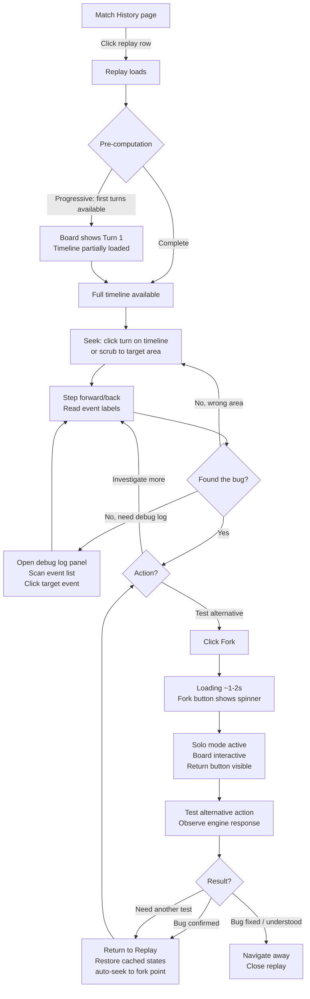
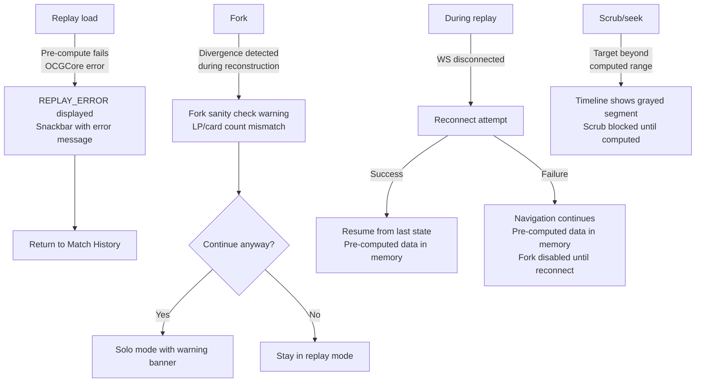
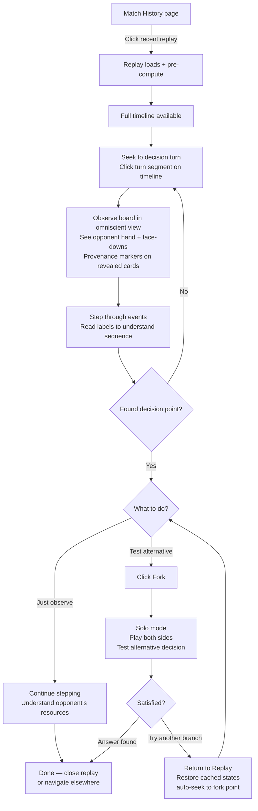
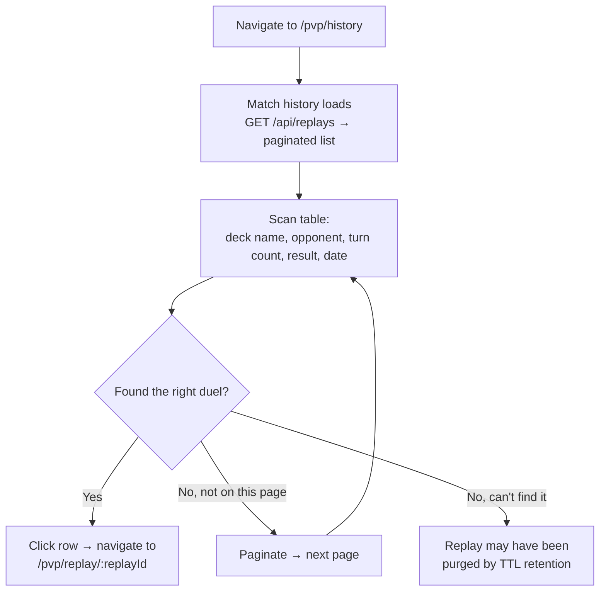

# UX Design Specification — PvP Replay Mode

**Author:** Axel
**Date:** 2026-03-21
**Related:** [prd-replay.md](prd-replay.md), [architecture-replay.md](architecture-replay.md)

---

## Executive Summary

### Project Vision

The PvP Replay Mode provides video-like playback and interactive exploration of completed PvP duels. It bridges passive review (replay) and active experimentation (fork to Quick Duel Solo) within a single interface. The primary value is eliminating manual board state reconstruction for debugging — seek replaces O(n) manual reproduction. The secondary value is post-game analysis with omniscient view and "what-if" branching.

The replay is not a standalone viewer — it is an extension of the PvP experience. The client receives the same WebSocket messages as a live duel, reuses the same board components (`PvpBoardContainerComponent` in `readOnly` mode), and fork navigates to the duel page (`/pvp/duel/fork-{replayId}`) for Quick Duel Solo. Return navigates back to the replay with auto-seek to the fork point.

### Target Users

**Axel (solo developer, competitive player)**
- **As debugger:** Needs to reproduce engine bugs efficiently. Currently requires replaying entire duels manually to reach the problematic turn. Replay + seek + fork eliminates this. WS message-level granularity (step-by-step) is critical for pinpointing the exact event where behavior diverges.
- **As analyst:** Wants to explore alternative decisions post-game. Omniscient view reveals opponent's hidden information (hand, face-downs), enabling better game reads. Fork at decision points tests "what-if" scenarios with full OCGCore state.
- **Tech-savvy:** Comfortable with developer tools, understands the underlying WS protocol. UX should be efficient, not hand-holding.

### Key Design Challenges

1. **Replay → Solo mode transition (fork):** The user shifts from passive spectator to active player. Fork navigates to `/pvp/duel/fork-{replayId}` where the board becomes interactive via `DuelPageComponent`. The transition must feel lightweight despite being a route navigation — the Fork button shows an inline spinner during server-side state reconstruction (~1-2s), then navigation occurs.

2. **Temporal navigation in complex duels:** A 30-turn duel can contain hundreds of events. The user navigates at two granularities — turn-level (seek) and event-level (step forward/back). Maintaining spatial awareness (current turn, phase, active player, position in timeline) is essential to prevent disorientation during step-by-step inspection.

3. **Omniscient information density:** Replay displays both players' hands, all face-down card identities, and all zones simultaneously. This doubles the visible information compared to live PvP. The board layout must accommodate this without visual overload — especially on the opponent's side where cards were previously hidden.

### Design Opportunities

1. **Turn-based timeline as spatial anchor:** A visual timeline (not just a turn counter) gives the user a spatial map of the duel. Turns are discrete segments; the current position is always visible. This transforms linear event playback into a navigable space — the user "sees" where they are and where they want to go.

2. **Fork as first-class "what-if" action:** The fork button should be permanently visible and framed as exploratory ("What if I...?"), not technical ("Fork to Quick Duel Solo"). This is the primary differentiator — seamless transition from observation to experimentation.

3. **Zero learning curve via PvP board reuse:** The replay board is the same `PvpBoardContainerComponent` the user already knows from live PvP. Only the control layer (playback controls overlay) is new. Familiarity is immediate.

## Core User Experience

### Defining Experience

The Replay Mode is a **search tool**, not a passive viewer. The user navigates to a specific moment in a completed duel, observes what happened at event-level granularity, and optionally branches into a Quick Duel Solo session to test alternatives. The core loop is: **find replay → seek to turn → step through events → fork if needed → return to replay**.

The primary interaction is temporal navigation — the user moves through the duel timeline at two granularities (turn-level seek and event-level step). Playback (play/pause at variable speed) is secondary to direct navigation (seek/step). The user is searching, not watching.

### Platform Strategy

- **Primary platform:** Desktop web (Chrome, Firefox, Edge, Safari). Debug and analysis workflows favor large screens.
- **Secondary platform:** Mobile web (Chrome Android, Safari iOS). Landscape-locked. Functional but not optimized — replay review on mobile is an edge case.
- **Input:** Mouse + keyboard primary. Keyboard shortcuts for frequent controls (play/pause, step forward/back, seek) are essential for efficient debug sessions. Touch secondary (mobile).
- **No offline:** Replay playback requires a server-side WebSocket session (OCGCore WASM replay). No client-side playback capability (closed by Architecture ADR-1).
- **Same infrastructure:** Reuses PvP Angular application shell, authentication, routing. No new deployment target.

### Effortless Interactions

1. **Seek → Step → Fork in 3 actions:** The user should go from "I want to look at turn 12" to "I'm now testing an alternative" with minimal friction. Seek jumps to the turn. Step reveals the exact event. Fork branches immediately — no confirmation dialog, no loading screen beyond OCGCore state reconstruction.

2. **Video-metaphor controls:** Play, pause, fast-forward, rewind, step forward/back use universally understood icons and behavior. No learning curve for the control layer. Keyboard shortcuts mirror common media players (Space = play/pause, Arrow keys = step, number keys or slider = seek).

3. **Replay discovery via familiar metadata:** Match history shows deck name, opponent, turn count, result, date — the same information the user remembers about a past duel. No need to remember replay IDs or timestamps.

4. **Omniscient view is the default with visual provenance:** In replay, everything is visible — both hands, all face-downs, all zones. Cards that were face-down during the live duel receive a subtle visual indicator (CSS border/overlay) to distinguish "what the player knew" from "what is revealed in replay." This supports post-game analysis without adding cognitive load.

5. **Fork requires no setup, return requires no effort:** No room creation, no deck re-selection, no opponent selection. The fork creates a Quick Duel Solo session from the exact OCGCore state at the current replay point. The user controls both sides immediately. A "Return to Replay" button is always visible in post-fork solo mode — clicking it reloads the replay and auto-seeks to the fork point. Solo changes are discarded implicitly (the replay is the immutable source of truth, solo is a disposable sandbox).

### Critical Success Moments

1. **"I found it" — Locating the bug or decision point.** The user seeks to the right turn, steps through events, and sees exactly what happened. This moment depends entirely on clear temporal navigation (knowing where you are) and readable board state (understanding what the engine did). If the timeline is confusing or the board state is unclear, the tool fails its primary purpose.

2. **"What if?" — Forking to test an alternative.** The user clicks Fork, the board becomes interactive, and they replay the sequence with a different choice. The transition must feel instantaneous and natural — the board stays the same, only the control paradigm changes (passive → active). If the transition is jarring or slow, the exploratory momentum is lost.

3. **"Let me try something else" — Returning from fork to replay.** The user tested one alternative, wants to try another. One click returns to the replay at the fork point. No re-navigation through match history, no re-seeking. The replay is always there to come back to. This makes fork feel safe and exploratory — the user experiments freely because returning is trivial.

4. **"That's the game" — Finding the right replay in match history.** The user opens match history and identifies the correct duel within seconds using deck name, opponent, and turn count. If the list is hard to scan or the metadata is insufficient, the user never reaches the replay.

### Experience Principles

1. **Search-first, not watch-first.** Every design decision should favor efficient navigation over cinematic playback. Seek and step are primary; play/pause is secondary. The user is hunting for a specific moment, not enjoying a show.

2. **Fork is exploratory, not permanent.** The fork from replay to Quick Duel Solo is a disposable experiment, not a one-way door. The user branches, tests, and returns to the replay to try another branch. The replay is the immutable timeline; solo is a throwaway sandbox. Return to replay is always one click away, auto-seeking to the fork point.

3. **Show everything, mark what's new.** Omniscient view is the default — no toggles, no perspective switching. All information is visible. Cards that were hidden during the live duel receive a subtle visual indicator so the user can distinguish prior knowledge from replay-revealed information.

4. **Keyboard-native efficiency.** Frequent actions (step, play/pause, seek) must have keyboard shortcuts. A debug session involves dozens of step-forward/step-back actions — clicking buttons for each one is unacceptable.

## Desired Emotional Response

### Primary Emotional Goals

1. **Control** — From the moment the replay opens, the user must feel in command of the timeline. The frustration of the original bug or loss is replaced by mastery over the sequence of events. "I can go anywhere in this duel instantly."

2. **Confidence** — After investigating (debug or analysis), the user leaves with certainty. Not "I think this is what happened" but "I know exactly what happened and I verified it." The fork-and-test loop builds evidence-based confidence.

3. **Efficiency** — The replay is a productivity tool. The user should feel that the time from "I want to investigate" to "I have my answer" is minimal. No wasted steps, no unnecessary screens, no friction between intent and action.

### Emotional Journey Mapping

| Stage | Emotion | Design Driver |
|-------|---------|---------------|
| Open match history | Recognition — "That's the game" | Familiar metadata (deck name, opponent, turns, result) enables instant identification |
| Replay loads | Control — "I can navigate this" | Timeline is immediately visible and understandable. Playback controls are obvious. No tutorial needed |
| Seek to turn | Precision — "I'm exactly where I need to be" | Seek is instant and unambiguous. Current position (turn, phase, player) is always clear |
| Step through events | Clarity — "I see exactly what happened" | Each event is visually distinct. Board state changes are readable. No guessing what the engine did |
| Fork | Empowerment — "Let me test this" | One click, no hesitation. The fork feels safe because return is trivial |
| Post-fork solo | Exploration — "What if...?" | Full control of both sides. The sandbox feeling — experiment freely, no consequences |
| Return to replay | Continuity — "Right back where I was" | Auto-seek to fork point. No re-navigation. The replay is always there |
| Investigation complete | Confidence — "I know what happened" | The debug/analysis loop produced a clear answer. Time well spent |

### Micro-Emotions

**Critical to achieve:**
- **Orientation** over confusion — The user always knows where they are in the duel timeline. Turn number, phase, active player, and timeline position are never ambiguous. This is the #1 priority. Without orientation, the feature is useless.
- **Confidence** over skepticism — The replay is deterministic. The user trusts that what they see is exactly what happened. No "is this accurate?" doubt.
- **Momentum** over hesitation — Fork, return, seek, step — every action is immediate. The user never pauses to wonder "what will this do?" or "will I lose my place?"

**Critical to avoid:**
- **Disorientation** — Not knowing which turn or event the user is looking at. This is the primary failure mode. If the timeline is unclear, the entire feature fails.
- **Anxiety before fork** — "Will I lose my replay?" must never cross the user's mind. The return path must be visually obvious before the user clicks Fork.
- **Tedium during navigation** — Clicking step-forward 50 times to reach the right event. Seek and fast-forward must eliminate repetitive manual navigation.

### Design Implications

| Emotional Goal | UX Design Approach |
|----------------|-------------------|
| Orientation (always know where you are) | Persistent timeline bar showing all turns with current position highlighted. Turn number + phase + active player always visible in a fixed header/overlay. Timeline is the primary navigation element, not a secondary indicator |
| Control (I can go anywhere) | Direct manipulation of the timeline (click on a turn to seek). Keyboard shortcuts for all navigation actions. No modal dialogs blocking navigation |
| Confidence (I know what happened) | Deterministic replay — same inputs always produce the same output. Visual provenance markers on revealed cards. Clear event descriptions during step-by-step |
| Momentum (every action is instant) | No confirmation dialogs. Fork is one click. Return is one click. Seek round-trip < 500ms. Keyboard shortcuts eliminate mouse travel |
| Safety (fork without fear) | "Return to Replay" button permanently visible in solo mode. Fork point remembered. Solo changes are implicitly disposable |

### Emotional Design Principles

1. **The timeline is the product.** If the user cannot orient themselves in the duel timeline at any moment, nothing else matters. Every other feature (fork, omniscient view, step-by-step) depends on the user knowing exactly where they are. Design the timeline first, everything else second.

2. **Confidence through determinism.** The replay shows exactly what happened — no approximation, no interpretation. The user's trust in the replay is absolute. Visual design should reinforce this: precise event labels, clear state transitions, no ambiguity in what the engine did.

3. **Zero-hesitation actions.** Every user action (seek, step, fork, return) should be executable without a moment of doubt. No "are you sure?" dialogs, no hidden consequences, no state loss. The user acts and the system responds immediately.

## UX Pattern Analysis & Inspiration

### Inspiring Products Analysis

**YouTube / Video Players**
- Core strength: universally understood timeline interaction. Click anywhere on the progress bar to seek. Hover for preview. Keyboard shortcuts (Space, arrows, J/K/L) for power users.
- What makes it compelling: zero learning curve. Every user already knows how to navigate a video. The mental model is instantly transferable to replay navigation.
- Key takeaway: the timeline bar IS the primary navigation element, not a secondary indicator.

**Dota 2 Replay Viewer**
- Core strength: competitive game replay with omniscient view, seek by time/tick, and event markers on the timeline (kills, objectives). The user can take control at any point — directly analogous to fork.
- What makes it compelling: the timeline shows *what happened*, not just *when*. Event markers let the user jump to significant moments without scrubbing through empty turns.
- Key takeaway: event markers on the timeline transform passive scrubbing into targeted navigation. Turn markers with LP change indicators would serve the same purpose for Yu-Gi-Oh!.

**Chrome DevTools (Performance Tab)**
- Core strength: dense temporal data navigated at multiple zoom levels. The flame chart shows events nested within larger time spans. The user zooms from macro (full timeline) to micro (individual function call) seamlessly.
- What makes it compelling: a debug tool designed for developers who need precision. No hand-holding — every pixel serves information density. Keyboard-driven workflow.
- Key takeaway: two-level navigation (macro = turns, micro = events within a turn) maps perfectly to the replay's seek-by-turn + step-by-event model.

**EDOPro / YGOPro**
- Core strength: the visual standard for Yu-Gi-Oh! digital play. Board layout, zone positions, card rendering, chain link display — all conventions the target user already knows.
- What makes it compelling: familiarity. The user doesn't need to learn what a Monster Zone or Graveyard looks like.
- Key takeaway: the board display should match existing Yu-Gi-Oh! digital conventions (already achieved via `PvpBoardContainerComponent` reuse). No innovation needed on the board itself — only on the control layer.

**DAW (Digital Audio Workstations) — Ableton, Logic Pro, FL Studio**
- Core strength: perfected temporal navigation with transport controls and scrubbing. Transport bar layout is a universal standard for media control: `|◀  ◁  ⏸/▶  ▷  ▶|` with direct manipulation of the playhead.
- What makes it compelling: transport controls are more complete than YouTube's play/pause model. The playhead is a direct manipulation tool.
- Key takeaway: the transport bar layout is the ideal model for replay controls. Fork belongs in the transport bar as a first-class action alongside play/pause/step.

### Transferable UX Patterns

**Navigation Patterns:**
- **Clickable timeline bar** (YouTube) — Direct manipulation of a horizontal progress bar to seek. Each turn is a clickable segment. Current position highlighted. Hover shows turn number and summary.
- **Scrub with live board update** (DAW) — Dragging the playhead along the timeline updates the board state in real-time. Enabled by pre-computing all board states at replay load time (see ADR-7 below). Seek and scrub are instantaneous (<1ms) because all states are client-side.
- **Event markers on timeline** (Dota 2) — Visual indicators on the timeline for significant events (LP changes, summons, effect activations). Turn markers with summary info help the user jump to the right turn without guessing.
- **Two-level zoom** (DevTools) — Macro view (all turns via timeline) + micro view (events within a turn via step-by-step). The timeline shows turns; stepping is the "zoomed in" view within a turn.
- **Progressive pre-computation** — The worker sends board states in batches (per turn) as they are computed. The client can begin navigation immediately on already-computed turns while remaining turns calculate in the background. The timeline visually shows computation progress (computed = clickable, remaining = grayed out). Prevents loading screen abandonment on heavy duels (50+ turns, 800+ responses).
- **Zoomable timeline** (DevTools) — Scroll wheel on the timeline zooms in/out. Zoomed out: all turns visible as segments. Zoomed in: individual events within a turn become visible and clickable. Prevents unusable tiny segments on long duels (50+ turns on a fixed-width bar).

**Interaction Patterns:**
- **Transport bar** (DAW) — Simplified control layout: `|◀  ◁  ⏸/▶  ▷  ▶|  ⑂Fork  ↩Return`. Start, step back, play/pause, step forward, end, fork action, return to replay. All primary actions in one bar. No fast-forward or rewind — seek/scrub replace them (see PRD Divergences).
- **Keyboard-first controls** (YouTube + DevTools) — Space = play/pause, Left/Right arrows = step back/forward, click on timeline = seek. Same shortcuts, same muscle memory.
- **Take control** (Dota 2) — Switch from spectator to player at any point. Fork button always visible in the transport bar, one click.
- **Event label granularity toggle** — Two levels of event description. **Normal mode** (default): events grouped by logical action ("Fusion Summon via Tearlaments Scheiren" — not 5 separate WS events). **Debug mode**: every individual WS event displayed (`MSG_MOVE`, `MSG_CHAINING`, etc.). Toggle in transport bar. Normal suits post-game analysis (Journey 2), debug suits bug investigation (Journey 1). Prevents event label noise on combo-heavy turns (15+ events per turn).
- **Clickable debug log panel** — Reuses the existing `DebugLogPanelComponent` (slide-in panel, 30+ message type formatter, color-coded by player). In replay, log entries become clickable — click on an entry seeks to that event. Current position entry is highlighted. No new component needed — just a `(click)` handler and highlight CSS on the existing panel.

**Visual Patterns:**
- **Board preview on timeline hover** (YouTube thumbnail) — Hovering over the timeline shows a miniature board preview (~200px wide) at the hovered position. Enables visual navigation — the user sees the board state before clicking/seeking. Uses pre-computed `boardStates[]` (no extra data). Rendered as a CSS-scaled `PvpBoardContainerComponent` in a popover above the cursor. Turn summary (turn, LP, event label) below the preview.
- **Persistent position indicator** (YouTube) — Turn number, phase, active player always visible in a fixed overlay. Timeline bar always accessible.
- **Event labels** (DAW track names + DevTools flame chart labels) — Each step displays a human-readable label of the current event: "Normal Summon: Tearlaments Scheiren", "Chain Link 1: Ash Blossom". Labels derived from WS events captured during pre-computation — not inferred from state diffs.
- **Information density for experts** (DevTools) — No simplification, no hiding data behind toggles. Everything visible, layout optimized for scan speed.

**Rendering Modes:**
- **Step / Play (1x):** Full animated transitions between consecutive board states. Card movement, LP change animation, chain link visual feedback. Animations driven by captured WS events (`MSG_MOVE`, `MSG_CHAINING`, etc.), not inferred from state diffs.
- **Scrub / Seek:** Direct board state injection, no animation. The board jumps to target state instantly. Standard behavior for timeline click or drag — same as YouTube frame-seeking.

### Architecture Note: Pre-Computed Board States (ADR-7)

**Status:** Proposed (amendment to architecture-replay.md ADR-3)

**Context:** The original architecture (ADR-3) specifies server-driven replay navigation — every playback command (play, pause, step, seek) is a WebSocket message to the Duel Server, which replays OCGCore events and streams results back. This creates a WS round-trip per action (~500ms), makes scrubbing impossible, and requires the worker thread to stay alive for the entire replay session.

UX design analysis identified that the primary interaction is temporal navigation (seek + step), not passive playback. The user needs instant, friction-free movement through the timeline — including drag-scrubbing with live board state feedback. Server-driven navigation cannot support this.

**Decision:** Pre-compute all board states at replay load time. The Duel Server worker replays all `playerResponses` through OCGCore WASM in silent mode, capturing a board state snapshot (`duelQueryField()` + `duelQuery()`) and the WS events that produced the transition after each response. The complete array is sent to the client. All navigation (seek, step, scrub, play) becomes 100% client-side.

**Pre-computed state format:** `Array<{ boardState: BoardState, events: WsMessage[], label: string }>`. Each entry includes the board state snapshot, the WS messages that produced the transition from the previous state (used for animation in step/play mode), and a human-readable event label. Animation is driven by captured events, not inferred from state diffs — more reliable and simpler client-side logic.

**Alternatives Considered:**

| Alternative | Pros | Cons | Rejected Because |
|-------------|------|------|-----------------|
| A) Server-driven (original ADR-3) | Simple worker logic, no bulk data transfer | ~500ms per action, no scrub, worker alive entire session, 9 WS message types | Fails the "timeline is the product" UX principle. Navigation must be instant |
| B) Checkpoint system (periodic snapshots) | Reduced seek cost vs A, lower memory than C | Still requires server round-trip for seek-between-checkpoints, complex checkpoint interval tuning | Half-measure — still server-dependent, still no scrub |
| C) Full pre-computation (selected) | Instant navigation (<1ms), scrub enabled, 9→2 WS types, worker freed after compute | 2-10s initial load, ~3-10MB client memory | Best alignment with UX principles. Trade-offs are acceptable |
| D) Hybrid (stream + pre-compute in background) | Instant start, progressive enhancement | Complex dual-mode logic, client must handle both server-driven and local navigation | Over-engineering for MVP. Progressive batch computation within option C achieves similar UX |

**Consequences:**

*Positive:*
- Navigation latency: ~500ms → <1ms (index swap)
- Scrub/drag with live board state update becomes possible
- WS protocol simplified: 9 client→server message types → 2 (`REPLAY_LOAD`, `REPLAY_FORK`)
- Worker thread freed after pre-computation (alive only for fork)
- Client-side animations driven by captured WS events — reliable, no diff inference needed
- Activity ping (`REPLAY_ACTIVITY_PING`) no longer needed — no persistent server session during navigation

*Negative:*
- Initial load time: 0 → 2-10s depending on duel length. Mitigated by progressive batch computation (navigation available from first computed turn)
- Client memory: ~3-10MB for board state array. Acceptable on desktop, monitor on mobile
- Fork still requires server round-trip (~1-2s) — worker must reconstruct live OCGCore WASM instance at fork point by replaying from scratch. Pre-computed states are read-only snapshots, not resumable WASM instances

**Impact on architecture-replay.md:**

| Section | Change |
|---------|--------|
| ADR-3 (Seek implementation) | Replaced by ADR-7. "Replay from scratch per seek" → "pre-compute all at load" |
| Replay Session Lifecycle (ADR-4) | Worker lifecycle changes: alive for pre-compute phase + fork only, not entire session. Idle timeout no longer needed |
| Protocol boundary (ADR-2) | Client→server types reduced from 9 to 2. `REPLAY_PLAY/PAUSE/STEP_*/SEEK/FF/REWIND/ACTIVITY_PING` removed. `REPLAY_LOAD` and `REPLAY_FORK` remain |
| Frontend Architecture | `ReplayConnection` simplified — receives pre-computed states, manages local navigation. No longer sends playback commands |
| New server→client type | `REPLAY_BOARD_STATES` (batch of pre-computed board states with event metadata and labels) replaces per-event game messages during replay |
| Fork Architecture (ADR-6) | Unchanged mechanically — worker reconstructs WASM at fork point. But now the worker must be re-activated (it was freed after pre-compute) |

### Anti-Patterns to Avoid

- **Hidden timeline** — Timeline that appears only on tap and auto-hides. The replay timeline must be permanently visible — it is the primary navigation tool, not a secondary control.
- **Confirmation dialogs for navigation** — "Are you sure you want to seek to turn 5?" Never. Every navigation action is instant and reversible.
- **Modal overlays blocking the board** — Prompts or menus that obscure the game board during replay navigation. The board must remain visible at all times.
- **Linear-only navigation** — Replay systems that only allow play/pause with no seek. Seek-to-turn is mandatory, not a nice-to-have.
- **Separate replay application** — The replay must be part of the same application. No context switching.
- **Replays without textual context** — Board state changing silently without explaining what happened. Every step must display a human-readable event label. Without labels, the user sees movement but doesn't understand the engine's logic.
- **Replay that forgets position** — If the user inspects a card, resizes the window, or switches tabs and returns, the replay must never lose its current position. With pre-computed client-side states, this is inherently safe (all states in memory), but must be verified — no accidental state reset on component lifecycle events.

### Design Inspiration Priority

| Pattern | Source | Priority | Rationale |
|---------|--------|----------|-----------|
| Clickable timeline bar | YouTube | P0 — Critical | Primary navigation element. Without it, the tool fails (Emotional Principle #1) |
| Transport bar with fork | DAW | P0 — Critical | All primary actions in one bar. Fork as first-class action |
| Keyboard shortcuts | YouTube + DevTools | P0 — Critical | Keyboard-native efficiency (Experience Principle #4) |
| Event labels (normal/debug) | DAW + DevTools | P0 — Critical | "Confidence through determinism" — user reads what happened |
| Turn markers with LP delta | Dota 2 | P1 — Important | Targeted navigation, reduces seek guessing |
| Zoomable timeline | DevTools | P1 — Important | Required for long duels (50+ turns) |
| Progressive pre-computation | Original | P1 — Important | Prevents loading abandonment on heavy duels |
| Clickable debug log panel | Existing component | P1 — Important | Reuse existing `DebugLogPanelComponent` with click-to-seek |
| Board preview on timeline hover | YouTube thumbnail | P0 — Critical | Enables visual navigation — user sees the board state at the hovered position before clicking, finds the right moment faster |
| Scrub-mode board simplification | YouTube | P2 — Nice to have | Evaluate after user testing |

### Risk Mitigations (Pre-Mortem)

| Risk | Impact | Prevention | MVP Scope |
|------|--------|------------|-----------|
| Pre-compute too slow on heavy duels (50+ turns) | User abandons at loading screen | Progressive batch computation — navigation available from first computed turn | MVP |
| Timeline unusable on long duels | Segments too small to click | Zoomable timeline (scroll wheel) or horizontal scroll overflow | MVP |
| Event labels become noise on combo turns | Step-by-step feels like log scrolling | Two-level granularity (normal/debug) with toggle in transport bar | MVP |
| Fork-return loses mental context | Chaotic exploration, user forgets what was tested | Fork history (list of fork points with timestamp) | Post-MVP (accepted risk — typically 1-2 forks per session) |
| Scrub visually disorienting | User loses spatial awareness during drag | Simplified board during drag, or accept chaos (video editor pattern) | Post-MVP (evaluate after user testing) |

### PRD Divergences

This UX specification diverges from the PRD ([prd-replay.md](prd-replay.md)) on the following functional requirements:

| PRD FR | PRD Description | UX Decision | Rationale |
|--------|----------------|-------------|-----------|
| FR9 | Fast-forward at variable speed | **Removed.** Seek/scrub replace fast-forward. No speed selector. | Search-first principle — if you want to go fast, seek to the turn, don't watch in accelerated playback. Seek is instant with pre-computed states |
| FR10 | Rewind the replay | **Removed.** Seek/scrub replace rewind. Step-back remains for single-event regression. | Same rationale — backward scrub on timeline replaces dedicated rewind control |
| — | Fork is one-way (Architecture ADR-6) | **Fork is reversible.** Fork navigates to `/pvp/duel/fork-{replayId}`. Return navigates back to `/pvp/replay/:replayId?seekTo={forkIndex}`, auto-seeks to fork point. | Fork must feel exploratory, not permanent. User experiments freely because returning is trivial |
| — | Server-driven navigation (Architecture ADR-3) | **Pre-computed client-side navigation (ADR-7).** All board states computed at load time. | Enables instant seek (<1ms), scrub with live board update, simplified WS protocol (9→2 types) |

## Design System Foundation

### Design System Choice

**Angular Material 19.1.1** — inherited from the existing skytrix application. No new design system or CSS framework introduced for the Replay Mode.

### Rationale for Selection

- **Brownfield constraint:** The entire application uses Angular Material. Introducing a different system would create visual inconsistency and maintenance burden.
- **Component reuse:** `PvpBoardContainerComponent`, card inspector, and all board zone components already use Angular Material styling and CDK primitives. The replay extends these — it does not replace them.
- **Solo developer:** Angular Material's opinionated defaults reduce design decisions. No design team to maintain a custom system.

### Two Visual Contexts

The Replay Mode spans two distinct visual contexts:

**1. Match History page — Material Design standard**
- Standard Angular Material components: `mat-table` for the replay list, `mat-paginator` for pagination, `mat-icon` for result indicators.
- Same look and feel as other standard pages (deckbuilder, settings).
- Responsive: handled by Angular Material defaults.

**2. Replay Viewer page — Immersive dark theme (Option B light)**
- The board (`PvpBoardContainerComponent`), transport bar, timeline, and debug log panel share the same dark visual tone (`#16213e` background — matching existing `DebugLogPanelComponent`).
- Transport bar and timeline are custom SCSS components (~50 lines), not Material components. `mat-icon` for icons only (Material Symbols: `skip_previous`, `arrow_left`, `play_arrow`, `pause`, `arrow_right`, `skip_next`, `fork_right`, `undo`). White icons on dark background.
- No new CSS custom properties namespace (`--replay-*`). No design tokens. No theme harmonization effort. The dark background + white icons + existing accent colors are sufficient.
- This is a debug/analysis tool — visual polish is secondary to functionality. The dark theme provides visual unity with minimal CSS effort.

### Implementation Approach

**Existing components reused as-is:**
- `PvpBoardContainerComponent` (board display, `readOnly` input signal)
- Card inspector / card tooltip
- Board zone components (monster, spell/trap, graveyard, banished, etc.)
- `DebugLogPanelComponent` (with added click-to-seek behavior)
- `MatSnackBar` with `SnackbarComponent` for notifications (replay errors, divergence warnings)

**New components:**
- **Match History page:** `mat-table` + `mat-paginator` (standard pattern, `CustomPageable<ReplayDTO>`). Columns: deck name, opponent, turn count, result icon, date. Row click navigates to replay.
- **Transport bar:** Custom SCSS component. Dark background (`#16213e`), `mat-icon` buttons, no `mat-toolbar` or `mat-button`. Layout: `|◀  ◁  ⏸/▶  ▷  ▶|  ⑂Fork  ↩Return`.
- **Timeline bar:** Custom SCSS component. Horizontal bar below the transport bar. Dark background, accent color for current position, turn segments clickable. CDK or native pointer events for scrub interaction. Zoomable via scroll wheel (desktop) or pinch (mobile).
- **Turn markers / tooltips:** `MatTooltip` for hover turn summary on timeline segments.

### Responsive Strategy

Responsive behavior consistent with the existing PvP implementation:

- **Desktop:** Transport bar and timeline full width below the board. All buttons visible with icon + optional label. Timeline supports scroll-wheel zoom and mouse scrub.
- **Mobile (landscape-locked):** Transport bar compact (icons only, no text labels, smaller touch targets). Timeline simplified (turn segments clickable, no zoom — touch scrub only). Same landscape-lock mechanism as PvP board (`screen.orientation.lock('landscape')`). Board uses same responsive sizing (`height: 90%; aspect-ratio: 274/215; max-width: 100%`).
- **Match History page:** Angular Material responsive defaults. `mat-table` column hiding on narrow screens if needed (hide date column on mobile, keep deck name + opponent + result).

### Z-Index Management

- Transport bar and timeline: dedicated token in `_z-layers.scss` (above board, below overlays).
- Debug log panel (slide-in): existing z-index already defined.
- Card inspector: existing z-index already defined.

## Defining Experience

### Core Interaction

**"Navigate to any moment in a past duel and debug from there."**

The user thinks in events, not turns. "When Scheiren triggered" is the mental anchor, not "turn 12." The timeline shows turns as structural segments, but event labels are the actual navigation targets. The user scans labels to find the right moment, then forks to debug.

The fork is not exploratory play — it is a targeted debug action. "I want to see what happens if I respond differently to this specific prompt." The user forks, replays the critical action, observes the result, and returns to try another approach.

### User Mental Model

**How the user thinks about replay navigation:**
- Mental anchors are **events**, not turns. "The fusion trigger that didn't resolve" — not "turn 12." Turns are structural containers; events are the meaningful units.
- The timeline is a **search space**, not a video. The user doesn't watch from left to right — they jump to areas of interest and inspect locally.
- Step-by-step is **reading**, not watching. Each step reveals a labeled event ("Chain Link 1: Tearlaments Scheiren — Fusion Effect"). The user reads the sequence like a log, not observes it like a movie.

**How the user thinks about fork:**
- Fork = **"debug from here."** It's a breakpoint, not a save point. The user wants to re-execute a specific sequence with different inputs and compare the output.
- The fork is disposable. The user doesn't care about the solo session itself — they care about the answer: "does the engine behave correctly if I do X instead of Y?"
- Return = **"try again from the same breakpoint."** The user returns to the exact fork point to launch another debug attempt. Multiple fork-return cycles from the same point are the expected workflow.

**Current solution (without replay):**
- Start a new PvP Quick Duel Solo session with the same decks
- Manually play through N turns to reach the problematic board state
- This takes minutes to hours for a single investigation
- No guarantee of reaching the exact same board state (different draws, different RNG)

**What makes the replay better:**
- Deterministic — exact same sequence, every time
- Seek eliminates manual replay — jump directly to the event
- Fork preserves the exact OCGCore state — no approximation
- Multiple investigations from the same point without replaying from scratch

### Success Criteria

| Criterion | Measure | Why It Matters |
|-----------|---------|---------------|
| User finds the right event | < 30 seconds from replay open to target event | If navigation is slow, the user reverts to manual reproduction |
| User understands what happened | Event labels clearly describe engine actions | If the user can't read what the engine did, they can't identify the bug |
| Fork preserves exact state | Zero desynchronization between replay state and forked solo state | If the fork diverges, the debug is invalid |
| Return lands at fork point | Exact same event index, board state, and timeline position | If the user has to re-navigate after return, the fork-return loop breaks |
| Multiple fork-return cycles feel instant | < 2 seconds per fork (OCGCore reconstruction) + instant return (restore cached board states, seek to fork point — no re-pre-computation) | The debug loop is iterative — each cycle must be fast |

### Pattern Analysis — Established Patterns with Yu-Gi-Oh! Adaptation

All core interactions use **established patterns** — no novel UX education needed:

| Interaction | Established Pattern | Yu-Gi-Oh! Adaptation |
|-------------|-------------------|---------------------|
| Timeline navigation | Video player seek (YouTube) | Turn segments with event labels instead of time codes |
| Step-by-step | Debugger step-over (IDE) | Each "step" is one OCGCore event with a readable label |
| Scrub | DAW playhead drag | Drag along timeline, board state updates in real-time (pre-computed) |
| Fork | Debugger "run from here" / Git branch | Create a live session from a frozen replay point |
| Return to replay | Browser "back" button / Git checkout | Return to the immutable timeline at the fork point |
| Debug log panel | IDE console / DevTools console | Existing `DebugLogPanelComponent` with click-to-navigate |

**No novel patterns.** Every interaction maps to a pattern the user (developer + gamer) already knows. The defining experience is the **combination** of these patterns in a Yu-Gi-Oh! context, not any individual interaction.

### Experience Mechanics

#### Flow 1: Find the Event (Seek → Step)

**1. Initiation:**
- User opens replay from match history (row click). Replay loads with pre-computation (~2-10s, progressive). Board shows initial game state (both hands dealt, turn 1).

**2. Interaction:**
- User clicks a turn segment on the timeline (or scrubs) → board jumps to that turn's first event. Turn number, phase, and active player update in the position indicator.
- User presses Right Arrow (or clicks Step Forward) → board advances one event. Event label appears: "Normal Summon: Tearlaments Scheiren (Zone M3)."
- User scans event labels. Not the right event → keeps stepping. Too far → Left Arrow steps back one event.
- Alternative: user opens debug log panel, scans the event list, clicks the target event → board jumps to that event.

**3. Feedback:**
- Timeline position indicator tracks current event within the turn.
- Event label always visible — user reads what the engine did.
- Board state updates with each step (animated in step mode).
- Debug log panel highlights the current event entry.

**4. Completion:**
- User found the problematic event. The board shows the exact state before/after the issue. The event label describes what the engine did. User is ready to fork or continue investigating.

#### Flow 2: Debug from Here (Fork)

**1. Initiation:**
- User clicks Fork in the transport bar (or keyboard shortcut). No confirmation dialog.

**2. Interaction:**
- Loading indicator (~1-2s) while the worker reconstructs OCGCore WASM state at the fork point.
- Board transitions from replay mode to solo mode: transport bar controls are replaced by PvP action UI. Board `readOnly` switches to `false`. `ReplayConnection` closes, `DuelConnection` opens.
- "Return to Replay" button appears (always visible in solo mode post-fork).
- User plays both sides, testing the alternative action.

**3. Feedback:**
- Visual mode indicator changes (e.g., subtle border color or label: "Solo — Forked from Turn 12, Event 47").
- Board becomes interactive — action menus appear on card click, prompts display for engine queries.
- The user sees the engine's response to their alternative action in real-time.

**4. Completion:**
- User observed the result. Either the bug reproduces (confirms the issue) or the alternative works (isolates the root cause).
- User clicks "Return to Replay" to try another approach, or navigates away (match history, deckbuilder, etc.).

#### Flow 3: Try Again (Return → Re-fork)

**1. Initiation:**
- User clicks "Return to Replay" in solo mode post-fork.

**2. Interaction:**
- Solo session closes (worker cleanup). Cached `boardStates[]` restored instantly — no re-pre-computation, no WS reconnection. Auto-seeks to the fork point (cached event index).
- Board returns to replay mode: transport bar controls reappear, `readOnly` = true, position indicator shows the fork point.
- User is exactly where they forked — ready to fork again or navigate elsewhere.

**3. Feedback:**
- Timeline shows the fork point. Position indicator confirms the event index.
- Board state matches the pre-fork state exactly.

**4. Completion:**
- User forks again to test another alternative (loop back to Flow 2), or navigates to a different point in the replay (loop back to Flow 1), or leaves.

#### Expected Debug Session Flow

```
Open replay → Seek to turn 12 → Step to event 47 (the problematic trigger)
  → Fork → Test alternative A → Observe result → Return to replay (turn 12, event 47)
  → Fork → Test alternative B → Observe result → Return to replay (turn 12, event 47)
  → Navigate to turn 6 → Step to event 23 (an earlier decision)
  → Fork → Test alternative C → Observe result → Done — close replay
```

Typical session: 2-4 fork-return cycles, 1-2 navigation jumps. Total investigation time: 5-15 minutes vs. hours of manual reproduction.

## Visual Design Foundation

### Color System

**Inherited — no new colors.** The Replay Mode uses the existing skytrix design tokens from `_tokens.scss` and PvP-specific tokens.

**Surface colors (replay viewer context):**
- Transport bar background: `--surface-nav: #161616` (semantic token for toolbars)
- Timeline background: `--surface-elevated: #1E293B` (semantic token for elevated panels)
- Board background: existing PvP board surfaces (`--surface-base: #121212`)

**Accent & interaction colors:**
- Primary accent: `--pvp-accent: #C9A84C` (gold, Millennium theme)
- Timeline current position: `--pvp-accent` or `--pvp-highlight-selected: rgba(255, 215, 0, 0.6)`
- Timeline computed/available turns: `--text-secondary: #9E9E9E`
- Timeline not-yet-computed turns (progressive loading): `--border-subtle: rgba(255, 255, 255, 0.3)` grayed out
- Player indicators: P1 `#64b5f6` (blue), P2 `#ef5350` (red) — same as debug panel
- LP display: `--pvp-lp-own: #4CAF50`, `--pvp-lp-opponent: #90CAF9`, `--pvp-lp-danger: #F44336`

**Omniscient provenance marker:**
Cards that were face-down during the live PvP duel should receive a distinct visual indicator in replay — a CSS class `.revealed-in-replay` with a dashed border or corner triangle. Does NOT reuse `--pvp-highlight-selectable` (that token means "actionable" in PvP live, which would create semantic confusion in replay context). **Implementation status:** The `replayMode` signal exists in `PvpHandRowComponent` and controls card visibility, but the `.revealed-in-replay` CSS class binding is not yet applied in the template — this visual provenance marker is pending implementation.

**Opponent hand rendering in omniscient view:**
In live PvP, the opponent's hand renders as face-down card backs. In replay omniscient mode, the opponent's hand cards show their full card art/identity (same rendering as the player's own hand). This is driven by the `omniscient: true` flag on the message filter — card codes are not sanitized, so `BoardState.opponentHand` contains real card IDs instead of zeros. The board component renders cards with valid IDs as face-up art. The `.revealed-in-replay` class is applied to opponent hand cards as a provenance marker (these were hidden during live PvP).

**Semantic colors:**
- Error / divergence warning: `--danger: #CF6679`
- Event label categories: reuse debug panel dots (event = `#90a4ae`, prompt = `#64b5f6`, response = `#81c784`, system = `#90a4ae`)

**Match history page:** Standard Material theme — no custom colors needed.

### Typography System

**Inherited — no new fonts.**

- **UI text:** Roboto (Material default) — transport bar labels, match history table, position indicator, tooltips
- **Event labels / debug log:** `'Courier New', Courier, monospace` at `0.75rem` — same as `DebugLogPanelComponent`. Monospace for WS message readability
- **LP display:** `--pvp-lp-font-size: clamp(1rem, 4dvh, 1.5rem)` — reused from PvP
- **Phase badge:** `--pvp-phase-badge-font-size: clamp(0.875rem, 3dvh, 1.25rem)` — reused from PvP
- **Timeline turn labels:** caption size (`12px, 400 weight`) — small, non-intrusive, readable on timeline segments

### Spacing & Layout Foundation

**Board layout:** Identical to PvP — `height: 90%; aspect-ratio: 274/215; max-width: 100%` with CSS 3D perspective (`--pvp-perspective-depth: 800px`, `--pvp-rotate-x-angle: 15deg`).

**Replay viewer layout (desktop):**
```
┌─────────────────────────────────────────┐
│                                         │
│              Board (PvP)                │
│         aspect-ratio: 274/215           │
│                                         │
├─────────────────────────────────────────┤
│  [T1][T2][T3]...[T12▼]...[T30]         │  ← Timeline bar
│  Turn 12 · MP1 · "Normal Summon: ..."  │  ← Position + event label (integrated)
├─────────────────────────────────────────┤
│  |◀  ◁  ⏸/▶  ▷  ▶|  ⑂Fork  ↩Return  │  ← Transport bar
└─────────────────────────────────────────┘
```

Timeline is directly below the board (closest to visual content, pattern YouTube). Event label is integrated into the timeline block (reduces eye travel during step-by-step). Transport bar is at the bottom (secondary to navigation).

**Solo mode layout (post-fork):**
```
┌─────────────────────────────────────────┐
│  Solo — Forked from Turn 12, Event 47   │  ← Mode indicator
├─────────────────────────────────────────┤
│                                         │
│              Board (PvP)                │
│            interactive mode             │
│                                         │
├─────────────────────────────────────────┤
│                           ↩ Return      │  ← Return to Replay button
└─────────────────────────────────────────┘
```

The Return button occupies the same space as the transport bar — same height, same position. The transition from replay to solo mode only changes the bar content, not the layout structure.

**Fork loading state:** When the user clicks Fork, the Fork button shows an inline `mat-spinner` (18px) and becomes disabled during OCGCore WASM reconstruction (~1-2s). No modal, no overlay — just the button indicating progress.

**Spacing tokens:**
- PvP field gap: `--pvp-field-gap: 0.25rem`
- PvP radius: `--pvp-radius-sm: 2px`, `--pvp-radius-md: 4px`, `--pvp-radius-lg: 8px`
- Transport bar button spacing: 8px gap (standard Material icon button spacing)
- Timeline segments: no gap (continuous bar), turn boundaries marked by subtle border

**Touch targets:** 44×44px minimum (`--pvp-card-min-tap-target: 44px`) — applies to transport bar buttons on mobile.

### Responsive Strategy

Responsive behavior consistent with the existing PvP implementation:

- **Desktop:** Timeline and transport bar full width below the board. All buttons visible with icon + optional label. Timeline supports scroll-wheel zoom and mouse scrub.
- **Mobile (landscape-locked):** Transport bar compact (icons only, no text labels, smaller touch targets respecting 44px minimum). Timeline simplified (turn segments clickable, no zoom — touch scrub only). Same landscape-lock mechanism as PvP board (`screen.orientation.lock('landscape')`). Board uses same responsive sizing (`height: 90%; aspect-ratio: 274/215; max-width: 100%`).
- **Match History page:** Angular Material responsive defaults. `mat-table` column hiding on narrow screens if needed (hide date column on mobile, keep deck name + opponent + result).

**Responsive breakpoints (inherited):**
- `$bp-mobile: 576px`
- `$bp-tablet: 768px`
- `$bp-desktop-sm: 1024px`
- `$bp-pvp-narrow: 480px` (portrait phones)
- `$bp-pvp-tiny: 400px` (very small phones)

### Z-Index Management

Z-index tokens are only needed if transport bar and timeline use absolute/fixed positioning (overlay mode). If layout uses standard flex flow (board → timeline → transport bar in a flex column), z-index tokens are not needed — standard document flow handles stacking.

If overlay positioning is required during implementation, add to `_z-layers.scss`:

| Token | Value | Element |
|-------|-------|---------|
| `$z-pvp-timeline` | 55 | Timeline bar (above hand `50`) |
| `$z-pvp-transport-bar` | 60 | Transport bar (above timeline, below prompt sheet `80`) |

Existing tokens reused:
- `$z-pvp-board: 1` — board canvas
- `$z-pvp-hand: 50` — player hands
- `$z-pvp-prompt-sheet: 80` — prompts (in solo mode post-fork)
- `$z-pvp-chain-overlay: 950` — chain card travel overlay
- `$z-pvp-orientation-lock: 9000` — landscape lock overlay

### Layout Validation (Comparative Analysis)

Layout choices validated via comparative analysis against alternatives:

| Dimension | Options Compared | Winner | Score |
|-----------|-----------------|--------|-------|
| Timeline placement | A: Under board (flex) vs B: Overlay on board vs C: Side panel | A: Under board | 3.45 / 5 |
| Return button placement | A: Replaces transport bar vs B: Floating corner vs C: Top bar | A: Replaces transport bar | 3.70 / 5 |
| Mobile layout | A: Stacked compact vs B: Timeline in board vs C: All overlay | A: Stacked compact | 3.55 / 5 |

Key rationale: under-board placement preserves full board size, avoids touch conflicts, and maintains desktop↔mobile layout consistency. The transport bar replacement for Return button minimizes visual disruption during mode transition.

### Accessibility Considerations

- **Contrast ratios:** All text on `--surface-nav` / `--surface-elevated` backgrounds uses `--text-primary: #EAEAEA` — contrast ratio exceeds WCAG AAA (7:1).
- **Touch targets:** 44×44px minimum on mobile for all interactive elements (transport bar buttons, timeline segments).
- **Reduced motion:** Existing `prefers-reduced-motion` media query in debug panel and PvP animations — replay step/play animations must respect this (skip animation, show final state directly).
- **Keyboard navigation:** All transport bar actions accessible via keyboard shortcuts. Timeline focusable and navigable via Tab + Enter/Arrow keys.
- **Color independence:** Timeline position uses both color (gold accent) and shape (playhead marker) — not color-only. Provenance marker uses dashed border (shape), not color-only.

## Design Direction

### Design Directions Explored

Not applicable — brownfield project. The visual direction is fully constrained by the existing PvP board components, design tokens, and the decisions made in this UX specification (layout, color system, typography). There is no meaningful visual variation to explore.

### Chosen Direction

**Single direction: Dark immersive viewer extending PvP visual language.**

The Replay Mode is visually indistinguishable from a PvP duel in layout and board appearance. The only new visual elements are the timeline bar and transport bar below the board, both using existing design tokens (`--surface-nav`, `--surface-elevated`, `--pvp-accent`). The debug log panel is reused as-is with added click-to-seek behavior.

**Visual identity summary:**
- Dark surfaces (`#161616`, `#1E293B`) consistent with PvP board context
- Gold accent (`#C9A84C`) for active elements (timeline position, selected state)
- White Material icons on dark background for transport controls
- Monospace event labels matching debug panel typography
- Dashed border provenance marker for omniscient-revealed cards
- Flex column layout: board → timeline+label → transport bar

### Design Rationale

1. **Brownfield = no choice to make.** The board is built. The tokens exist. The layout is validated. Introducing visual variation would create inconsistency with the rest of the application.
2. **Debug tool aesthetic.** The user expects a functional, information-dense interface — not a polished consumer product. The dark theme, monospace labels, and debug panel aesthetic are appropriate for the use case.
3. **Zero learning curve.** The board looks identical to PvP. Only the controls below the board are new. The user recognizes the interface instantly.

### Key Visual Elements

| Element | Visual Treatment | Source |
|---------|-----------------|--------|
| Board | `PvpBoardContainerComponent` in `readOnly` mode, omniscient view | Existing PvP component |
| Timeline bar | `--surface-elevated` background, turn segments, gold accent for current position, integrated event label | New, using existing tokens |
| Transport bar | `--surface-nav` background, white `mat-icon` buttons, inline `mat-spinner` for fork loading | New, using existing tokens |
| Event label | Monospace `0.75rem`, integrated in timeline block, categories color-coded | Matching `DebugLogPanelComponent` |
| Mode indicator (solo) | Simple text label: "Solo — Forked from Turn 12, Event 47" | New, minimal styling |
| Return button | Occupies transport bar space, same height/position | New, replaces transport bar |
| Provenance marker | `.revealed-in-replay` class, dashed border on cards that were face-down in live PvP | New CSS class |
| Debug log panel | Existing component with click-to-seek + current event highlight | Extended existing component |
| Match history | Standard `mat-table` + `mat-paginator`, Material theme | New, standard Material |

## User Journey Flows

### Journey 1: Le Debugger — Reproduire et corriger un bug

**PRD narrative:** Axel retrouve un duel dans match history, ouvre le replay, seek au bon tour, step event par event pour identifier le bug, fork pour tester une correction.

**UX flow adapté (intègre les décisions UX : pré-calcul, pas de fast-forward, fork réversible) :**



**Error paths:**



### Journey 2: L'Analyste — Explorer des alternatives post-game

**PRD narrative:** Axel vient de perdre, ouvre le replay de la partie, navigue au moment de la décision critique, observe en omniscient view ce que l'adversaire avait en main, fork pour tester l'alternative.

**UX flow adapté :**



### Journey 3: Match History Discovery

**Not in PRD as a separate journey, but critical path to both J1 and J2.**



### Journey Patterns

**Navigation pattern — Seek → Step → Act:**
Every journey follows the same navigation core: seek to the area of interest (timeline click/scrub), step through events to find the exact moment (arrow keys/step buttons), then act (fork, observe, or leave). This three-phase pattern is consistent across all journeys.

**Fork-Return loop:**
Both J1 and J2 use the same fork-return cycle: fork at a point, test, return to the same point, optionally fork again. The loop is the defining interaction pattern of the Replay Mode. Design must optimize for multiple iterations (fast fork ~1-2s, instant return).

**Entry pattern — Match History → Replay:**
Both journeys start from match history. The match history is a gateway, not a destination — the user spends < 10 seconds finding the right replay. Design must optimize for scan speed (clear columns, familiar metadata, row click to open).

**Error recovery — graceful degradation:**
All errors (WS disconnect, pre-compute failure, divergence) degrade to the previous safe state: match history (for load failures) or replay mode (for fork failures). No dead ends. The pre-computed data in client memory survives WS reconnection.

### Keyboard Shortcut Map

| Key | Action | Context |
|-----|--------|---------|
| Space | Play / Pause | Replay mode |
| Right Arrow | Step forward one event | Replay mode |
| Left Arrow | Step back one event | Replay mode |
| Home | Seek to start (Turn 1) | Replay mode |
| End | Seek to last event | Replay mode |
| F | Fork | Replay mode |
| A | Toggle animations on/off | Replay mode |
| M | Toggle prompt mode (decision/result) | Replay mode |
| V | Toggle perspective (player 1/player 2) | Replay mode |
| D | Toggle debug panel | Both modes |
| G | Toggle event label granularity (normal/debug) | Replay mode |

## Component Strategy

### Design System Components (Angular Material — reused)

| Component | Usage in Replay | Notes |
|-----------|----------------|-------|
| `mat-table` | Match History — replay list | Standard paginated table with `CustomPageable<ReplayDTO>` |
| `mat-paginator` | Match History — pagination | Synced with `mat-table` |
| `mat-icon` | Transport bar buttons, result icons, navigation | Material Symbols set |
| `mat-tooltip` | Turn summary on timeline hover | Lightweight, no custom tooltip |
| `mat-spinner` | Fork loading state (inline 18px in Fork button) | Existing Material component |
| `MatSnackBar` + `SnackbarComponent` | Error notifications (divergence, WS disconnect, pre-compute failure) | Existing custom snackbar pattern |

### Existing PvP Components (reused with modifications)

| Component | Usage in Replay | Modification |
|-----------|----------------|-------------|
| `PvpBoardContainerComponent` | Board display in replay and solo modes | Add `readOnly` input signal. Receives board state via input signals — agnostic of data source |
| Card inspector / card tooltip | Card detail on click/hover for any card on the board | No modification |
| Board zone components | All 18 zones | No modification |
| `DebugLogPanelComponent` | Event log with click-to-seek | Add `(click)` handler on log entries to emit event index. Add `.active` CSS class on current event entry |
| `DebugLogService` | Feeds events to debug panel | Adapt to accept pre-computed event array instead of live `logServerMessage()` calls |
| `DebugLogFormatter` | Format 30+ WS message types to readable labels | No modification |

### Custom Components (new)

#### 1. Timeline Bar Component

**Purpose:** Primary navigation element — visual representation of the duel as a horizontal bar of turn segments.

**Anatomy:**
```
┌─────────────────────────────────────────────────┐
│ [T1][T2][T3]...[T12▼]............[T30]          │  ← Turn segments (clickable)
│ Turn 12 · Main Phase 1 · P1 · "Normal Summon…" │  ← Position + event label
└─────────────────────────────────────────────────┘
```

**Input signals:**
- `turns: Array<{turnNumber, startIndex, endIndex, p1LP, p2LP, eventCount}>` — derived metadata per turn (~2KB, not the full board states array). **Turn 0 ("Setup")** is the initial game state: draw phase, opening hands dealt, LP set — all events before the first player action of Turn 1. Turn 0 appears as the first segment on the timeline (labeled "Setup")
- `currentIndex: number` — current event index
- `computedUpTo: number` — progressive computation progress
- `totalEvents: number` — total number of events in the replay

**Output signals:**
- `seekTo = output<number>()` — emitted on click/scrub release (event index)
- `scrubbing = output<number>()` — emitted during drag (event index, for live board update via parent)

**Data flow:** The timeline receives the full `boardStates` array (needed for the hover board preview popover — renders a scaled `PvpBoardContainerComponent` at the hovered position). It emits event indices; the parent (`ReplayPageComponent`) uses `boardStates[currentIndex]` to drive the main board display.

**States:**
- Default: full timeline, gold playhead at current position. All turns visible as equal-width segments
- Scrubbing: playhead follows cursor, emits index to parent for live board update
- Partially computed: computed turns normal, remaining turns grayed out with subtle border
- Zoomed in: scroll wheel zooms in/out. **Zoom anchor:** cursor position (zoom centers on where the mouse points). **Zoom levels:** 3 discrete levels — L1 (default: turns only), L2 (turns expanded, event count labels visible), L3 (individual events visible as sub-segments within turns, clickable). Zoom transitions use CSS `transform: scaleX()` with `transform-origin` at cursor X position. Horizontal overflow handled by `overflow-x: auto` on the timeline container — scroll to pan. On mobile: no zoom (touch scrub only, per responsive strategy)
- Hover: a popover shows a **miniature board preview** (~200px wide) of the board state at the hovered position, anchored above the cursor X position on the timeline. Below the preview: turn number, LP for both players, event label. The preview is a scaled-down `PvpBoardContainerComponent` (CSS `transform: scale()`) with `readOnly = true`, animations disabled, card inspector disabled. Dismissed on mouse leave. During progressive loading, hover beyond `computedUpTo` shows turn summary text only (no preview). On mobile: no hover preview (touch-only — scrub with live main board update replaces it)

**Play mode:** Playhead advances per event (~500ms/event for animation). A turn of 3 events traverses in ~1.5s, a turn of 40 events in ~20s. Consistent with "automated step-by-step" mental model. No speed control — seek/scrub replaces fast-forward (FR9 removed).

**Keyboard:** Left/Right arrows handled at page level (step), not by timeline. Home/End seek to start/end.

**Accessibility:** `role="slider"`, `aria-valuemin`, `aria-valuemax`, `aria-valuenow`, `aria-label="Duel timeline"`. Focusable via Tab.

---

#### 2. Transport Bar Component

**Purpose:** Secondary control bar — playback actions, fork, return.

**Anatomy:**
```
┌──────────────────────────────────────────────────┐
│  |◀   ◁   ⏸/▶   ▷   ▶|   ⑂ Fork   ↩ Return   │
└──────────────────────────────────────────────────┘
```

**Input signals:**
- `isPlaying: boolean` — toggles play/pause icon
- `forking: boolean` — shows spinner, disables Fork button
- `positionLabel: string | null` — current position indicator
- `animationsEnabled: boolean` — animation toggle state
- `promptMode: 'decision' | 'result'` — prompt mode toggle state
- `perspectiveIndex: number` — current perspective (0 or 1)

**Output signals (one per action):**
- `skipStart = output<void>()`
- `stepBack = output<void>()`
- `playPause = output<void>()`
- `stepForward = output<void>()`
- `skipEnd = output<void>()`
- `fork = output<void>()`
- `toggleAnimations = output<void>()`
- `togglePromptMode = output<void>()`
- `togglePerspective = output<void>()`

> **Implementation note (post-v1):** No `mode` input or `returnToReplay` output — fork uses route navigation to `/pvp/duel/fork-{replayId}`, not in-page mode switching. The transport bar is always in replay mode.

**States:**
- Forking: Fork button shows `mat-spinner` (18px), disabled
- Playing: pause icon shown instead of play

**Accessibility:** All buttons have `aria-label`. Keyboard shortcuts handled at page level.

---

#### 3. Match History Page Component

**Purpose:** Gateway to replays — paginated list of past duels.

**Anatomy:**
```
┌────────────────────────────────────────────────────────┐
│  Match History                                         │
├──────────┬──────────┬───────┬────────┬────────────────┤
│ Deck     │ Opponent │ Turns │ Result │ Date           │
├──────────┼──────────┼───────┼────────┼────────────────┤
│ Tear v3  │ Player2  │ 18    │ 🏆     │ 2026-03-20     │
│ Kashtira │ Player3  │ 25    │ ❌     │ 2026-03-19     │
├──────────┴──────────┴───────┴────────┴────────────────┤
│                    < 1 2 3 >                           │
└────────────────────────────────────────────────────────┘
```

**Data source:** `ReplayService.getMatchHistory()` → `GET /api/replays` → `CustomPageable<ReplayDTO>`

**States:** Loading (`mat-spinner`), Empty ("No replays found"), Loaded (paginated table), Error (snackbar)

**Responsive:** Desktop: all 5 columns. Mobile: hide date column, keep deck name + opponent + result.

**Accessibility:** Standard `mat-table` accessibility. Row clickable with `role="link"`, `aria-label="Open replay: [deck name] vs [opponent]"`.

### Data Flow Architecture

```
ReplayPageComponent (controller)
├── boardStates: Array<{boardState, events[], label}>  ← full pre-computed data
├── currentIndex: signal<number>                        ← current position
├── computedUpTo: signal<number>                        ← pre-compute progress
├── turns: computed<TurnMetadata[]>                     ← derived from boardStates
├── currentBoardState: computed<BoardState>             ← boardStates[currentIndex]
├── currentEvents: computed<WsMessage[]>                ← boardStates[currentIndex].events
│
├── TimelineBarComponent
│   ├── IN: turns, currentIndex, computedUpTo, totalEvents, boardStates, ownPlayerIndex
│   └── OUT: seekTo(index), scrubbing(index)
│
├── TransportBarComponent
│   ├── IN: isPlaying, forking, positionLabel, animationsEnabled, promptMode, perspectiveIndex
│   └── OUT: skipStart(), stepBack(), playPause(), stepForward(), skipEnd(), fork(), toggleAnimations(), togglePromptMode(), togglePerspective()
│
├── PvpBoardContainerComponent
│   ├── IN: currentBoardState (single state), readOnly
│   └── OUT: (none in replay, card interactions in solo)
│
└── DebugLogPanelComponent
    ├── IN: all events (derived), currentIndex
    └── OUT: seekToEvent(index)
```

### Component Implementation Priority

| Priority | Component | Dependency | Rationale |
|----------|-----------|------------|-----------|
| P0 | Match History page | `ReplayService`, `ReplayDTO` | Entry point — blocks both journeys |
| P0 | Timeline bar | Pre-computed board states | Primary navigation — defining element |
| P0 | Transport bar | Timeline bar | Control actions — fork, return, step, play |
| P0 | `PvpBoardContainerComponent` `readOnly` refactor | None | Board must accept input signals |
| P1 | `DebugLogPanelComponent` click-to-seek | Pre-computed events | Debug navigation enhancement |
| P1 | Provenance marker (`.revealed-in-replay`) | Board component | Omniscient view visual indicator |

## UX Consistency Patterns

### Navigation Patterns

**Timeline seek (primary navigation):**
- Click on turn segment → instant board state update, no animation
- Drag/scrub on timeline → live board state update during drag, no animation
- Release drag → board shows final state at release point
- Scroll wheel on timeline → zoom in/out (desktop only)

**Step navigation (micro navigation):**
- Right Arrow / Step Forward button → advance one event, animated transition (~500ms)
- Left Arrow / Step Back button → go back one event, animated transition
- During play mode → automatic step-forward at ~500ms intervals

**Skip navigation:**
- Home / Skip Start → seek to Turn 1, Event 0
- End / Skip End → seek to last event

**Debug log navigation:**
- Click on log entry → seek to that event (same as timeline click — instant, no animation)
- Current event entry highlighted with `.active` class

**Pattern rule:** All navigation actions are instant and reversible. No confirmation dialogs. No "are you sure?" prompts. The user can always undo by navigating elsewhere.

### Feedback Patterns

**Error feedback — `MatSnackBar` with `SnackbarComponent`:**

| Error Type | Message | Action | Severity |
|------------|---------|--------|----------|
| Script/engine version mismatch | "This replay was recorded with a different script/engine version — results may differ from the original duel" | Dismiss (non-blocking, replay continues) | `displayError` (warning severity) |
| Pre-compute failure | "Replay failed to load: [error]" | Return to Match History | `displayError` |
| WS disconnect (reconnect failed) | "Connection lost" | Return to Match History | `displayError` |
| Fork divergence warning | "State mismatch detected (LP/cards). Continue anyway?" | Yes/No in snackbar action | `displayError` with action |
| Seek beyond computed range | (no snackbar — timeline visually blocks the action) | — | Visual only |
| Replay not found (deleted/expired) | "Replay not found — it may have expired" | Return to Match History | `displayError` |

**Note on truncated replays:** Duels ended by DISCONNECT or TIMEOUT produce valid but shorter replays. The timeline shows only the turns that were actually played. The last pre-computed state is the replay's end — no artificial "duel incomplete" marker. The match history result column shows the appropriate icon (TIMEOUT/DISCONNECT).

**Pattern rule:** Errors always degrade to the previous safe state. No dead ends. Error messages use existing `displayError` / `displaySuccess` utility functions from `core/utilities/functions.ts`.

**Success feedback:**
- No explicit success feedback for navigation actions (seek, step, fork). The board state change IS the feedback.
- Fork completion: the mode transition (transport bar → return button, board becomes interactive) IS the feedback.

### Loading States

| Context | Loading Indicator | Duration | Behavior |
|---------|------------------|----------|----------|
| Match history page load | `mat-spinner` centered in page | < 1s (API call) | Standard Material loading |
| Replay pre-computation | Progress text: "Loading replay... Turn 15/30" | 2-10s | Progressive — board available from first computed turn. Timeline grays out uncomputed turns |
| Fork (OCGCore reconstruction) | `mat-spinner` inline in Fork button (18px), button disabled | 1-2s | No overlay, no modal. Just the button state |
| Return to replay (restore cached data) | No loading indicator needed | Instant (<1ms — restore cached `boardStates[]` + seek to `forkEventIndex`) | No re-pre-computation, no WS reconnection. Cached data restored from before the fork |

**Pattern rule:** Loading indicators are inline and contextual — never full-screen overlays or modal spinners. The user sees where the loading is happening and the rest of the UI remains interactive.

**Empty state:**
- Match history with no replays: "No replays yet. Complete a PvP duel to see it here." Centered text, no illustration.

### Mode Transition Patterns

**Replay → Solo (fork):**
1. Fork button shows `mat-spinner`, disabled (~1-2s server-side reconstruction)
2. Server sends `REPLAY_FORK_READY` with fork tokens (or warning if sanity check fails)
3. App navigates to `/pvp/duel/fork-{replayId}` — `DuelPageComponent` loads in fork mode
4. Board is interactive — action menus and prompts available, player controls both sides
5. Fork duels skip surrender confirmation on leave (canDeactivate bypassed)

**Solo → Replay (return):**
1. Player navigates back (browser back or explicit action)
2. App navigates to `/pvp/replay/:replayId?seekTo={forkEventIndex}`
3. Replay page loads fresh — new WS connection, re-pre-computation (progressive loading)
4. `seekTo` query param auto-positions the timeline at the fork point
5. Board is read-only again — replay controls visible

**Pattern rule:** Fork uses route navigation, not in-page mode switching. The replay page is destroyed during fork and re-created on return. The trade-off is re-pre-computation cost (~2-10s) for simpler architecture. The user's position is preserved via `seekTo` query param.

### i18n Pattern

New translation keys added to `fr.json` and `en.json`:

**Match History page:**
- `replay.matchHistory.title`
- `replay.matchHistory.deckName`
- `replay.matchHistory.opponent`
- `replay.matchHistory.turns`
- `replay.matchHistory.result`
- `replay.matchHistory.date`
- `replay.matchHistory.empty`
- `replay.matchHistory.victory` / `defeat` / `draw`

**Replay Viewer:**
- `replay.viewer.turn`
- `replay.viewer.phase.[phaseName]`
- `replay.viewer.fork`
- `replay.viewer.returnToReplay`
- `replay.viewer.loading`
- `replay.viewer.loadingTurn`
- `replay.viewer.soloMode`
- `replay.viewer.forkedFrom`

**Errors:**
- `replay.error.loadFailed`
- `replay.error.connectionLost`
- `replay.error.divergenceWarning`
- `replay.error.notFound`

**Pattern rule:** All user-visible strings go through `ngx-translate`. No hardcoded strings in templates. Default language: FR (existing project convention).

## Responsive Design & Accessibility

### Responsive Strategy

**Desktop-first with mobile support.** The Replay Mode is primarily a debug/analysis tool used on desktop. Mobile is supported (landscape-locked) but not the primary target.

**Desktop (≥1024px):**
- Full layout: board → timeline+label → transport bar (flex column)
- Timeline supports scroll-wheel zoom and mouse scrub
- Transport bar shows icons + optional text labels
- Debug log panel slides in from right (existing behavior)
- Keyboard shortcuts fully active

**Tablet (768px–1023px):**
- Same layout as desktop, slightly reduced board size
- Timeline supports touch scrub (no scroll-wheel zoom)
- Transport bar shows icons only (no text labels)
- Landscape preferred, portrait functional but cramped

**Mobile (≤767px, landscape-locked):**
- Board uses PvP responsive sizing (`height: 90%; aspect-ratio: 274/215; max-width: 100%`)
- Timeline compact: turn segments clickable, touch scrub, no zoom
- Transport bar compact: icons only, 44px touch targets
- Match history: hide date column, keep deck name + opponent + result
- Debug log panel: full-width overlay (existing responsive behavior)

### Breakpoint Strategy

Inherited from project — no new breakpoints:

| Breakpoint | Value | Replay Behavior |
|------------|-------|-----------------|
| `$bp-pvp-tiny` | 400px | Minimal layout — very compact transport bar, timeline turn numbers only |
| `$bp-pvp-narrow` | 480px | Compact layout — small touch targets at 44px minimum |
| `$bp-mobile` | 576px | Mobile layout — landscape-locked, icons only |
| `$bp-tablet` | 768px | Tablet layout — touch scrub, no zoom |
| `$bp-desktop-sm` | 1024px | Full desktop layout |

**Approach:** Desktop-first media queries (`@media (max-width: $bp-*)`) — consistent with existing PvP responsive implementation.

### Accessibility Strategy

**WCAG AA compliance** — industry standard, consistent with the existing application. No AAA requirements for a personal debug tool.

**Accessibility checklist for Replay Mode:**

| Category | Requirement | Implementation |
|----------|------------|----------------|
| Color contrast | 4.5:1 for normal text, 3:1 for large text | Verified: `#EAEAEA` on `#161616` = ~13:1 (exceeds AAA) |
| Color independence | Information not conveyed by color alone | Timeline playhead = color + shape. Provenance marker = dashed border. Result icons = icon + text |
| Touch targets | 44×44px minimum | `--pvp-card-min-tap-target: 44px` applied to all transport bar buttons and timeline segments |
| Keyboard navigation | All actions accessible without mouse | Keyboard shortcut map defined (Space, arrows, Home/End, F, A, M, V, D, G) |
| Focus indicators | Visible focus state on all interactive elements | Angular Material default focus indicators + `:focus-visible` on custom components |
| Screen reader | ARIA roles and labels | Timeline: `role="slider"`. Transport buttons: `aria-label`. Match history rows: `aria-label` with replay context |
| Reduced motion | Respect `prefers-reduced-motion` | Skip step/play animations, show final state directly. Existing media query in PvP components |
| Semantic HTML | Proper heading hierarchy, landmarks | Match history: `<main>`, `<table>`. Replay viewer: `<main>`, `<nav>` for transport bar |

### Testing Strategy

**No automated accessibility testing framework** in the current project (big bang MVP approach, no tests until MVP done — per project convention).

**Manual testing checklist:**
- Keyboard-only navigation through full Journey 1 flow (match history → replay → seek → step → fork → return)
- Tab order follows visual layout (timeline → transport bar → debug panel toggle)
- Screen reader announces turn number, phase, and event label on step navigation
- `prefers-reduced-motion` disables all step/play animations
- Mobile landscape: all touch targets ≥ 44px, scrub gesture works without conflict

**Browser matrix (inherited from PvP NFR9):**
- Desktop: Chrome, Firefox, Edge, Safari (latest 2 versions)
- Mobile: Chrome Android, Safari iOS (latest 2 versions)

### Implementation Guidelines

**For the implementing agent:**

1. **Use existing responsive mixins** from `_responsive.scss` — `$bp-mobile`, `$bp-tablet`, etc. Do not create new breakpoints.
2. **Timeline and transport bar** use flex layout with `gap` and `flex-wrap` for responsive adaptation — not absolute positioning.
3. **Touch targets** enforced via `min-width: var(--pvp-card-min-tap-target)` and `min-height` on all interactive elements.
4. **ARIA attributes** on custom components:
   - Timeline: `role="slider"`, `aria-valuemin="0"`, `aria-valuemax="{totalEvents}"`, `aria-valuenow="{currentIndex}"`, `aria-label="Duel timeline"`
   - Transport buttons: individual `aria-label` per action
   - Match history table: standard `mat-table` ARIA (automatic)
5. **`prefers-reduced-motion` check** before any `transition` or `animation` CSS property. Use `@media (prefers-reduced-motion: reduce)` to disable.
6. **Landscape lock** on mobile: reuse existing PvP mechanism (`screen.orientation.lock('landscape')`).
