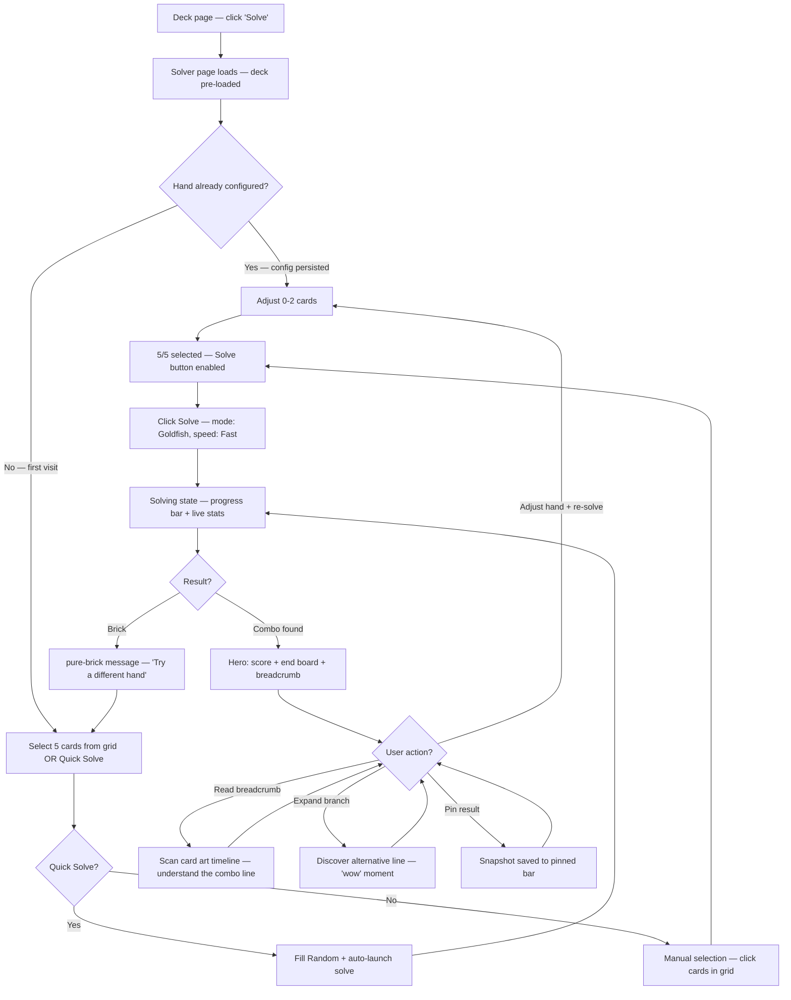
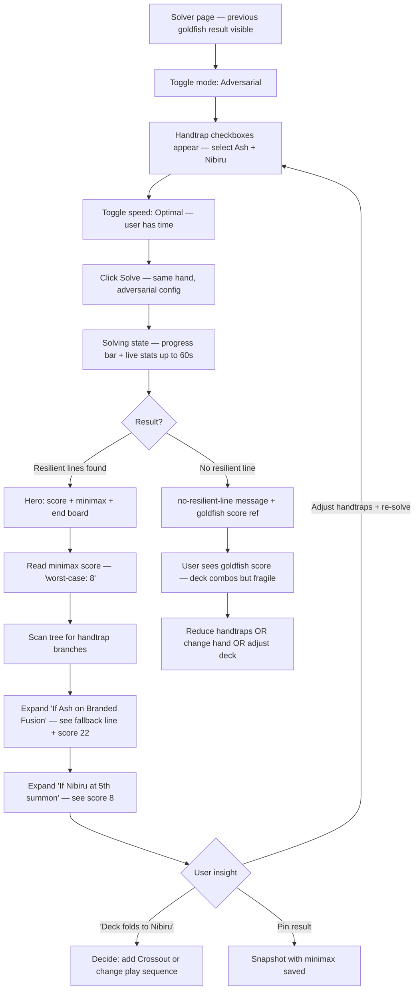
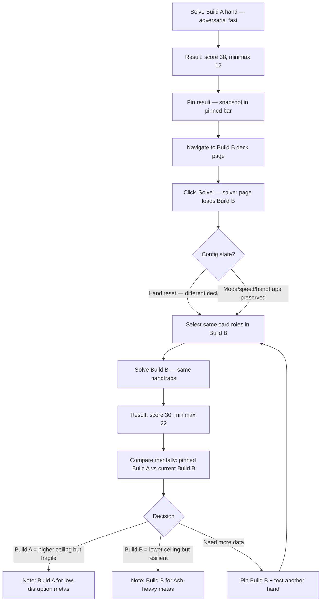

# UX Design Specification skytrix — Combo Path Solver

**Author:** Axel
**Date:** 2026-03-22

---

## Executive Summary

### Project Vision

Le Combo Path Solver est le premier analyseur automatisé de résilience aux handtraps pour le TCG Yu-Gi-Oh!. Il remplace des heures de test manuel par une exploration systématique de toutes les lignes de combo possibles depuis une main donnée. Le résultat est un arbre de décision interactif qui montre le chemin optimal, les alternatives, et les points de rupture face aux handtraps. Extension brownfield de skytrix (Angular 19 + Node.js duel-server + OCGCore WASM).

### Target Users

**Primary:** Axel — competitive Yu-Gi-Oh! player who knows his goldfish combos but cannot systematically explore all fallback lines against every handtrap combination. Tech-savvy, desktop user, iterates rapidly between solves.

**Future:** Competitive players preparing for tournaments, TCG content creators seeking data-driven deck analysis.

**User mental model:** The user is not looking for an abstract tree — they seek 3 concrete answers in this order:
1. **Global score** — "How good is my deck?"
2. **End board** — "What cards do I end with, how many interruptions?"
3. **Handtrap chokepoints** — (adversarial) "Where does it break, and what's the plan B?"

### Key Design Challenges

1. **Visualizing a potentially large decision tree without overwhelming the user** — Potentially hundreds of nodes. Breadcrumb + collapse by default is critical, but alternative branches must remain discoverable without drowning the user.

2. **Feedback during long-running solves (up to 60s)** — "Nodes explored" and "best score" are technical metrics. Feedback must communicate progression in a meaningful way for a player.

3. **Solve configuration without friction** — Hand selection + mode + speed + handtraps = many options. The user wants to launch fast, not configure 5 parameters.

4. **Result reading hierarchy in < 10s** — Score → end board → chokepoints. The UX must reflect this exact priority, not present everything flat.

### Design Opportunities

1. **The "Aha moment" as north star** — "I discover a line I didn't know existed" or "I see precisely where my deck breaks against Ash". The UX must amplify this moment of discovery.

2. **Enriched annotations as differentiator** — "Activate Branded Fusion → send Albaz + Lubellion → Fusion Summon Mirrorjade" instead of "Activate effect". This is what makes the solver readable and useful vs a raw technical log.

3. **Breadcrumb as combo narration** — The main path tells the combo as a logical sequence of steps. The tree is the exploratory detail, the breadcrumb is the combo story.

4. **End board as visual anchor** — Displaying the final cards with their interruption types gives a tangible, immediately understandable result (vs a raw numeric score alone).

5. **Pin results for iterative comparison** — The user can pin a summary snapshot (score, end board cards, config, minimax if adversarial) to keep it visible during subsequent solves. In-memory, client-side. Makes Journey 3 (Build Comparison) fluid without a dedicated side-by-side UI.

## Core User Experience

### Defining Experience

The core experience is **reading and understanding a solve result in under 10 seconds**. The solver's value is not in the computation — it's in the moment the user sees the recommended line, its end board, and its resilience. Everything else (configuration, progress, iteration) serves this moment.

**Core loop:** Configure → Wait → **Read** → Iterate

The read phase is the product. Configuration and progress are supporting infrastructure.

### Platform Strategy

- **Desktop-first**, mouse and keyboard. The decision tree requires horizontal space and hover interactions for node details.
- No mobile target for MVP. Tree visualization does not translate well to touch/small screens.
- Existing skytrix Angular SPA — new route `/decks/:id/solver`, lazy-loaded, same navigation patterns.

### Effortless Interactions

1. **Config persistence between solves, scoped per deck** — Hand selection, mode, speed, and handtrap toggles persist after a solve completes. When the user switches to a different deck, the hand resets (cards may not exist in the new deck) but mode/speed/handtraps carry over. The user changes 1-2 cards in the hand and relaunches. No full reconfiguration from scratch.

2. **Main path visible without interaction** — The recommended combo line, its score, and its end board are visible immediately on result load. No click, no expand, no scroll to find the answer.

3. **Pin and compare** — One-click pin captures a summary snapshot (score, end board, config, minimax). Pinned results remain visible during subsequent solves for mental comparison.

4. **Re-solve is one click** — After adjusting config, a single "Solve" button relaunches. No confirmation dialog, no navigation. The button is visually disabled during the server rate limit cooldown (2s) to prevent silent rejection.

### Experience Principles

1. **Answer first, exploration second** — The result page leads with the answer (score + end board + main path). The decision tree is available for exploration but is not the primary interface. The breadcrumb tells the story; the tree is the reference.

2. **Persist context, minimize re-entry** — Configuration state survives across solves. The user flow is "adjust and relaunch", not "configure from scratch each time".

3. **Technical transparency for power users** — Live stats during solve (nodes explored, best score, elapsed time) are shown in a secondary zone — visible but not center stage. The target user is technical and wants to see the solver working.

4. **Progressive disclosure for tree depth** — Main path visible by default. Alternative branches collapsed. Handtrap branches labeled but collapsed. The user drills down by choice, never by necessity.

## Desired Emotional Response

### Emotional Journey Mapping

```
Configure ──► Wait ──► Read Result ──► Iterate
  Control      Anticipation   Surprise/Relief    Momentum
  "I know       "It's          "I didn't         "Each solve
   what I        working"       know this"         makes me
   want to                      or "Now            smarter"
   test"                        I know"
```

The emotional arc is **certainty → anticipation → revelation → accumulation**. There is no frustration phase if the UX is correct — even a brick result is a revelation ("now I know this hand doesn't work").

### Emotional Design Principles

1. **Surprise over confirmation** — When the solver finds a line the user didn't know, the UX should make it feel like a discovery, not just another data row. The recommended path breadcrumb is the "wow" moment delivery mechanism.

2. **Clarity over drama** — Adversarial results (chokepoints, low resilience scores) are presented as neutral knowledge gained, never as alarming warnings. Red/danger colors are avoided for chokepoint branches — use distinct but calm visual treatment (e.g., handtrap icon + label, not red exclamation marks).

3. **Momentum over completion** — Each solve is not a task to finish but a step in an ongoing exploration. Pinned results and persistent config reinforce the feeling that the user is building understanding, not starting over each time.

4. **Informed acceptance over failure** — Brick results ("No viable combo") are framed as useful data: "This hand configuration has no path to an interruption." The empty state invites the next action ("Try a different hand") rather than presenting a dead end.

### Critical Success Moments

_These define the concrete pass/fail criteria for the emotional goals above._

1. **First result read (< 10s)** — The user sees score + end board + main path breadcrumb and immediately understands the result. This is the make-or-break moment. If they have to hunt for the answer, the product fails. _(Emotion: Surprise & discovery)_

2. **Discovery of an unknown line** — The user expands a branch and finds a combo path they hadn't considered. This is the "Aha moment" that validates the solver's existence. _(Emotion: Surprise over confirmation)_

3. **Chokepoint identification (adversarial)** — The user sees exactly where a handtrap breaks their combo and what the best fallback line is. This turns abstract fear ("Ash might wreck me") into concrete knowledge. _(Emotion: Relief & clarity)_

4. **Iterative comparison** — The user pins a result, changes a card, resolves, and compares scores. The trade-off between builds becomes data, not gut feeling. _(Emotion: Productive momentum)_

5. **Brick acknowledgment** — When the solver returns "No viable combo", the user receives it as actionable information ("this hand has no path to an interruption — try a different hand"), not as a tool failure. The empty state design matters as much as the result state. _(Emotion: Informed acceptance)_

## UX Pattern Analysis & Inspiration

### Inspiring Products Analysis

**Adopt:**
- Card art as visual identifier (Master Duel) — for end board display, hand selector, and breadcrumb annotations
- Click-to-toggle compact grid (Cardcluster) — for hand selection panel
- Functional minimalism (Cardcluster) — no decorative elements, data-focused layout

**Adapt:**
- Information density hierarchy (Master Duel) — adapt from game state to analysis result: score → end board → tree instead of LP → field → hand
- Frictionless iteration (Cardcluster) — extend from "edit deck" to "adjust config and re-solve"
- Chess analysis tree navigation (Lichess) — main line + indented variations, adapted with score badges and handtrap labels. CDK flat tree with `getLevel()` indentation mirrors the Lichess variation tree pattern.

**Invent:**
- Decision tree with score badges and handtrap branch labels — no direct reference exists for scored combo path trees. Custom CDK Tree design combining Lichess-style navigation with card art thumbnails and interruption type badges.

**Avoid:**
- Text log dumps (YGOPro style)
- Heavy animations in analysis context
- Modal interruptions during config
- Raw scores without contextual breakdown

## Design System Foundation

### Design System Choice

**Angular Material 19.1.1** — existing design system, no change. The solver page extends the established skytrix visual language.

### Rationale for Selection

- **Already in place** — Angular Material + CDK are installed and used across the entire application. Zero new dependencies (project constraint).
- **CDK Tree available** — `CdkTree` + `CdkTreeNode` are part of CDK, already installed. The decision tree component uses CDK flat tree mode — no d3, no vis-network.
- **Material components cover solver needs** — chips (breadcrumb path), toggles (mode/speed), checkboxes (handtraps), progress bar, buttons, cards (pinned results). All exist in Material.
- **Consistent with existing UX** — Users navigating from deck view to solver stay in a familiar visual environment. No jarring style switch.

### Implementation Approach

**Existing Material components used in solver:**

| Component | Solver Usage |
|---|---|
| `mat-button` | Solve, Cancel, Pin |
| `mat-button-toggle` | Mode (Goldfish/Adversarial), Speed (Fast/Optimal) |
| `mat-checkbox` | Handtrap selection |
| `mat-chip` | Breadcrumb main path steps |
| `mat-progress-spinner` | Solve progress |
| `mat-card` | Pinned result snapshots |
| `mat-icon` | Interruption type badges, expand/collapse |
| `mat-tooltip` | Fallback scoring hints (short text) |
| `CdkTree` + `CdkTreeNode` | Decision tree (flat mode) |

**Custom components (not in Material):**

| Component | Purpose |
|---|---|
| Hand selector grid | Compact card art grid with click-to-toggle (Cardcluster pattern) |
| Score display | Large score + contextualized breakdown |
| End board display | Card art thumbnails + interruption badge overlays |
| Tree node row | Card art + annotation + score badge + expand/collapse |

### Customization Strategy

- **Theming** — Use existing skytrix Material theme. No new palette.
- **SCSS shared styles** — Leverage `src/app/styles/` for solver-specific tokens (tree indentation, card art thumbnail sizes, score badge colors).
- **Z-index** — Use existing `_z-layers.scss` tokens for any overlay elements (tooltips, badges).
- **Card art sizing convention** — Define `$card-thumb-sm: 32px 46px` for breadcrumb/tree nodes, `$card-thumb-md: 56px 82px` for end board display.

## Defining Experience

### The One-Line Experience

"Pick a hand, hit Solve, and in 5 seconds see the best combo your deck can make — including exactly where it breaks if the opponent has Ash."

The shift: from "I play to test" to "I read to decide". The solver replaces manual exploration with systematic analysis the user consumes as a result.

### User Mental Model

**Current workflow (without solver):**
1. Open solo simulator → manually play the hand → try variants by hand → mentally retain results
2. Slow, incomplete, no systematicity. The player knows their main line but cannot explore all branches.

**With solver:**
1. The user **delegates exploration to the machine** and **consumes the result**
2. Mental model shift: from "player" to "analyst". The solver is a tool, not a game.
3. The user thinks in terms of: "Is this hand good?" → "What's the board?" → "Where does it break?"

### Success Criteria

| Criterion | Metric | How User Knows |
|---|---|---|
| Instant comprehension | Result understood in < 10s | Score + end board + breadcrumb visible without interaction |
| Discovery | User finds unknown combo line | Branch expansion reveals new path — "wow" moment |
| Actionable resilience | User identifies chokepoints | Handtrap branches show exactly where and what the fallback is |
| Iteration speed | Config adjust + re-solve < 5s user time | Persistent config, one-click re-solve, rate limit visible |
| Trust | User believes the result | Score breakdown explains the number; live stats show the solver worked |

### Novel UX Patterns

**Established patterns (no user education needed):**
- Config panel with toggles, checkboxes, card grid — standard Material interactions
- Progress bar + live stats — familiar long-running task pattern
- Expand/collapse tree — file explorer / Lichess variation navigation

**Novel combinations (unique to solver):**
- Breadcrumb as card art timeline — compact vignette sequence with hover annotations. No direct precedent at this scale.
- End board with interruption badges — card art thumbnails + overlay icons for interruption types. Custom design.
- Scored decision tree — Lichess-style navigation + score badges per node + handtrap branch labels. Novel composite pattern.

**No user education required** — all novel patterns are combinations of familiar elements (card art, badges, expand/collapse). No new interaction paradigm to learn.

### Experience Mechanics

**1. Initiation:**
- User is on deck page. Clicks "Solve" button in deck toolbar (alongside "Edit" and "Test").
- Routes to `/decks/:id/solver`. Deck pre-loaded. Config panel ready.

**2. Configuration:**
- Hand selector: compact card art grid of deck cards, click-to-toggle, counter "3/5 selected". "Fill random" button completes the hand to 5 with random cards from remaining deck (local random, no server involved). Supports partial fix: select 1-3 key cards, fill the rest randomly.
- Mode toggle: Goldfish / Adversarial (button toggle group)
- Speed toggle: Fast / Optimal (button toggle group)
- Handtrap checkboxes: visible only when Adversarial selected. 5 predefined handtraps with card art + name.
- "Solve" button: primary action, prominent placement.

**3. Solve (waiting):**
- "Solve" button becomes "Cancel" button.
- Progress bar (indeterminate or percentage-based if estimable).
- Live stats in secondary zone: nodes explored, best score so far, elapsed time.
- Contextual message: "Exploring combo lines..."

**4. Result (the defining experience):**
- **Result transition:** Hero block (score + end board) renders immediately upon SOLVER_RESULT. Breadcrumb and tree render 200-300ms after, below the fold. No reveal animation, no post-solve spinner. The answer is there, instantly.
- **Hero block (top):** Global score in `mat-headline-4` ("35 — 3 interruptions") + interruption breakdown as `mat-chip` components below (one chip per type, e.g., "omni-negate ×2", "destruction ×1"), grouped by 5 color families.
- **End board (below score):** Card art thumbnails of final field cards with interruption type badge overlays.
- **Breadcrumb (below end board):** Card art vignette timeline of main path. Hover/click reveals full annotation per step.
- **Minimax score (adversarial only):** Worst-case resilience score displayed alongside global score.
- **Decision tree (below breadcrumb):** CDK flat tree, collapsed by default. Main path pre-expanded. Alternative branches show score. Handtrap branches labeled with handtrap name + activation timing.
- **Pin button:** Captures summary snapshot (score, end board, config, minimax) to pinned results area.
- **Brick states (two distinct messages):**
  - `pure-brick`: "No viable combo — this hand has no path to an interruption even uncontested." (Goldfish score = 0)
  - `no-resilient-line`: "No resilient line found — all combo paths are broken by the selected handtraps." (Goldfish score > 0, minimax score = 0. Shows the goldfish score as reference.)

**5. Iteration:**
- User adjusts 1-2 cards in hand selector, relaunches. Config persists per deck.
- Previous result replaced by new result. Pinned results remain visible.
- Solve button disabled during rate limit cooldown (2s).

## Visual Design Foundation

### Color System

**Existing skytrix Material theme** — no new palette. The solver page uses the same primary, accent, and warn colors as the rest of the application.

**Solver-specific semantic colors — 5 interruption chip families:**

| Color Family | Color | Interruption Types Grouped |
|---|---|---|
| Negate | Purple | omni-negate, typed-negate, targeted-negate |
| Removal | Orange | destruction, banish, banish-facedown, send-to-gy |
| Control | Teal | bounce, spin, control-change, attach, move-to-st |
| Disable | Amber | floodgate, flip-facedown |
| Hand | Grey | hand-rip |

Color carries the functional category. The chip text label carries the precise type ("omni-negate ×1" including uses per turn from `usesPerTurn` in interruption-tags.json). The eye groups by color, the text specifies. 5 families respect Miller's Law (7±2 cognitive chunks).

Colors implemented as SCSS variables in `src/app/styles/` (e.g., `$solver-chip-negate`, `$solver-chip-removal`). Chips use `mat-chip` with custom background color per family. Chip colors must work on both light and dark Material themes if applicable.

**Handtrap branch labels:** Existing theme secondary text color with small handtrap card art thumbnail. No red/danger treatment (per emotional design principle: "clarity over drama").

### Typography System

**Existing skytrix typography** — no change. Material Design type scale already in place.

**Solver-specific usage:**

| Element | Style |
|---|---|
| Global score + interruption count | `mat-headline-4` — "35 — 3 interruptions", largest element, immediate anchor |
| Score breakdown chips | `mat-body-1` — typed chips below score |
| End board card names | `mat-caption` — below card art thumbnails |
| Breadcrumb annotations (hover) | `mat-body-2` — tooltip/popover content |
| Tree node annotations | `mat-body-2` — card name + action description |
| Tree node score | `mat-body-1` + bold — score value in tree row |
| Live stats (solving) | `mat-caption` — secondary, non-intrusive |
| Config labels | `mat-label` — standard Material form labels |

### Spacing & Layout Foundation

**Layout: Full-viewport with horizontal collapsible config panel (replay pattern). Maximizes horizontal space for decision tree indentation.**

```
┌───────────────────────────────────────────────────────┐
│  Config Panel (top, horizontal, full width)             │
│  ┌───────────────────────────────────────────────────┐ │
│  │ Hand Selector (card grid) | Mode/Speed toggles    │ │
│  │ Handtrap checkboxes | [Solve] button              │ │
│  └───────────────────────────────────────────────────┘ │
│  (collapses after first solve, uncollapse on config)    │
│                                                         │
│  Result Area (full width, below config)                 │
│  ┌───────────────────────────────────────────────────┐ │
│  │ Pinned Results Bar (horizontal, max 4, unpin btn) │ │
│  │ Hero + End Board (fused, layout-adaptive):        │ │
│  │   Goldfish: [Score+breakdown | end board cards]   │ │
│  │   Adversarial: [Score+minimax | line 1]           │ │
│  │                [end board cards | line 2]          │ │
│  │ Breadcrumb: mat-chips + chevrons (horizontal)     │ │
│  │ Decision Tree: CDK flat tree (no zoom, collapse)  │ │
│  └───────────────────────────────────────────────────┘ │
└───────────────────────────────────────────────────────┘
```

**Key layout decisions:**
- Config panel horizontal at top, full width. Collapses after first solve completes (transport bar pattern). When collapsed, a visible toggle button (`mat-icon-button` with `tune` icon) remains in the collapsed bar — clicking it transitions state to 'configuring' and uncollapses the panel. Required for keyboard accessibility (hidden controls cannot be interacted with).
- Hero + end board fused into one compact block. Score left, end board cards right. Layout-adaptive: goldfish = 1 line, adversarial = 2 lines (score + minimax first, end board second).
- Pinned results bar horizontal above result area. Max 4 pins. Each pin card has unpin button.
- Breadcrumb: `mat-chip-listbox` with card art embedded + `mat-icon chevron_right` between chips. `overflow-x: auto` + `white-space: nowrap`. Horizontal scroll if > 8 steps, never wraps to multi-line. Visually distinct from tree below (horizontal chips vs vertical indented list).
- Decision tree: CDK flat tree with collapse (Lichess pattern). No zoom/pan for MVP. Zoom → Phase 2 if needed.

**Spacing specifics:**
- Card art grid: 4px gap between thumbnails
- End board cards: 8px gap
- Tree indentation: 24px per level (CDK `getLevel()`)
- Section separation: 16px

**Card art sizing:**
- `$card-thumb-sm: 32px × 46px` — breadcrumb chips / tree nodes
- `$card-thumb-md: 56px × 82px` — end board display
- End board badges: corner bottom-right, semi-transparent background, "type ×uses" format

### Accessibility Considerations

- **Contrast ratios** — All interruption chip colors meet WCAG AA contrast against their text (white or dark text per chip family).
- **Chip labels always include text** — color is not the sole differentiator. Each chip reads "omni-negate ×1", "destruction ×2", etc.
- **Keyboard navigation** — CDK Tree supports keyboard nav natively (arrow keys, Enter to expand/collapse).
- **No motion-dependent information** — all state changes communicated through static visual elements, not animations.

## Design Direction Decision

Single design direction explored and refined.

### Key Design Decisions Consolidated

**Layout:**
- Full-viewport, config panel horizontal at top, collapses after first solve (replay/transport bar pattern). Collapsed bar retains a `tune` toggle button to uncollapse (keyboard accessibility).
- Hero + end board fused (goldfish: 1 line, adversarial: 2 lines)
- Pinned bar horizontal above result area, max 4, visible across decks (each pin shows deck name)
- Breadcrumb: `mat-chip` + `chevron_right`, horizontal scroll, never wraps. CDK Overlay (`CdkConnectedOverlay`) for multi-line annotations (combo annotations can exceed 150+ chars — `mat-tooltip` truncates).
- Tree: CDK flat, Lichess-style collapse. Main path expanded + root children collapsed at load (~10-15 lines max). No zoom MVP.

**Hand Selector:**
- Deduplicated grid: 1 card art per unique card, ×N counter, multi-select (click = +1 copy). Main deck only (no extra deck).
- Fill Random: completes to 5 from remaining cards (local random)
- Quick Solve: Fill Random + Solve in one click

**Result Display:**
- Score + interruption count on hero line ("35 — 3 interruptions")
- **Fallback scoring indicator:** When any end board card uses the fallback heuristic (untagged, scored as 1 base point per face-up monster), the hero line appends a `mat-icon` `info_outline` with `mat-tooltip`: "Some cards lack interruption tags — score is estimated." End board cards scored via fallback show a dashed border instead of solid, distinguishing them from tagged cards with precise badges.
- End board cards with badges bottom-right ("omni-negate ×1"), semi-transparent background
- 5 chip color families (Negate/Removal/Control/Disable/Hand), text label carries precise type
- Score delta on root-level alternative branches ("+3" / "-5 vs main")
- Hover enlargement on card art thumbnails (120×175px popup)
- Two brick states: `pure-brick` vs `no-resilient-line` with distinct messages

**Pins:**
- Snapshot includes: score, end board cards, hand cards (5), config, minimax, **deck name**, deckSeed
- Flat list visible across decks, each pin card shows its deck name. Max 4 pins. No hide/restore logic on deck switch.

**Config Panel:**
- Mode toggle (Goldfish/Adversarial), Speed toggle (Fast/Optimal)
- Algorithm selector (DFS/MCTS/Auto) — visible, standard toggle group. Removable post-validation.
- Handtrap checkboxes (adversarial only)
- Config persistence per deck (hand resets on deck change, mode/speed/handtraps carry over)
- Rate limit: Solve button disabled during 2s cooldown

**Solve State:**
- Progress bar + live stats (nodes, best score, elapsed) in secondary zone
- Cancel button replaces Solve button
- Result transition: hero renders immediately, breadcrumb + tree 200-300ms after

**Architecture Notes:**
- Solver result resilience: server keeps last result per userId, resends on WS reconnect

## User Journey Flows

### Journey 1: Goldfish Discovery — "What can my deck do?"

**Entry point:** Deck page → click "Solve" button → `/decks/:id/solver`



**Key UX moments:**
- Quick Solve eliminates all config steps for "just test a random hand"
- Hero block gives the answer in < 2s (score + end board)
- Branch expansion is the "wow" moment — discovery of unknown line
- Brick loops back to hand selection with actionable message

### Journey 2: Handtrap Resilience — "Does it hold against Ash?"

**Entry point:** Same solver page, switch to Adversarial mode



**Key UX moments:**
- Handtrap checkboxes appear only in Adversarial — progressive disclosure
- Minimax score is the "relief" moment — "finally I know the worst case"
- Handtrap branches in tree give concrete chokepoint identification
- No-resilient-line message gives actionable insight with goldfish score reference

### Journey 3: Build Comparison — "With or without the Extender?"

**Entry point:** Solver page, iterative solves with pin comparison



**Key UX moments:**
- Pin captures the full context (score + hand + end board + config + deck name + deckSeed)
- All pins remain visible across deck switches (flat list with deck name on each card) — Build A's pin is visible while viewing Build B's result for mental comparison.
- Config persistence carries mode/speed/handtraps across decks — only hand resets
- Decision is data-driven, not gut feeling

### Journey Patterns

**Navigation patterns:**
- **Single-page flow** — all solver interactions happen on one page. No navigation between config/progress/result. State transitions within the same view.
- **Deck as context anchor** — navigating from deck page to solver pre-loads the deck. Navigating between decks resets hand but preserves config.

**Decision patterns:**
- **Progressive disclosure** — handtrap checkboxes hidden in Goldfish mode. Algorithm selector visible but secondary. Tree collapsed by default.
- **Defaults that work** — Goldfish + Fast + Auto is the default config. The user can launch immediately with just a hand selection. Every toggle has a sensible default.

**Feedback patterns:**
- **Immediate hero** — result hero block renders instantly. No delay between solve completion and answer visibility.
- **Actionable empty states** — brick and no-resilient-line messages include suggestions ("try a different hand", "consider adding protection").
- **Rate limit feedback** — Solve button disabled during cooldown, not silent rejection.

### Flow Optimization Principles

1. **Minimum clicks to first result** — Quick Solve = 1 click. Manual config = select 5 cards + 1 click = 6 interactions. No other steps required.
2. **Zero re-entry on iteration** — config persists. Adjust 1 card = 1 click + Solve = 2 interactions total for a re-solve.
3. **Answer before exploration** — hero block answers the 3 questions (score, end board, chokepoints) before the user touches the tree.
4. **Fail informatively** — every error state (brick, no-resilient-line, SOLVER_ERROR) gives context and next action.

## Component Strategy

> **Accessibility:** All components in this section must meet WCAG AA. See the [Responsive Design & Accessibility](#responsive-design--accessibility) section at the end of this document for detailed accessibility requirements, ARIA patterns, and the testing checklist.

### Design System Components (Angular Material 19)

| Material Component | Solver Usage | Journey |
|---|---|---|
| `mat-button` | Solve, Cancel, Pin, Unpin, Quick Solve | All |
| `mat-button-toggle` | Mode, Speed, Algorithm | J1, J2, J3 |
| `mat-checkbox` | Handtrap selection | J2 |
| `mat-chip` / `mat-chip-listbox` | Breadcrumb steps, interruption breakdown chips | All |
| `mat-progress-spinner` | Solve progress | All |
| `mat-card` | Pinned result snapshots | J3 |
| `mat-icon` | Expand/collapse, chevrons, pin, block, shield | All |
| `CdkConnectedOverlay` | Breadcrumb annotations (multi-line text, can exceed 150+ chars) | All |
| `mat-tooltip` | Fallback scoring hints (short text) | All |
| `CdkConnectedOverlay` | Card art hover enlargement (120×175px image popup) | All |
| `CdkTree` + `CdkTreeNode` | Decision tree (flat mode) | All |

**Coverage: ~70% of UI needs covered by Material.** No new dependencies required.

### Custom Components

**Injection pattern:** 4 components inject `SolverService` directly (stateful — read/write solver state). 3 components are purely presentational (inputs only, no service injection).

#### 1. HandSelectorGrid *(injects SolverService)*

**Purpose:** Select test hand cards from the deck
**Content:** Deduplicated card art grid showing each unique main deck card with ×N copy counter. Main deck only (no extra deck).
**Actions:** Click card = select/deselect 1 copy (multi-click for multiple copies of same card). "Fill Random" completes to 5. "Quick Solve" = Fill Random + auto-launch.
**States:**
- `idle` — no cards selected, counter "0/5", Solve disabled
- `partial` — 1-4 cards selected, Solve disabled
- `complete` — 5/5 selected, Solve enabled
- `locked` — during solve, clicks disabled
- `error` — deck has < 5 main deck cards, message "Not enough cards to form a hand"

**Accessibility:** Each card has `aria-label` with card name + copy count. Selection announced by screen reader.
**Implementation:** Standalone, OnPush, signals. Injects `SolverService` for config persistence per deck.

#### 2. HeroResultBlock *(injects SolverService)*

**Purpose:** Display the primary solve answer: score + end board
**Content:** Score number + interruption count, breakdown chips (5 color families), end board card arts with interruption badges (type ×uses, corner bottom-right), minimax score (adversarial), pin button
**Actions:** Pin button calls `solverService.pinResult()`. Card art hover shows enlarged artwork (120×175px via CDK Overlay — `mat-tooltip` only renders text strings and cannot display images).
**States:**
- `goldfish` — single line: score left, end board right
- `adversarial` — two lines: score + minimax first, end board second

**Implementation:** Standalone, OnPush. `input<SolverResult>()`. Injects `SolverService` for pin write.

#### 3. BreadcrumbPath *(presentational)*

**Purpose:** Linear narration of the recommended combo line
**Content:** Sequence of mat-chips with embedded card art thumbnail (32×46px) + short action label, connected by `chevron_right` icons
**Actions:** Hover chip = CDK Overlay (`CdkConnectedOverlay`) with full multi-line annotation (combo annotations can exceed 150+ chars — `mat-tooltip` only renders short text strings). Click chip = `output<SolverAction>()` emitted to parent, which scrolls `DecisionTreeView` to corresponding node via `viewChild`.
**States:**
- `default` — horizontal scroll, `white-space: nowrap`, never wraps
- `overflow` — fade-out on right edge when content exceeds viewport

**Implementation:** Standalone, OnPush. `input<SolverAction[]>()`, `output<SolverAction>()`.

#### 4. DecisionTreeView *(presentational)*

**Purpose:** Interactive exploration of alternative combo paths
**Content:** CDK flat tree with card art thumbnail + annotation + score per node. Handtrap branch labels. Score delta on root-level alternatives ("+3" / "-5 vs main"). Pruned children count ("... and N other branches").
**Actions:** Click node = expand/collapse. Hover card art = enlarged popup (120×175px). Public method `scrollToNode(action)` callable by parent via `viewChild`.
**States:**
- `initial` — main path expanded, root children collapsed (~10-15 lines)
- `exploring` — user has expanded branches
- `empty` — no tree (brick result)

**Implementation:** Standalone, OnPush. `input<DecisionNode>()`. `CdkTree` flat mode, `getLevel()` for indentation (24px per level).

#### 5. SolveProgressPanel *(injects SolverService)*

**Purpose:** Show solve progress during computation
**Content:** Progress bar (indeterminate), live stats (nodes explored, best score, elapsed time), contextual message ("Exploring combo lines...")
**States:**
- `running` — stats updating via SolverService progress signals
- `cancelled` — brief "Cancelled" message before showing partial result

**Implementation:** Standalone, OnPush. Injects `SolverService`, reads progress signals directly.

#### 6. BrickStateBlock *(presentational)*

**Purpose:** Display actionable message when no combo is found
**Content:** Icon + title + message + suggestion
**States:**
- `pure-brick` — icon `block`, "No viable combo", "Try a different hand"
- `no-resilient-line` — icon `shield`, "No resilient line found", goldfish score reference + suggestion

**Implementation:** Standalone, OnPush. `input<'pure-brick' | 'no-resilient-line'>()`, `input<number | undefined>()` for goldfish score ref.

#### 7. PinnedResultsBar *(injects SolverService)*

**Purpose:** Horizontal bar showing pinned solve snapshots for comparison
**Content:** Max 4 pinned cards, each showing: score, mini hand cards (5), mini end board cards, mode label, unpin button
**Actions:** Unpin button calls `solverService.unpinResult(index)`.
**States:**
- `empty` — bar hidden (no pins in session)
- `populated` — 1-4 pin cards visible

**Implementation:** Standalone, OnPush. Injects `SolverService`, reads `pinnedResults()` signal. Visible across decks (flat list, each pin shows deck name).

### Component Implementation Strategy

All custom components follow existing skytrix patterns:
- Standalone, OnPush, signals (`input()`, `output()`, `signal()`, `computed()`)
- SCSS with shared styles from `src/app/styles/`
- Card art sizing via `$card-thumb-sm` and `$card-thumb-md` SCSS variables
- Interruption chip colors via `$solver-chip-*` SCSS variables
- No new dependencies — Material + CDK only
- Stateful components inject `SolverService` directly (root-scoped singleton)
- Presentational components use inputs/outputs only

### Implementation Roadmap

> **Note:** Component implementation order and phasing are defined in the architecture document (architecture-solver.md, Implementation Sequence) and the epics/stories (epics-solver.md). Refer to those documents for the authoritative build order.

## UX Consistency Patterns

### Button Hierarchy

| Level | Style | Usage in Solver | Examples |
|---|---|---|---|
| **Primary** | `mat-raised-button` accent | The ONE action that advances the user | Solve, Quick Solve |
| **Destructive** | `mat-stroked-button` warn | Stops or removes something | Cancel (during solve), Unpin |
| **Secondary** | `mat-stroked-button` | Supporting actions | Fill Random |
| **Icon-only** | `mat-icon-button` | Compact contextual actions | Pin (push_pin), Expand/Collapse |

**Rules:**
- Maximum 1 primary button visible at any time. Solve OR Cancel, never both.
- Solve button is in the config panel. Cancel replaces it during solve.
- Quick Solve is primary but smaller — secondary placement in config panel, next to Solve.
- Disabled state: Solve disabled when < 5 cards selected OR during rate limit cooldown (2s). Simple disabled, no micro-timer — the button was just used, temporary inactivity is self-explanatory.

### Feedback Patterns

| State | Visual Treatment | Solver Usage |
|---|---|---|
| **Loading** | `mat-progress-spinner` indeterminate + contextual message + live stats | Solve in progress |
| **Success** | Hero block renders immediately, no toast/snackbar | Solve complete with result |
| **Partial result** | Hero block + "Partial result" `mat-chip` outline badge next to score | Solve cancelled or timed out with best-so-far |
| **Empty result** | Icon + title + subtitle + suggestion (BrickStateBlock) | Brick / No resilient line |
| **Error** | `mat-snackbar` error via `displayError()` with "Dismiss" action button, no auto-dismiss | SOLVER_ERROR (WASM failure, deck not found, etc.) |
| **Info** | Inline text, `mat-caption` style | "Exploring combo lines..." |

**Rules:**
- **No success toast** — the result IS the success feedback. Adding a snackbar "Solve complete!" is noise.
- **Errors use existing snackbar pattern** — `displayError()` from `core/utilities/functions.ts`. No auto-dismiss — user must click "Dismiss". Critical errors (WASM_INIT_FAILED) must not disappear unnoticed.
- **Brick is NOT an error** — it's an empty result with a distinct visual (BrickStateBlock). Never shown as a snackbar.
- **Partial results are labeled** — "Partial result" chip badge ensures the user knows a longer solve might yield a better score.

### State Machine

```
loading → idle → configuring → running → complete
                                  ↓         ↓
                               cancelled   configuring (new solve)
                               ↓      ↓
                     (partial) →  complete
                     (no partial) → configuring
                                  ↓
                                error → configuring
```

**States:**
- `loading` — deck is being fetched from the route param `:id`. Displays a centered `mat-progress-spinner` (same pattern as existing deck loading). Transitions to `idle` once the deck is loaded. If deck fetch fails, transitions to `error`.
- `idle` — first visit, no config. Transition to `configuring` on first interaction.
- `configuring` — hand selected (complete or partial). Solve enabled only when 5/5.
- `running` — solve in progress. Config locked. Only action: Cancel or Escape.
- `cancelled` — transitional. If `partialTree` exists → `complete` with partial badge. If not → `configuring`.
- `complete` — result displayed. Config unlocked. User can adjust and re-solve.
- `error` — SOLVER_ERROR received. Snackbar shown (no auto-dismiss). Config unlocked.

**Rules:**
- No direct `idle → running` (must configure first, unless Quick Solve auto-fills).
- Quick Solve: `idle → configuring → running` in one click.

### Navigation Patterns

- **Single-page, no routing transitions** — all solver states on the same page. State transitions within the view.
- **Entry: Deck page → Solver** — `/decks/:id` "Solve" button → `/decks/:id/solver`. Deck pre-loaded.
- **Exit: Browser back** — returns to deck page. No confirmation dialog.
- **Deck switch** — hand resets, mode/speed/handtraps preserved, pins remain visible across decks (flat list with deck name on each card).

### Keyboard Shortcuts

| Shortcut | Action | Condition |
|---|---|---|
| `Ctrl+Enter` | Launch solve | State = `configuring`, 5/5 cards selected, not in cooldown |
| `Escape` | Cancel solve | State = `running` only. No intercept in other states. |
| Arrow keys | Navigate tree nodes | CDK Tree native keyboard nav |
| `Enter` | Expand/collapse tree node | CDK Tree native |

### Interaction Patterns

**Card art interactions (consistent across all components):**

| Interaction | Behavior | Where |
|---|---|---|
| Click card art | Select/deselect (hand grid) OR expand tree node | HandSelectorGrid, DecisionTreeView |
| Hover card art | Enlarged popup 120×175px via CDK Overlay (`CdkConnectedOverlay`) | BreadcrumbPath, DecisionTreeView, HeroResultBlock, PinnedResultsBar |
| Hover breadcrumb chip | Full annotation tooltip | BreadcrumbPath |
| Click breadcrumb chip | Scroll tree to corresponding node | BreadcrumbPath → parent → DecisionTreeView |

**Toggle interactions:**
- Single-select toggle groups (Mode, Speed, Algorithm) — one option active at all times.
- Multi-select checkboxes (Handtraps) — 0 to 5 selected. Visible only in Adversarial mode.

### Anti-Patterns (Solver-Specific)

| Anti-Pattern | Why | Correct Approach |
|---|---|---|
| Success toast after solve | The result IS the feedback | Hero block renders immediately |
| Confirmation dialog on re-solve | Breaks iteration speed | One-click re-solve, no confirmation |
| Modal for config options | Breaks single-page flow | Inline sidebar controls |
| Red/danger colors for chokepoints | Creates dread, not clarity | Neutral handtrap labels, calm visual treatment |
| Score without breakdown | Creates skepticism | Always show "N interruptions" + typed chips |
| Animated result reveal | Delays the answer | Instant render, no animation |
| Auto-dismiss error snackbar | Critical errors go unnoticed | "Dismiss" action button, user must close |
| Enter alone as Solve shortcut | Triggers accidental solves during config | `Ctrl+Enter` only |

## Responsive Design & Accessibility

### Responsive Strategy

**Desktop-first, no mobile target for MVP.** The decision tree visualization requires horizontal space and hover interactions that don't translate to touch/small screens.

**Desktop breakpoints:**

| Breakpoint | Layout Behavior |
|---|---|
| ≥ 1920px (large desktop) | Full-width result area. Comfortable space for tree at all depths. |
| 1366px - 1919px (laptop) | Full-width result area ~1300px. Tree indentation fits 5+ levels. |
| 1024px - 1365px (small laptop) | Full-width result area ~960px. Tree usable at 4-5 levels. |
| < 1024px | **Not supported for MVP.** Display message: "Solver requires a desktop browser (1024px minimum)." |

**No tablet or mobile layout.** Mobile adaptation (Phase 2+) would require a fundamentally different UI — tree replaced by step-by-step view, sidebar replaced by bottom sheet.

### Accessibility Strategy

**Target: WCAG AA.**

**Already covered in previous steps:**
- Chip labels always include text (color not sole differentiator)
- CDK Tree native keyboard navigation (arrow keys, Enter)
- No motion-dependent information
- Contrast ratios for chip families

**Additional accessibility requirements:**

| Requirement | Implementation |
|---|---|
| **Focus indicators** | Angular Material default focus rings. No custom styles. |
| **Screen reader: score** | `aria-label="Score: 35, 3 interruptions"` on hero block. Chip breakdown provides per-type detail via individual chip labels. |
| **Screen reader: tree** | CDK Tree provides `role="tree"`, `role="treeitem"`, `aria-expanded`. Each node: `aria-label` with action + score. |
| **Screen reader: hand selector** | Each card: `aria-label="Branded Fusion, 3 copies, 1 selected"`. Counter: `aria-live="polite"`. |
| **Screen reader: progress** | `aria-live="polite"` on live stats region. Updates announced at 5s intervals. |
| **Screen reader: brick** | `role="alert"` on BrickStateBlock for immediate announcement. |
| **Color blindness** | 5 chip families distinguishable under deuteranopia/protanopia. Text labels as fallback. |
| **Keyboard: Ctrl+Enter** | Announced via `aria-keyshortcuts` on Solve button. |
| **Click targets** | All click targets ≥ 32px for mouse precision. |

### Testing Strategy

**Manual validation checklist before release:**
- [ ] Tab through entire solver page — all interactive elements reachable
- [ ] Screen reader (NVDA) reads score, end board, breadcrumb, tree correctly
- [ ] Ctrl+Enter launches solve, Escape cancels
- [ ] All chips readable without color (text labels present)
- [ ] Tree keyboard navigation works (arrow keys, Enter)
- [ ] Error snackbar announced by screen reader

### Implementation Guidelines

- Use Angular Material's built-in ARIA support — don't reinvent
- CDK Tree handles `role="tree"` / `role="treeitem"` / `aria-expanded` natively
- Add `aria-label` only where Material doesn't provide one (custom components)
- `aria-live="polite"` for dynamic content updates (progress stats, card counter)
- `role="alert"` for error states (brick, SOLVER_ERROR snackbar)
- No custom focus management needed — Material handles focus trapping and restoration
