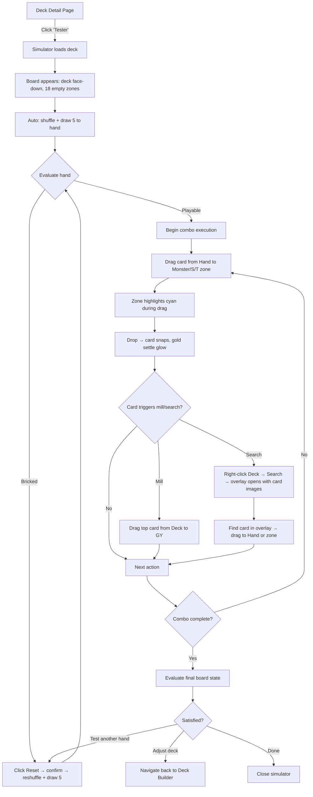
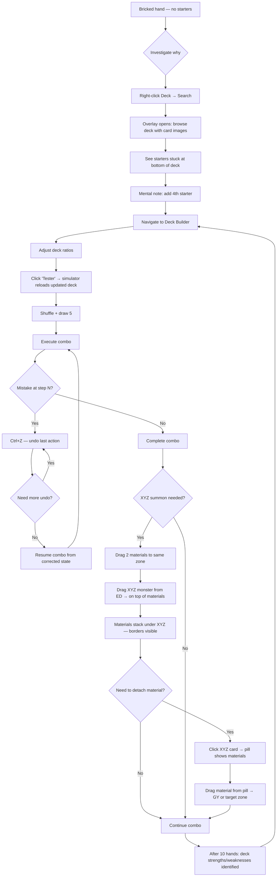
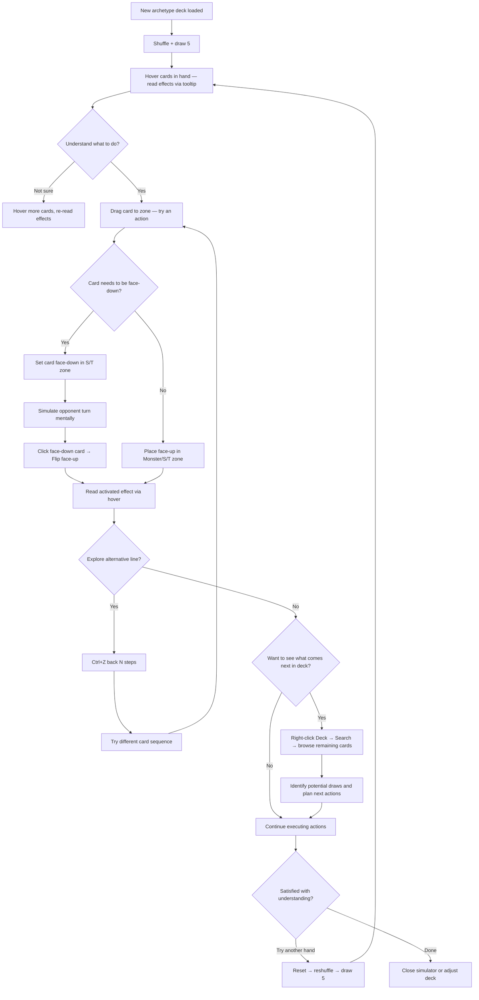

# UX Design Specification skytrix

**Author:** Axel
**Date:** 2026-02-08
**Last Revised:** 2026-02-12

### Revision History

| Date | Source | Changes |
|---|---|---|
| 2026-02-12 | Sprint Retro (Epics 1-5) | **A.** Fixed 16:9 aspect ratio layout with proportional scaling (Master Duel zoom-out style), replaces flexible CSS Grid responsive model. **B.** Face-down behavior rethought for solo context: inspector shows full details for face-down cards, ED overlay displays all cards face-up (no eye icon/grouping), deck/ED zones show card-back when count > 0. **C.** `preventDefault()` on right-click for entire board in all builds (incl. devMode); right-click gesture reserved for future custom context menu. **D.** Collapsible navbar: chevron toggle at navbar border, collapses to ~32px thin bar, collapsed by default on simulator page only. |

---

## Executive Summary

### Project Vision

A solo Yu-Gi-Oh! combo testing simulator integrated into the existing skytrix deck management application. The simulator provides a fully manual, visually polished game board where players can load any decklist, draw a hand, and execute card actions via drag & drop across 18 physical game zones. No rules engine — full manual control for maximum flexibility. Visual reference: Yu-Gi-Oh! Master Duel aesthetics.

The core workflow is: build deck → test combos → iterate — all within a single application, eliminating the need for external simulators like DB Grinder or EDOPro.

### Target Users

**Primary User:** Axel — solo developer and competitive Yu-Gi-Oh! player who builds and optimizes decks in skytrix. High technical proficiency. Desktop-first usage with short, repetitive testing sessions (5-10 hands per deck iteration).

**Usage Context:** Personal tool for personal use. Sessions are short and iterative — load deck, test hands, identify weaknesses, adjust deck, retest. The simulator must support rapid reset-and-retry cycles.

### Key Design Challenges

1. **Visual Density Management** — 18 zones on a single screen with a fixed 16:9 aspect ratio. The board scales proportionally to fit the available viewport space (Master Duel "zoom-out" style) — never scrolls, never deforms. The board must remain readable with 10+ cards in play. Clear visual hierarchy between primary zones (monster, spell/trap, hand) and secondary zones (banish, extra deck). Card details are always accessible via hover/inspector for readability at any scale.
2. **Action Discoverability** — Without a rules engine to guide the player, all available actions (mill, search, reveal, flip, toggle position, banish, return to hand/deck) must be intuitively discoverable through the interface. No tutorial — the UI must be self-explanatory.
3. **Drag & Drop Precision** — Targeting the correct zone among 18 while dragging a card. Visual feedback during drag (zone highlighting, capacity indicators) is critical to avoid frustrating mis-drops.
4. **Future Mobile Readiness** — While MVP is desktop-only, the fixed 16:9 scaling model naturally adapts to any screen size. Mobile will lock to landscape orientation (like Master Duel). Touch interaction (tap-to-place) is a post-MVP design effort.

### Design Opportunities

1. **Visual Polish as Differentiator** — Master Duel-inspired aesthetics set this apart from every existing combo testing tool. The visual quality becomes a reason to use skytrix over functional-but-ugly alternatives.
2. **Integrated Workflow Fluidity** — Seamless transition from deck builder to simulator and back. No competitor offers this integrated experience. The "Test" button from the deck detail page is a one-click bridge.
3. **Undo/Redo as Exploration Superpower** — Iterative combo exploration without full resets. Players can branch, backtrack, and explore alternative play lines — a capability no traditional simulator provides.

## Core User Experience

### Defining Experience

The simulator's core experience is defined by a single interaction: **dragging a card from one zone to another**. Every feature in the simulator — summoning, activating, milling, searching, banishing, returning — is a variation of moving a card between zones. If this one interaction is fluid, precise, and visually satisfying, the entire product succeeds.

The core loop is: **load deck → shuffle → draw 5 → execute combo via drag & drop → evaluate board → reset → retry**. This cycle must complete in seconds, not minutes. The simulator exists to answer one question fast: "does my combo work?"

### Platform Strategy

- **Primary Platform:** Desktop web (Angular 19 SPA) — mouse + keyboard interaction
- **Input Model:** Mouse-driven drag & drop as primary, keyboard shortcuts as accelerators
- **Hover Dependency:** Card tooltips on hover are integral to the experience — desktop-only capability leveraged fully
- **Screen Requirements:** The board has a fixed 16:9 aspect ratio and scales to fit the viewport via `transform: scale()`. No scrolling, no minimum size threshold — the board always fits. Letterboxing (empty space) filled by the app's existing background. Card details remain accessible at any scale via hover/inspector.
- **Future Mobile Consideration (Post-MVP):** The fixed 16:9 scaling model naturally adapts to any screen. Mobile will lock to landscape orientation (like Master Duel). Touch interaction requires a dedicated tap-to-place mode (post-MVP design). Pill and overlay interactions will need touch equivalents (tap, long press) in mobile version.
- **Offline:** Not required — deck data loaded at initialization, then all processing is client-side and ephemeral
- **No Backend Dependency:** Zero network calls during simulation — all state is local

### Effortless Interactions

1. **Drag & Drop as Natural Language** — Grab a card, drop it where you want. No context menus, no confirmation dialogs, no intermediate steps. The card goes where you put it.
2. **Drop Zone Illumination** — During drag, valid target zones highlight. The player instinctively knows where to drop without memorizing zone rules.
3. **Instant Undo** — Ctrl+Z works exactly like any editor. No "are you sure?" — just immediate reversal. Redo with Ctrl+Y.
4. **One-Click Reset** — Single button with brief confirmation returns to a fresh shuffled hand. Competitors require quitting and relaunching.
5. **Passive Card Info** — Hover to read card effects. No click needed, no mode to enter. Information is always one hover away.
6. **Automatic Zone Behavior** — Single-card zones reject drops when occupied (card returns to origin). No error messages — the interface just does the right thing.

### Pill Interaction System

Pills are contextual action buttons that provide access to stacked zone operations. They are a **minimal complement** to drag & drop, not a parallel interaction system. Pills exist only where drag alone cannot reach: **hidden cards inside stacked zones**.

**Zone Pills (Stacked Zones — Essential):**
- Appear on **click** (not hover) on stacked zones (deck, graveyard, banish, extra deck)
- Click trigger avoids accidental activations during drag operations across the board
- Primary purpose: open the pile view overlay to see and interact with stacked cards
- Zone-specific actions: Draw, Mill N, Shuffle, Search (deck); View (GY, banish, extra deck)
- These are the ONLY way to access hidden/stacked cards — essential for gameplay

**Card Pills (Board Cards — Nice-to-Have, Post-MVP-A):**
- Optional shortcut pills on hover over cards on the board (Send to GY, Banish, Flip, Toggle ATK/DEF)
- Not required for MVP-A — drag & drop already covers all card-to-zone movements
- Can be added as comfort layer if drag-only testing reveals friction points

**Pill-to-Drag Flow:**
- Zone pills open a **side or bottom overlay** (not fullscreen centered) to keep the board visible as a drag target
- Player selects a card in the overlay, then drags it to any target zone on the board
- This two-step flow (click opens access → drag completes placement) preserves drag-first philosophy
- The overlay position ensures drop zones remain accessible during the drag

**Display Rules:**
- Pills are NEVER permanently visible — they appear on click (zones) only
- A global `isDragging` flag suppresses all pill display during active drag operations — no distracting pop-ins while moving cards
- Pills disappear when the player starts dragging or clicks elsewhere
- The board remains visually clean at rest, interactive on engagement

### Critical Success Moments

1. **"This is better" Moment** — First drag & drop interaction. The card moves smoothly, the target zone highlights, the drop feels precise. The visual polish exceeds EDOPro and DB Grinder immediately.
2. **"This is what I needed" Moment** — First complete combo (10+ actions) executes without friction. The board matches the intended end state. The player knows the combo works.
3. **"Make or Break" Interaction** — A mis-drop or drag lag during a combo sequence. If undo is not instant and obvious, frustration kills the experience. The undo must be as fast as the mistake.
4. **"Why didn't this exist before" Moment** — Clicking "Test" from the deck page, landing directly in the simulator with the deck loaded. The integrated workflow is the unique value.
5. **"I can explore freely" Moment** — Using undo to backtrack 3 actions, trying an alternative line, then undoing again to try a third option. No fear, no penalty, pure exploration.
6. **"Stacked zones feel accessible" Moment** — Clicking the graveyard, seeing the pile in a side overlay, picking a card, and dragging it to the field — all in one fluid motion. Hidden cards are never out of reach.

### Experience Principles

1. **Drag-First** — Drag & drop is THE interaction mode. Everything is draggable, everywhere is droppable (where valid). Pills exist only where drag cannot reach (stacked zone access). Even stacked zone interactions conclude with a drag.
2. **Zero Friction Cycles** — The test-reset-retry cycle must be as fast as the player's thought. No friction between intention and action. Every transition (load, reset, draw) is near-instant.
3. **Visual Clarity Under Density** — 18 zones, 40+ cards — the board must remain readable. Strict visual hierarchy between primary zones (monsters, spells, hand) and secondary zones (banish, extra deck). Pills appear only on click, are suppressed during drag — the board stays clean.
4. **Forgiving Exploration** — Undo/redo makes every action reversible. The player explores without fear of "breaking" the board state. Mistakes are cheap, experimentation is encouraged.
5. **Progressive Disclosure** — The board at rest is minimal and uncluttered. Complexity reveals itself on interaction: pills appear on click, overlays open to the side, card details show on hover. The interface is as simple or as rich as the player needs in the moment.

## Desired Emotional Response

### Primary Emotional Goals

1. **Mastery & Control** — "I control every card, every action. Nothing escapes me." The simulator is a precision tool that responds exactly to the player's intent. Full manual control reinforces the feeling of expertise.
2. **Flow & Immersion** — "I don't think about the interface, only my combo." The UI disappears during play. Drag & drop is so fluid that the player's focus stays on card interactions, not on operating the tool.
3. **Confidence** — "My deck works, I proved it in 5 tests." The simulator transforms uncertainty into validated knowledge. After a testing session, the player knows their deck's strengths and weaknesses.
4. **Aesthetic Satisfaction** — "It's beautiful, it's a pleasure to play on." Master Duel-level visual polish turns every card placement into a micro-moment of delight. The board is a visual experience, not just a functional grid.
5. **Lucidity** — "My deck has a problem, now I know which one." Even negative results (bricked hands, failed combos) are successes of the tool. The simulator reveals truth about the deck — the design must frame negative outcomes as actionable insight, not discouragement.

### Emotional Journey Mapping

| Moment | Target Emotion |
|---|---|
| First visit — empty board with deck loaded | Recognition — the layout matches a familiar Yu-Gi-Oh! playmat. No learning needed, instant confidence. |
| Click "Test" from deck page | Anticipation — "let's see what this deck can do" |
| Initial hand of 5 displayed | Excitement or clarity — "I have my starters!" or "bricked, quick reset" |
| During combo execution (drag & drop) | Flow / immersion — the interface vanishes, only the combo matters |
| Final board state achieved | Satisfaction / pride — "my combo works, the board is clean" |
| Mid-combo mistake | Serenity (not frustration) — Ctrl+Z, resume. No big deal. |
| Board reset | Renewal — clean slate in 1 second, fresh start |
| After 5-10 test hands (positive) | Confidence — "I know my deck, its strengths and weaknesses" |
| After 5-10 test hands (negative — bricked) | Lucidity — "my deck has a ratio problem, I know what to fix". The ultra-fast reset cycle encourages retesting rather than abandoning. |
| Return to deck builder | Motivation — "I know exactly what to adjust" |

### Micro-Emotions

**Critical Emotional Pairs (desired > avoided):**

- **Recognition > Confusion** — First-time users instantly recognize the Yu-Gi-Oh! playmat layout. No tutorial needed, no learning curve for the board structure.
- **Confidence > Confusion** — Every zone is clear, every action is obvious. Never "what can I do here?"
- **Flow > Frustration** — Drag is precise, undo is instant. No friction that breaks the rhythm.
- **Satisfaction > Impatience** — Reset is instant, shuffle is fast. Never waiting.
- **Delight > Mere satisfaction** — Master Duel visual polish transforms a mundane action (placing a card) into a micro-moment of pleasure.
- **Lucidity > Discouragement** — Negative test results are framed as useful discovery, not failure. The ease of reset-and-retry turns disappointment into iteration.

### Design Implications

| Emotion | Supporting UX Choices |
|---|---|
| **Recognition** | Board layout mirrors standard Yu-Gi-Oh! playmat zones — familiar spatial arrangement eliminates onboarding |
| **Mastery** | 100% manual control, no imposed rules, all zones accessible, no artificial constraints |
| **Flow** | Drag & drop < 16ms, zero confirmation dialogs during play, non-intrusive pills, keyboard shortcuts |
| **Confidence** | Drop zone highlighting during drag, undo always available, card info on hover, clear zone labels |
| **Aesthetic Satisfaction** | Master Duel-inspired visuals, smooth placement animations, clean board at rest, polished card rendering |
| **Serenity on Error** | Instant undo, redo available, reset without penalty, silent rejection of invalid drops |
| **Lucidity** | Ultra-fast reset encourages retesting, seamless return to deck builder for adjustments |

### Emotional Design Principles

1. **The Interface Disappears** — During active play, the UI should be invisible. The player sees cards and zones, not buttons and borders. Chrome and controls fade to the background.
2. **Mistakes Are Free** — Every error is instantly reversible. The emotional cost of a wrong action is zero. This encourages bold exploration over cautious play.
3. **Flow > Beauty** — Aesthetic polish serves the rhythm, never the reverse. Animations must be < 100ms or interruptible by the next action. If a player drags a second card while the first is animating, the first animation completes instantly. Beauty is the spice, flow is the meal.
4. **Momentum Never Breaks** — No loading screens, no spinners, no "processing" states. Every action completes within the player's attention span. The combo rhythm is sacred.
5. **Recognition Over Learning** — The board layout mirrors the physical Yu-Gi-Oh! playmat that every player knows. Spatial familiarity replaces tutorials. First-time confidence is built through recognition, not instruction.
6. **Negative Results Are Wins** — The simulator reveals truth about a deck. Bricked hands are not failures — they are actionable data. The design encourages rapid iteration: reset fast, retest, adjust, repeat.

## UX Pattern Analysis & Inspiration

### Inspiring Products Analysis

**Yu-Gi-Oh! Master Duel (Primary Visual Reference):**
- Premium board aesthetics: dark atmospheric background with luminous zone accents
- Zones delimited by subtle borders — clean grid without visual heaviness
- Card rendering with shadow and elevation during interactions
- Stacked zone access via click on zone icon → overlay expansion
- Weakness to avoid: long, blocking animations during chain resolution

**Hearthstone (Primary Interaction Reference):**
- Gold standard for card game drag & drop — fluid, satisfying, physically weighted
- Cards follow the cursor with slight inertia, creating a tactile sensation
- Valid drop zones illuminate during drag — instant visual guidance
- Invalid drops return the card to origin with a smooth animation, zero error messages
- Minimalist board despite many elements — visual clarity under density
- Short, interruptible animations that never block the next action

**EDOPro / DB Grinder (Anti-Reference):**
- Functionally complete but visually austere — utility-first design
- Context menus (right-click → dropdown → select action) create unnecessary friction
- Information overload: counters, logs, and statuses always visible
- These represent the UX baseline to surpass — same functionality, radically better interaction

### Transferable UX Patterns

**Interaction Patterns:**
- **Physical drag feedback** (from Hearthstone) — card follows cursor with slight weight/inertia, creating a tactile sensation during drag. Reinforces the Mastery emotion.
- **Zone highlighting during drag** (from Hearthstone) — valid target zones illuminate, invalid zones stay neutral. Directly transferable to all 18 simulator zones. Supports Confidence emotion.
- **Silent invalid drop recovery** (from Hearthstone) — card returns to origin with smooth animation on invalid drop. No error toast, no dialog. Supports Serenity on Error emotion.
- **Click-to-expand stacked zones** (from Master Duel) — click on GY/deck/banish icon opens an overlay showing all cards. Maps directly to zone pills system.

**Visual Patterns:**
- **Atmospheric board** (from Master Duel) — dark background with luminous accents on active zones. The board has visual presence without distracting from cards. Supports Aesthetic Satisfaction emotion.
- **Subtle zone borders** (from Master Duel) — thin lines that define zones without creating a heavy grid. Borders can intensify during drag for guidance. Supports Visual Clarity Under Density principle.
- **Card elevation on drag** (from Hearthstone) — shadow and slight scale increase when a card is picked up, reinforcing the physical metaphor. Supports Flow & Immersion emotion.

**Navigation Patterns:**
- **Overlay for pile inspection** (from both) — side/bottom overlay shows stacked zone contents without obscuring the board. Player can drag from overlay to board. Supports Progressive Disclosure principle.

### Anti-Patterns to Avoid

1. **Context menus for card actions** (EDOPro pattern) — Right-click → dropdown menu → select action. Too many clicks, breaks flow. Replace with direct drag & drop.
2. **Blocking animations** (Master Duel pattern) — Animations that prevent the next action from starting. Violates Flow > Beauty principle. All animations must be < 100ms or interruptible.
3. **Permanent information overload** (DB Grinder pattern) — Counters, logs, and status indicators always visible. Violates Progressive Disclosure principle. Show information on demand only.
4. **Mid-game confirmation dialogs** (Hearthstone "end turn" pattern) — For a solo simulator with undo/redo and no consequences, zero confirmation dialogs during play. Only exception: board reset (destructive, clears undo stack).
5. **Tiny touch targets** (general mobile anti-pattern) — Even on desktop, zones must be large enough for precise drops. Future mobile adaptation requires generous tap targets.

### Design Inspiration Strategy

**Adopt As-Is:**
- Hearthstone's drag & drop feedback model (physical weight, zone highlighting, silent recovery)
- Master Duel's click-to-expand pattern for stacked zones
- Hearthstone's short, interruptible animation philosophy

**Adapt to Context:**
- Master Duel's atmospheric board aesthetic — adapted for an 18-zone board (denser than Master Duel's ~12 visible zones). Simplify visual effects to maintain performance.
- Card elevation/shadow effects — use CSS box-shadow and transform: scale() rather than complex shader-like effects. Performance-first adaptation.
- Overlay positioning — adapt to side/bottom placement (not centered fullscreen) to maintain board visibility during pill-to-drag flow.

**Explicitly Avoid:**
- EDOPro's context menu interaction model — replaced entirely by drag-first + pills
- Master Duel's blocking animation sequences — all animations are interruptible or < 100ms
- DB Grinder's utility-first visual approach — aesthetic polish is a core differentiator, not optional
- Any pattern that adds clicks between intention and action

## Design System Foundation

### Design System Choice

**Angular Material 19.1.1 (Existing) + Custom Simulator Theme**

The design system is predetermined by the brownfield context. skytrix already uses Angular Material with CDK. The simulator extends this foundation with a dedicated visual theme for the game board while reusing Material infrastructure for standard UI elements.

Zero new dependencies — Architecture decision enforced.

### Rationale for Selection

1. **Brownfield constraint** — Angular Material is already installed, themed, and used across the application. Adding a second design system would create inconsistency and bloat.
2. **CDK DragDrop** — The drag & drop infrastructure is part of Angular CDK, already installed. No alternative needed.
3. **Board is custom by nature** — No design system provides card game board components. The board layout, zone components, and card rendering are 100% custom regardless of design system choice.
4. **Material for standard UI** — Overlays, dialogs (reset confirmation), buttons (pills), tooltips — these are standard UI patterns where Material excels and is already in use.

### Implementation Approach

**Material Components Used in Simulator:**

| Component | Use Case |
|---|---|
| CDK DragDrop | All card drag & drop interactions, zone connections |
| CDK Overlay / mat-dialog | Pile inspection overlays (GY, banish, deck search, reveal) |
| mat-button | Zone pills (Draw, Mill, Shuffle, Search, View) |
| mat-icon | Zone labels, action indicators |
| mat-tooltip | Card detail on hover (reuses existing card-tooltip component) |
| mat-dialog | Reset confirmation dialog (only confirmation in the simulator) |

**Custom Components (No Material):**

| Component | Reason |
|---|---|
| Board layout (CSS Grid) | Unique 18-zone game board — no Material equivalent |
| Zone component | Custom zone rendering with capacity logic, dual-purpose Pendulum indicator |
| Stacked zone component | Card count badge + top card preview — game-specific rendering |
| Hand component | Ordered multi-card zone with free reordering — custom layout |
| Sim-card component | Card rendering (face-up/down, ATK/DEF rotation, drag handle) — game-specific |

### Customization Strategy

**Simulator Theme (SCSS Variables):**

A dedicated set of SCSS variables in `src/app/styles/` for the simulator page, coexisting with the existing app theme:

- **Board background:** Dark atmospheric tones (inspired by Master Duel) — deep navy/charcoal gradient
- **Zone borders:** Subtle luminous lines — low opacity at rest, intensified during drag hover
- **Zone highlighting:** Accent color glow on valid drop targets during drag
- **Card shadows:** Elevation effect on drag (box-shadow + slight scale transform)
- **Stacked zone badges:** Card count indicators with semi-transparent background
- **Pill buttons:** Compact, semi-transparent buttons that blend with the board aesthetic
- **Overlay backdrop:** Semi-transparent dark overlay that dims the board without hiding it

**Theme Isolation:**
- Simulator styles are scoped to the simulator page component (Angular ViewEncapsulation default)
- No impact on existing app theming
- Shared SCSS variables allow consistency with the broader skytrix palette where appropriate (accent colors, typography)

## Defining Core Experience

### Defining Experience

**"Drag cards across a Yu-Gi-Oh! board to test your combo in seconds."**

The simulator's identity is captured in one interaction: picking up a card and placing it exactly where you want on a familiar playmat. Every feature — mill, search, banish, summon, activate — is a variation of this single gesture. If the drag & drop feels perfect, the product succeeds. If it doesn't, nothing else matters.

### User Mental Model

**Current Problem-Solving:**
- Real duels (EDOPro, Master Duel) — must play a full game to test one combo. Relies on drawing the right hand by chance.
- Mental simulation — reading card effects and imagining sequences. Unreliable, error-prone for complex combos.

**Mental Model the Player Brings:**
- The Yu-Gi-Oh! playmat is hardcoded in muscle memory — zone positions are instinctive, not learned
- Combos are thought of as linear sequences with branches: normal summon → effect → mill → trigger → fusion
- Cards are physical objects to be picked up and placed — not data entries in a form
- The deck is a stack to draw from, the graveyard is a pile to browse — real-world metaphors apply directly

**Expectations:**
- The board looks like the playmat I know
- Moving a card = grab it and put it somewhere. Not "select → choose destination → confirm"
- The combo result is visible at a glance on the final board state
- If I make a mistake, I undo it like in any editor

### Success Criteria

| Criteria | Indicator |
|---|---|
| **"It just works"** | A card lands exactly where intended on first try. Zero mis-drops in a typical session. |
| **Feeling competent** | A 10-action combo executes in under 15 seconds with no pauses or hesitation. |
| **Correct feedback** | Card snaps into zone with subtle visual confirmation (glow/shadow settle). Board state updates instantly. |
| **Perceived speed** | Every action completes before the player thinks about the next one. No perceptible delay between intention and result. |
| **Automatic behavior** | Shuffle on init, card count updates, zone capacity enforcement, undo stack tracking — all invisible to the player. |
| **Session success** | After 5-10 hands, the player has a clear mental model of their deck's consistency and knows what to adjust. |

### Novel UX Patterns

**Established Patterns (Adopt — zero education needed):**
- Drag & drop card movement (Hearthstone convention)
- Playmat zone layout (Yu-Gi-Oh! convention — every player knows it)
- Click on stacked zone to inspect (Master Duel convention)
- Ctrl+Z / Ctrl+Y for undo/redo (universal convention)
- Keyboard shortcuts for frequent actions (universal convention)

**Innovative Combinations (Our twist — naturally discoverable):**
- **Pill-to-drag flow** — click stacked zone → overlay opens → pick card → drag to board. Combines two known conventions (click-overlay + drag-drop) into a new flow. Naturally discoverable: "I click to see, I drag to act."
- **Undo in a card simulator** — existing simulators have no undo. Applying the universal Ctrl+Z pattern to a card game is novel but requires zero education because the gesture is already known.

**Nothing requires a tutorial.** All patterns are either established conventions or natural combinations of known interactions.

### Experience Mechanics

**The Drag & Drop Interaction — Step by Step:**

**1. Initiation:**
- Player hovers a card → cursor changes to grab
- Player clicks and holds → card "lifts" (scale: 1.05, box-shadow increases)
- Board enters drag mode: valid zones illuminate, `isDragging` flag suppresses pills
- CDK creates a drag preview that follows the cursor

**2. Interaction:**
- Card follows cursor with slight physical weight (CDK drag constraint)
- Valid target zones glow with accent color on hover
- Invalid zones (occupied single-card) show no reaction — silent rejection
- Hand zone allows reordering (sorting enabled)
- The player's focus is on the destination, not the interface

**3. Feedback:**
- Drop on valid zone: card snaps into position (< 100ms transition), subtle glow settles
- Drop on invalid zone: card returns to origin with smooth animation (CDK default behavior)
- Board state signal updates → computed signals propagate → OnPush re-renders affected zones only
- Command pushed to undo stack (invisible to player, instant)

**4. Completion:**
- Card is placed, board reflects the new state immediately
- Player moves to next action — zero pause, zero confirmation
- Combo complete: player observes final board, evaluates result
- Next action: reset for another hand, undo to try alternative, or return to deck builder

## Visual Design Foundation

### Color System

**Palette Philosophy:** Dark atmospheric board inspired by Master Duel — the simulator has its own visual universe, independent from the main skytrix app theme. The board is a stage where cards are the stars.

**Dual-Accent System:**
- **Cyan `#00d4ff`** — Primary interactive accent. Used for: drag zone highlighting, active pills, focused elements, interactive borders. Cyan = "you can act here."
- **Gold `#d4a017`** — Secondary status accent. Used for: successful card placement glow (settle animation), full zone badges, completion feedback. Gold = "something happened here."

**SCSS Token Map:**

| Token | Value | Usage |
|---|---|---|
| `$sim-bg` | `#0a0e1a` | Board background base (deep navy) |
| `$sim-surface` | `#111827` | Zone surface, overlay background |
| `$sim-surface-elevated` | `#1e293b` | Elevated surfaces (cards, active overlays) |
| `$sim-accent-primary` | `#00d4ff` | Interactive elements — drag highlights, pills, focus |
| `$sim-accent-secondary` | `#d4a017` | Status/reward — placement glow, success feedback |
| `$sim-zone-border` | `rgba(#00d4ff, 0.15)` | Zone borders at rest — subtle, luminous |
| `$sim-zone-highlight` | `rgba(#00d4ff, 0.3)` | Valid drop zone highlight during drag |
| `$sim-zone-glow-success` | `rgba(#d4a017, 0.4)` | Card placement settle glow |
| `$sim-text-primary` | `#f1f5f9` | Primary text — high contrast on dark |
| `$sim-text-secondary` | `#94a3b8` | Secondary text — labels, counts |
| `$sim-error` | `#ef4444` | Semantic error (reserved, rarely used in solo context) |
| `$sim-overlay-backdrop` | `rgba(#0a0e1a, 0.7)` | Overlay backdrop — dims board without hiding it |

**Color Rule:** Maximum 3 active colors on the board at any moment (cyan + gold + card art). Semantic colors (red, orange) stay in background — almost never appear in solo simulator context.

### Typography System

**Single Font Family:** Roboto (already bundled with Angular Material — zero additional network requests, zero FOIT risk).

**Hierarchy through weight and size, not font variety:**

| Element | Size | Weight | Usage |
|---|---|---|---|
| Zone labels | `0.75rem` | 500 | Zone identification (Monster, S/T, GY...) |
| Card name (overlay) | `0.875rem` | 500 | Card names in pile inspection — scannable at speed |
| Card count badge | `0.75rem` | 700 | Stacked zone card count (bold for visibility at small size) |
| Pill button text | `0.8125rem` | 500 | Zone action pills (Draw, Mill, Shuffle...) |
| Overlay heading | `1rem` | 600 | Overlay titles (Graveyard, Banished, Search...) |
| Body/tooltip text | `0.875rem` | 400 | Card effect text, tooltips, descriptions |

**Typography Principle:** On the board, text is minimal — zone labels and card counts only. Card names and details appear in overlays and tooltips (Progressive Disclosure). The board speaks through card art and spatial position, not text.

### Spacing & Layout Foundation

**Base Unit:** 4px (aligned with Angular Material's density system).

**Board Gaps:** Defined in `rem` (not `px`) for future mobile scalability — gaps scale with viewport when rem base is adjusted.

**Spacing Tokens:**

| Token | Value | Usage |
|---|---|---|
| `$sim-gap-zone` | `0.5rem` | Gap between board zones (CSS Grid gap) |
| `$sim-gap-card` | `0.25rem` | Gap between cards within a zone (hand spacing) |
| `$sim-padding-zone` | `0.5rem` | Internal zone padding |
| `$sim-padding-overlay` | `1rem` | Overlay internal padding |
| `$sim-radius-zone` | `0.375rem` | Zone border radius (subtle rounding) |
| `$sim-radius-card` | `0.25rem` | Card border radius |

**Layout Principles:**
1. **Fixed 16:9 aspect ratio board** — The board is a fixed-ratio container that scales proportionally to fit the available viewport space (below the navbar area, when visible). Scaling is achieved via `transform: scale()` on the board container — a single scale factor applied to the entire board. The board floats over the app's existing background; empty space (letterboxing) uses the app background, not black bars.
2. **CSS Grid with named areas** — Inside the fixed-ratio container, each of the 18 zones has a named grid area. Zone dimensions use fixed proportions (not `fr` + `minmax()`), since the container itself handles viewport adaptation via scaling.
3. **Dynamic rescaling on navbar toggle** — The available viewport space changes when the collapsible navbar is shown/hidden. The board recalculates its scale factor dynamically to always fit within the available space, maintaining the 16:9 ratio.
4. **Overlay positioning** — Pile overlays open to the side or bottom (never centered fullscreen) to keep the board visible as a drag target during pill-to-drag flow.

### Accessibility Considerations

**Contrast Compliance:**
- Primary text (`#f1f5f9`) on board background (`#0a0e1a`): contrast ratio ~15.4:1 (exceeds WCAG AAA)
- Secondary text (`#94a3b8`) on board background: contrast ratio ~6.5:1 (exceeds WCAG AA)
- Cyan accent on dark surface: contrast ratio ~8.2:1 (exceeds WCAG AA for UI components)
- Gold accent on dark surface: contrast ratio ~7.1:1 (exceeds WCAG AA for UI components)

**Interaction Accessibility:**
- Zone highlighting during drag provides non-color feedback (border intensification + subtle glow spread)
- Card elevation on drag (shadow + scale) provides non-color depth cue
- Pill buttons meet minimum 44x32px touch target for future mobile adaptation
- Keyboard shortcuts (Ctrl+Z, Ctrl+Y, Ctrl+Shift+R) provide non-mouse interaction paths

## Design Direction Decision

### Design Directions Explored

Eight design directions were generated and evaluated via interactive HTML mockups:

1. **Master Duel Classic** — Subtle cyan borders, dark navy surfaces, atmospheric. Faithful to Master Duel premium aesthetics.
2. **Neon Arena** — Amplified neon glow, electric atmosphere. High visual intensity.
3. **Clean Minimal** — Near-invisible zones at rest, maximum card focus.
4. **Frosted Glass** — Glassmorphism, translucent panels, rounded corners. Modern/iOS aesthetic.
5. **Elevation Rich** — Depth through shadow only (no borders). Physical, layered feel.
6. **Bold Grid** — Thick geometric borders, uppercase labels. Blueprint precision.
7. **Ambient Glow** — Inner zone illumination, warm golden field zone. Magical atmosphere.
8. **Stealth Dark** — Invisible at rest, zones materialize on interaction only.

### Chosen Direction

**Direction 1: Master Duel Classic** — selected for its faithful balance between Master Duel premium aesthetics and functional clarity. Subtle cyan borders define zones without visual heaviness. Dark atmospheric surfaces create depth while keeping card art as the visual focus.

### Board Layout (Corrected)

The board uses a **7-column x 4-row CSS Grid**, matching the official Yu-Gi-Oh! playmat layout:

```
   .     |   .   | EMZ-L |   .   | EMZ-R |   .   | Banish
 Field   |  M-1  |  M-2  |  M-3  |  M-4  |  M-5  |   GY
   ED    | ST-1  |  ST-2 |  ST-3 |  ST-4 |  ST-5 |  Deck
Controls |              Hand (5 cols)              |   .
```

**Zone Notes:**
- **ST-1** doubles as **Pendulum Left** zone. **ST-5** doubles as **Pendulum Right** zone (per Master Rule 5).
- **EMZ-L** and **EMZ-R** are Extra Monster Zones, positioned above M-2 and M-4 respectively.
- **Controls row**: Undo / Redo / Reset buttons aligned left, Hand zone spans 5 central columns.
- **Deck** and **Extra Deck** display cards face-down by default.

**CSS Grid Template:**
```css
grid-template-areas:
  ".        .     emz-l   .      emz-r   .      banish"
  "field    m1    m2      m3     m4      m5     gy"
  "ed       st1   st2     st3    st4     st5    deck"
  "controls hand  hand    hand   hand    hand   .";
```

### Zone Interaction Rules

**One Zone = One Card** (with XYZ exception):
- Each Monster/S/T zone holds exactly one card (single-card zone behavior).
- **XYZ Exception:** An XYZ monster can have overlay materials stacked underneath. Materials are visually indicated by card borders peeking out below the XYZ card. Click on an XYZ card opens a pill showing all attached materials. Each material is individually draggable (detach material for XYZ effects).

**No Zone Restrictions:**
- Monsters CAN be placed in S/T zones (certain card effects require this).
- Cards CAN be dropped on the Main Deck (return to deck) or Extra Deck (Pendulum monsters return face-up).
- The simulator imposes no placement validation — full manual control.

**Stacked Zone Interactions:**
- **Deck / Extra Deck:** Right-click opens a small context menu (Shuffle, Search). No dedicated pill buttons for Mill — milling is done by dragging the top card from Deck to GY.
- **Graveyard / Banished:** Click opens side overlay with card list and card images. Cards are draggable from overlay to board.
- **Deck zone** — displays card-back image when `count > 0` (never appears visually empty). **Extra Deck overlay** — all cards displayed face-up (solo context: ED contents are known to the owner). No eye icon, no "face-down" grouping.

**Card Images in Overlay:**
- When a pile overlay (GY, Banished, Deck search) is open, card images are displayed alongside card names for visual identification. Design to be tested and iterated.

### Design Rationale

1. **Master Duel Classic** aligns directly with the project's stated visual reference (Master Duel premium aesthetics) without overcommitting to flashy effects that could distract during fast combo sequences.
2. The subtle border approach supports visual density management — 18 zones remain distinct without creating a heavy grid that competes with card art.
3. The atmospheric dark background reinforces the "board as stage" metaphor where cards are the visual focus.
4. Direction 1 is the most natural starting point — it can be refined toward more glow (Direction 7) or more minimalism (Direction 3) based on real usage feedback.

### Implementation Approach

**Template-Ready CSS Architecture:**
- All grid areas defined as SCSS variables for easy layout changes (future mobile, alternative layouts).
- Zone positions parameterized — swapping EMZ positions or adding zones requires only grid-template changes, no component restructuring.
- Card aspect ratios and zone proportions defined as tokens for consistent scaling.

**XYZ Overlay Material Rendering:**
- Materials rendered as stacked elements with `position: absolute` offset (2-3px per material) showing only the card border edge.
- Click handler on XYZ card toggles a pill overlay listing all attached materials.
- Each material in the pill is a CDK drag source, enabling detach-to-zone operations.

**Right-Click Context Menu:**
- CDK Overlay triggered on `contextmenu` event for Deck and Extra Deck zones.
- Minimal menu: Shuffle, Search (Deck) / View (Extra Deck).
- Menu dismissed on click outside or on action selection.

**Overlay with Card Images:**
- Pile inspection overlays display card thumbnail + card name per row.
- Card image loaded from existing skytrix card image service.
- Layout: card image (small) | card name | drag handle — each row is a CDK drag source.

## User Journey Flows

### Journey 1: The Combo Builder (Happy Path)

**Entry:** Deck detail page → click "Tester" button
**Goal:** Validate that a turn-1 combo works in 5-10 test hands

**Flow:**



**Key Interactions:**
- **Drag from Hand → Zone:** Card lifts (scale 1.05), valid zones highlight cyan, drop snaps with gold glow
- **Mill:** No button — drag the visible top-card of the Deck directly to GY
- **Search Deck:** Right-click Deck → context menu "Search" → side overlay with card images → drag to destination
- **GY trigger:** Click GY zone → side overlay opens → see card with image → drag to field or banish
- **Reset:** Single button with brief confirmation → clears board, reshuffles, draws 5

### Journey 2: The Optimizer (Iteration & Edge Cases)

**Entry:** Mid-session after a bricked hand or failed combo
**Goal:** Diagnose deck weakness and iterate deck construction

**Flow:**



**Key Interactions:**
- **Undo chain:** Ctrl+Z repeatedly rewinds action by action. Ctrl+Y to redo. No limit during session.
- **XYZ summon flow:** Place 2+ materials in a zone → place XYZ on top. Materials visually stack (borders peeking). Click XYZ card → pill overlay shows materials → each material draggable for detach.
- **Deck Search investigation:** Right-click Deck → Search. Overlay shows all remaining cards with images. Does NOT remove cards — just visual inspection. To actually take a card: drag from overlay to hand/zone.
- **Iterative loop:** Simulator ↔ Deck Builder. "Tester" button always loads the current deck state.

### Journey 3: The Explorer (Learning New Archetype)

**Entry:** New deck created with unfamiliar archetype
**Goal:** Understand card interactions and discover combo lines

**Flow:**



**Key Interactions:**
- **Heavy hover usage:** Tooltip shows card image + full effect text. Essential for learning unfamiliar cards.
- **Face-down / Flip:** Drag card to S/T zone face-down (toggle via right-click or card pill). Click to flip face-up later.
- **Exploratory undo:** Ctrl+Z is the exploration superpower. Undo 5 actions, try different line, undo again. Zero penalty.
- **Deck browse:** Right-click Deck → Search is a non-destructive peek for learning what's in the deck.

### Journey Patterns

**Common Patterns Across All Journeys:**

| Pattern | Description | Used In |
|---|---|---|
| **Drag-to-zone** | Primary interaction — grab card, drop on target zone with visual feedback | All journeys |
| **Pile inspection** | Click stacked zone or right-click Deck → overlay with card images + drag sources | All journeys |
| **Undo chain** | Ctrl+Z reverses actions one by one, enabling exploration and error recovery | Journey 2, 3 |
| **Reset cycle** | Quick board reset → reshuffle → draw 5 for next test hand | Journey 1, 2 |
| **Hover-to-learn** | Card tooltip provides effect text without interrupting flow | Journey 1, 3 |
| **Context menu** | Right-click on Deck/ED for Shuffle, Search. Minimal, non-intrusive | Journey 1, 2, 3 |
| **XYZ material management** | Click XYZ → pill shows materials → drag to detach | Journey 2 |

**Navigation Pattern:**
- **Entry:** Always from Deck Detail page via "Tester" button
- **Exit:** Back to Deck Builder (for adjustments) or close simulator
- **Loop:** Simulator ↔ Deck Builder is the primary iteration cycle

### Flow Optimization Principles

1. **Zero-step mill** — No button, no menu. Drag top card from Deck to GY. One gesture replaces three clicks.
2. **Undo as exploration, not error correction** — Undo is a creative tool, not a safety net. The flow encourages branching: try line A, undo, try line B, compare.
3. **Right-click economy** — Context menus ONLY on Deck and ED zones (Shuffle, Search). No right-click elsewhere. Keeps the interaction space predictable.
4. **Overlay as drag source** — Every card in an overlay (GY, Banished, Deck Search) is immediately draggable. No "select then place" — see it, grab it, drag it.
5. **XYZ material peek** — Materials are always subtly visible (border peek). Full inspection requires one click. Detach requires one drag. Minimum friction for a complex mechanic.
6. **Hover is passive, click is active** — Hover = read information (tooltip). Click = open interaction (pills, overlays, flip). Clear mental model: looking vs. doing.

## Component Strategy

### Design System Components

**Angular Material 19.1.1 + CDK — Available Foundation:**

| Component | Usage in Simulator |
|---|---|
| `mat-icon` | Zone labels, control bar icons, overlay action icons |
| `mat-button` / `mat-icon-button` | Control bar (Undo, Redo, Reset), overlay action buttons |
| `mat-menu` | Right-click context menu on Deck and Extra Deck (Shuffle, Search) |
| `mat-tooltip` | Card name preview on hover (lightweight, non-blocking) |
| `mat-badge` | Card count badges on stacked zones (GY, Banished, Deck, ED) |
| `CDK DragDrop` | Core drag & drop interaction — `cdkDrag`, `cdkDropList`, `cdkDropListGroup` |
| `CDK Overlay` | Pile overlays (GY, Banished, Search), XYZ material pill |

**Gap Analysis — Components NOT Available in Angular Material:**

| Need | Gap | Solution |
|---|---|---|
| Game board grid | No game board component | Custom `SimBoardComponent` with CSS Grid named areas |
| Single-card zone | No card slot component | Custom `SimZoneComponent` — drag target + card display |
| Stacked zone (GY, Deck) | No pile/stack component | Custom `SimStackedZoneComponent` with `StackedZoneConfig` |
| Hand fan layout | No horizontal card fan | Custom `SimHandComponent` — drag-reorderable card row |
| Card rendering | No game card component | Custom `SimCardComponent` — image, position, drag source |
| XYZ material peek | No stacked indicator | Custom `SimXyzMaterialPeekComponent` — material borders + pill |
| Pile inspection overlay | CDK Overlay exists, but no card list pattern | Custom `SimPileOverlayComponent` — card image + name + drag row |
| Undo/Redo/Reset bar | No game control bar | Custom `SimControlBarComponent` — session controls |
| Card effect inspector | No card detail panel for game context | Custom `SimCardInspectorComponent` — hover-triggered side panel |

### Custom Components

#### SimBoardComponent (Root Container)

**Purpose:** Root component that renders the fixed 16:9 aspect ratio board container and orchestrates all child zones. The container scales via `transform: scale()` to fit the available viewport space (accounting for navbar visibility). Inside, a 7x4 CSS Grid renders the 18 zones.
**Content:** 18 zones rendered via named grid areas. Injects `BoardStateService` for zone data. Computes scale factor reactively based on viewport dimensions and navbar state.
**Actions:** Handles global keyboard shortcuts (Ctrl+Z, Ctrl+Y). Manages `isDragging` signal suppression for pills.
**States:** Default (board ready), Loading (deck loading), Empty (no deck loaded).
**Variants:** None — single layout. The board scales proportionally, never changes structure.
**Accessibility:** `role="application"`, `aria-label="Yu-Gi-Oh simulator board"`. Keyboard shortcut hints in control bar.

#### SimZoneComponent (Single-Card Zone)

**Purpose:** Renders a single-card zone (Monster, S/T, EMZ, Field). Serves as a CDK drop target.
**Content:** One card (via `SimCardComponent`) or empty state with zone label.
**Actions:** Drop target for drag operations. Delegates card interactions to `SimCardComponent`.
**States:** Empty (zone label visible), Occupied (card displayed), Drag-hover (cyan highlight when valid drop target), Drag-active (card being dragged out).
**Variants:** Configured via `zoneType` input — `'monster'`, `'spell-trap'`, `'emz'`, `'field'`. Visual styling adapts (field zone has subtle distinct border). **SimFieldZoneComponent eliminated** — `SimZoneComponent` with `zoneType: 'field'` handles all cases.
**Accessibility:** `role="listbox"`, `aria-label` with zone name (e.g., "Monster Zone 3"). Drop feedback announced via `aria-live`.

#### SimStackedZoneComponent (Multi-Card Zone)

**Purpose:** Renders stacked zones (Deck, Extra Deck, Graveyard, Banished) with card count badge and interaction triggers.
**Content:** Top card preview (or card back image for face-down zones). When `count > 0`, the zone must always display a card-back image — never appear visually empty. Card count badge, context menu trigger.
**Actions:** Click → open pile overlay. Right-click on Deck/ED → `mat-menu` context menu (Shuffle, Search). Drag from top card (Deck → GY for mill).
**States:** Empty (0 cards — dimmed), Has-cards (badge visible), Overlay-open (pill active).
**Configuration:** Uses `StackedZoneConfig` pattern instead of component variants:

```typescript
interface StackedZoneConfig {
  zoneType: 'deck' | 'extra-deck' | 'graveyard' | 'banished';
  faceDown: boolean;           // Deck=true (card-back displayed when count>0), ED=false (all face-up in overlay, solo context), GY=false, Banished=mixed
  contextMenu: boolean;        // true for Deck, ED
  contextMenuItems: string[];  // ['shuffle', 'search'] for Deck
  clickAction: 'overlay' | 'none';  // GY/Banished → overlay, Deck → top-drag
  topCardDraggable: boolean;   // true for Deck (mill), false for GY
}
```

**Context menu:** Uses `mat-menu` directly — **SimContextMenuComponent eliminated** as unnecessary abstraction.
**Banished face-down cards:** Visible to player but visually distinct (card back image + subtle "face-down" indicator icon). Separate visual group within the pile overlay.
**Accessibility:** `aria-label` with zone name + card count. Context menu keyboard accessible via Shift+F10.

#### SimHandComponent (Hand Zone)

**Purpose:** Horizontal card row with drag reordering support. Spans 5 grid columns.
**Content:** 0-N cards rendered as `SimCardComponent` instances. Cards face-up to player.
**Actions:** Drag cards to board zones, drag to reorder within hand, receive cards from board/overlays.
**States:** Empty (subtle placeholder), Has-cards (cards displayed with spacing), Drag-reorder (CDK sort animation active).
**Variants:** None — single responsive layout.
**Accessibility:** `role="listbox"`, cards are `role="option"`. Arrow keys for card navigation.

#### SimCardComponent (Individual Card)

**Purpose:** Renders a single card with image, position state, and drag behavior. **Owns XYZ material peek responsibility** — if the card is an XYZ monster with materials, it renders the material border peek and handles the material pill trigger.
**Content:** Card image (from existing skytrix card image service), position indicator (ATK/DEF orientation), face-up/face-down state.
**Actions:** Drag source (CDK `cdkDrag`). Click → card interaction (flip, position change). Hover → tooltip with card name. If XYZ with materials: click → opens `SimXyzMaterialPeekComponent` pill.
**States:** Face-up ATK (vertical), Face-up DEF (horizontal), Face-down DEF (horizontal, card back image — must display the Yu-Gi-Oh! card back, never invisible/empty), Dragging (elevated, semi-transparent origin), XYZ-with-materials (border peek visible below).
**Variants:** Board card vs. hand card vs. overlay card (sizing and interaction differ).
**Interaction:** Hover shows slight image enlargement for visual confirmation before click/drag.
**Accessibility:** `role="option"`, `aria-label` with card name and position. `aria-grabbed` during drag.

#### SimXyzMaterialPeekComponent (XYZ Material Management)

**Purpose:** Shows XYZ overlay materials as a pill/dropdown when an XYZ card is clicked. Each material is a drag source for detach operations.
**Content:** List of attached material cards (image thumbnail + name). Material count badge.
**Actions:** Each material row is a CDK drag source — drag to GY (detach) or other zone.
**States:** Hidden (default), Open (pill visible with material list), Animating (material being dragged out).
**Variants:** None.
**Technical Note:** Uses CDK Overlay positioned relative to the XYZ card. Must share `cdkDropListGroup` with board zones for cross-container drag — **flagged as technical risk requiring early spike**.
**Accessibility:** `role="listbox"` for material list, `aria-label` per material.

#### SimPileOverlayComponent (Pile Inspection)

**Purpose:** Side overlay that opens when a stacked zone is clicked. Shows all cards in the pile with images. Cards are draggable to board zones.
**Content:** Card list with image thumbnail + card name per row. Scrollable for large piles.
**Actions:** Each card row is a CDK drag source. Search mode adds a filter input. Close button or click-outside to dismiss.
**States:** Closed, Open-browse (GY, Banished — all cards visible face-up), Open-search (Deck search — filter input active, deck shuffled after close), Open-view (ED — all cards displayed face-up, no "face-down" grouping, no eye icon. In Yu-Gi-Oh!, the Extra Deck contents are known to the owner — only hidden from opponent. Solo context: no separation needed).
**Variants:** Mode determined by source zone (browse/search/view).
**Technical Note:** Overlay positioning avoids covering the board center — opens to the side. Must share `cdkDropListGroup` with board for drag-to-board. Same technical risk as XYZ material pill.
**Accessibility:** `role="dialog"`, `aria-modal="true"`, focus trap when open. Filter input `aria-label="Search cards"`.

#### SimCardInspectorComponent (Card Effect Reader)

**Purpose:** Fixed side panel that displays full card details on hover. Replaces the existing skytrix white tooltip with a dark-themed, simulator-integrated inspector. Allows reading card effects without interrupting gameplay flow.
**Content:** Full-size card image, card name, attribute icon + race icon + level/rank/link, ATK/DEF values, full effect description text (scrollable). No deck-building buttons (+1/-1) — simulator context only.
**Trigger:** Hover on any face-up `SimCardComponent` (board, hand, or overlay) updates the `hoveredCard` signal in `BoardStateService`. Inspector reacts to this signal.
**Position:** Fixed panel on the right side of the viewport, overlaying the board edge. Not part of the CSS Grid — uses `position: fixed` with `$sim-surface` background and subtle left border. Appears/disappears with a fast fade transition (~100ms).
**States:** Hidden (no card hovered, or `isDragging` active), Visible (card hovered — image + stats + effect text displayed).
**Suppression:** Hidden when `isDragging` is true — reading effects during drag would obstruct the interaction. Reappears when drag ends.
**Styling:** `$sim-surface` background, `$sim-text-primary` for card name and effect text, `$sim-text-secondary` for stat labels. Card image uses existing `CardImageDTO.url` (full resolution). Effect text rendered via `[innerHTML]` with `<br>` formatting (same as existing `CardDTO.description` preprocessing).
**Face-down cards:** Inspector shows **full card details** (image, name, stats, effect text) even for face-down cards. In a solo simulator, the player knows all their own cards — hiding information serves no purpose. The card's face-down *positional state* on the board is a gameplay choice, not an information barrier.
**Accessibility:** `role="complementary"`, `aria-label="Card inspector"`, `aria-live="polite"` for content updates on hover change.

#### Collapsible Navbar

**Purpose:** The app navbar can be collapsed to maximize board space. On the simulator page, the navbar starts **collapsed by default**. On all other pages, the navbar remains expanded by default.

**Toggle Mechanism:**
- A **chevron button** positioned at the border between the navbar and the main content area, acting as a visual "tab" or "handle"
- Navbar expanded → chevron points **up** (↑ = "collapse"). Navbar collapsed → chevron points **down** (↓ = "expand")
- The chevron remains visible in both states

**Collapsed State:**
- The navbar collapses to a **thin bar (~32px height)** containing only the chevron toggle button
- No logo, no text, no navigation links — just the toggle control
- The thin bar provides a persistent affordance to re-expand

**Expanded State:**
- Full navbar as it exists today — all navigation links, logo, etc.

**Board Interaction:**
- When the navbar collapses/expands, the available viewport space changes
- The board's `transform: scale()` factor recalculates dynamically to fit the new available space, maintaining the 16:9 ratio
- Transition should be smooth (~200ms) with the board rescaling in sync

**Scope:**
- Collapsed-by-default behavior applies **only to the simulator page**
- Other pages (deck builder, deck list, etc.) retain the expanded navbar by default
- The user's toggle choice is ephemeral (not persisted across page navigations)

#### SimControlBarComponent (Session Controls)

**Purpose:** Undo / Redo / Reset buttons positioned in the controls grid area (bottom-left).
**Content:** Three icon buttons with tooltips. Optional action count indicators.
**Actions:** Undo (Ctrl+Z), Redo (Ctrl+Y), Reset (Ctrl+Shift+R with confirmation dialog).
**States:** Undo-available / Undo-disabled (stack empty), Redo-available / Redo-disabled, Reset always available.
**Variants:** None.
**Accessibility:** `aria-label` per button, keyboard shortcuts announced in tooltips.

### Component Implementation Strategy

**Architecture Principles:**

1. **All standalone components** — No NgModule. Each component is self-contained with explicit imports.
2. **OnPush change detection everywhere** — Signal-based reactivity. Components react to `BoardStateService` signals.
3. **`isDragging` and `hoveredCard` global signals** — Live in `BoardStateService` (not cascaded via `@Input`). `isDragging` suppresses pills, overlays, and card inspector during drag. `hoveredCard` drives the `SimCardInspectorComponent` reactively.
4. **`StackedZoneConfig` over variants** — One `SimStackedZoneComponent` configured per zone type via a config object, not separate components per zone.
5. **CDK `cdkDropListGroup` sharing** — Board zones, hand, overlays, and XYZ material pills all belong to the same drop list group. This enables cross-container drag (overlay → board, material pill → GY). **Early technical spike recommended** to validate CDK Overlay + DragDrop interop.
6. **Existing card image service** — Card images loaded from skytrix's existing `CardImageDTO` / `ImgLoaderDirective` infrastructure. No new image loading logic.

**Component Hierarchy:**

```
SimBoardComponent (root grid)
├── SimZoneComponent × 13 (MZ1-5, ST1-5, EMZ-L, EMZ-R, Field)
│   └── SimCardComponent (0-1 per zone)
│       └── SimXyzMaterialPeekComponent (conditional, XYZ only)
├── SimStackedZoneComponent × 4 (Deck, ED, GY, Banished)
│   └── SimPileOverlayComponent (conditional, on click/context-menu)
├── SimHandComponent (1)
│   └── SimCardComponent × N (0-N cards in hand)
├── SimControlBarComponent (1)
└── SimCardInspectorComponent (1, fixed position, hover-driven)
```

### Implementation Roadmap

**Phase 1 — MVP-A Core (Critical Path):**

- `SimBoardComponent` — CSS Grid layout, zone rendering, keyboard shortcut capture
- `SimZoneComponent` — Drop target, card display, zone highlighting during drag
- `SimCardComponent` — Card image, drag source, face-up/down/ATK/DEF states
- `SimHandComponent` — Card row with drag reordering
- `SimStackedZoneComponent` — Card count badge, top card display, click trigger
- `SimControlBarComponent` — Undo/Redo/Reset with keyboard shortcuts
- `SimCardInspectorComponent` — Hover-triggered side panel with card image, stats, and effect text

**Phase 2 — MVP-A Complete (Full Interaction):**

- `SimPileOverlayComponent` — Side overlay with card images and drag-to-board
- `SimXyzMaterialPeekComponent` — Material pill with drag-to-detach
- Context menu integration (`mat-menu` on Deck/ED for Shuffle, Search)
- **CDK DragDrop + Overlay interop spike** — Validate `cdkDropListGroup` sharing across overlay boundaries

**Phase 3 — Post-MVP Enhancements:**

- `SimTokenComponent` — Token creation UI and token card rendering (post-MVP)
- `SimCounterBadgeComponent` — Counter management on face-up cards (post-MVP)
- Card pills on board cards — Quick-action pills on individual cards (post-MVP)
- Card effect tooltip — Enhanced tooltip with full card text and image (informed by existing skytrix tooltip pattern)

## UX Consistency Patterns

### Drag & Drop Patterns

**Drag Initiation:**
- Hover on any face-up card → cursor changes to `grab`
- `hoveredCard` signal updates in `BoardStateService` with **50ms debounce** — prevents flicker during fast mouse traversal across multiple cards, and naturally suppresses hover events during drag (since drag starts before debounce fires)
- Click and hold → card "lifts" (scale: 1.05, box-shadow increase), `isDragging` signal set to `true`
- Board enters drag mode: valid zones illuminate with `$sim-zone-highlight`, pills/overlays/inspector suppressed

**During Drag:**
- Card preview follows cursor via `cdkDragPreviewContainer: 'global'` — ensures correct z-index when dragging from overlays or pills that use CDK Overlay (overlay has high z-index, preview must be above it)
- Valid target zones glow cyan (`$sim-zone-highlight`) on hover
- Invalid zones (occupied single-card zones) show **no reaction** — silent rejection. No card replacement allowed; player must clear the zone first (drag existing card away, then place new card)
- Hand zone supports reordering (CDK sort animation)

**Cross-Container Drag:**
- `cdkDropListGroup` directive placed on `SimBoardComponent` root element — all drop lists (board zones, hand, overlay card rows, XYZ material pill rows) are children of this group
- This enables drag from overlay → board, material pill → GY, hand → zone, zone → zone without explicit `cdkDropListConnectedTo` wiring
- Dynamic overlays (pile overlays, XYZ pills) automatically join the group as children of the root component

**Drop Behavior:**
- Drop on valid zone: card snaps into position (< 100ms transition), gold settle glow via CSS `@keyframes` + `.zone--just-dropped` class (removed after animation completes — pure CSS, no Angular signal needed)
- Drop on invalid zone: card returns to origin with smooth animation (CDK default revert behavior)
- Board state signal updates → computed signals propagate → OnPush re-renders affected zones only
- Command pushed to undo stack

**Drag from Overlay:**
- Source pile overlay **stays open** during drag-from-overlay — allows multi-card operations (e.g., drag 3 cards from GY to board without re-opening overlay each time)
- Overlay closes automatically **after the last drop** if user clicks outside or interacts elsewhere
- Other overlays remain suppressed during drag (only source overlay stays)

### Overlay & Panel Patterns

**Pile Overlay Lifecycle:**
- Click on stacked zone → pile overlay opens to the side (never centered fullscreen)
- Opening a **new** pile overlay **auto-closes** the currently open overlay — maximum one pile overlay visible at a time
- Overlay stays open during drag-from-overlay; closes after drop if user navigates away
- Click-outside or Escape key → overlay closes
- Empty stacked zone click → opens empty overlay with subtle message ("No cards in [zone name]") — confirms the zone interaction works and avoids "nothing happened" confusion

**Card Inspector Panel:**
- Fixed panel on right side of viewport, driven by `hoveredCard` signal (50ms debounced)
- When a pile overlay is open on the right side → inspector **repositions to the left** via a computed signal (`inspectorPosition = overlay.isOpen && overlay.side === 'right' ? 'left' : 'right'`) — no OverlayPositionService needed, pure reactive computation
- Hidden when `isDragging` is `true` — reappears when drag ends
- Face-down cards: inspector shows **full card details** (solo context — player knows all own cards)

**Overlay Z-Index Hierarchy:**
1. Drag preview (highest — `cdkDragPreviewContainer: 'global'`)
2. Context menus (`mat-menu` CDK Overlay)
3. Pile overlays (`SimPileOverlayComponent`)
4. Card inspector (`SimCardInspectorComponent` — `position: fixed`)
5. Board zones (base level)

### Context Menu Patterns

**Stacked Zone Context Menu (Deck, Extra Deck):**
- Trigger: `contextmenu` event (right-click) on `SimStackedZoneComponent`
- Uses `mat-menu` directly — no custom component wrapper
- Deck menu items: **Shuffle**, **Search** (opens pile overlay in search mode)
- Extra Deck menu items: **View** (opens pile overlay in view mode)
- Menu dismissed on item selection or click-outside

**Board Card Context Menu (Card State Toggle):**
- Trigger: `contextmenu` event (right-click) on `SimCardComponent` **when on the board** (not in hand or overlay)
- Uses `mat-menu` with contextual items based on current card state:
  - Face-up ATK position → options: **Flip face-down**, **Change to DEF**
  - Face-up DEF position → options: **Flip face-down**, **Change to ATK**
  - Face-down DEF position → options: **Flip face-up (ATK)**, **Flip face-up (DEF)**
- Card state change is a board state command → pushed to undo stack
- Menu items are dynamic, computed from current card state signal

**Context Menu Production Rule:**
- `event.preventDefault()` on `contextmenu` event on the **entire board**, in **all builds** (including `isDevMode()`). The native browser context menu is never shown on the board — it breaks drag & drop flow and is not useful during simulator interaction.
- The **navbar** retains the native browser context menu (useful for debugging links, navigation, etc.).
- **Right-click gesture reserved:** The right-click on the board is blocked from native behavior but the gesture is reserved for a future custom context menu (e.g., card quick-actions). Not implemented now — just ensure `preventDefault()` is in place so the gesture is available later.

### Feedback & State Indication Patterns

**Card Placement Feedback (Gold Glow):**
- On successful drop: target zone receives `.zone--just-dropped` CSS class
- CSS `@keyframes` animation: gold glow (`$sim-accent-secondary`) fades from 0.4 opacity to 0 over ~400ms
- Class removed after animation completes (via `animationend` event listener)
- Pure CSS approach — no Angular signal, no timer, no subscription

**Drag Zone Highlighting:**
- Valid zones: `$sim-zone-highlight` (cyan at 0.3 opacity) + border intensification
- Invalid/occupied zones: no visual change — silent rejection
- Hand zone: accepts drops (return to hand) with cyan highlight

**Card State Indicators:**
- Face-up ATK: card vertical, full image visible
- Face-up DEF: card rotated 90° (horizontal), full image visible
- Face-down: card back image displayed on the board (must never appear invisible/empty). Inspector shows full card details regardless (solo context — player knows all own cards)
- XYZ with materials: 2-3px offset card borders visible below the XYZ card

**Stacked Zone Badges:**
- `mat-badge` with card count, always visible when count > 0
- Badge uses `$sim-accent-primary` (cyan) background
- Count updates reactively via computed signal from board state

### Keyboard Shortcut Patterns

**Defined Shortcuts:**

| Shortcut | Action | Scope |
|---|---|---|
| `Ctrl+Z` | Undo last board action | Global (captured by `SimBoardComponent`) |
| `Ctrl+Y` | Redo last undone action | Global |
| `Escape` | Close active overlay/menu | Global |

**Reset — No Keyboard Shortcut:**
- Reset is button-only (`SimControlBarComponent`) — **no keyboard shortcut assigned**
- `Ctrl+Shift+R` conflicts with browser hard refresh across Chrome/Firefox/Edge — assigning it would either fail silently or trigger unintended browser behavior
- Reset requires confirmation dialog, making a shortcut less useful (still needs mouse click to confirm)

**Shortcut Principles:**
- All shortcuts captured at `SimBoardComponent` level via `@HostListener('document:keydown')`
- Shortcuts disabled when focus is in a text input (e.g., pile overlay search filter)
- Shortcut hints displayed as tooltips on `SimControlBarComponent` buttons

### Loading & Empty State Patterns

**Empty Stacked Zone:**
- Visual: dimmed zone with zone label, no card image, badge hidden (count = 0)
- Click: opens empty overlay with subtle message — e.g., "No cards in Graveyard" — confirms zone works, avoids "nothing happened" confusion
- Same overlay component, just empty content state

**Empty Hand:**
- Visual: dashed border only (subtle `$sim-zone-border` with `border-style: dashed`)
- No placeholder text — dashed border is sufficient visual affordance
- Drop target remains active (cards can be returned to empty hand)

**Deck Loading State:**
- Brief loading indicator while deck data loads from skytrix API
- Board zones render immediately (empty state) — cards populate once data arrives
- Shuffle + draw 5 animation plays after load completes

**Undo/Redo Stack States:**
- Undo stack empty → Undo button disabled (dimmed icon, `aria-disabled`)
- Redo stack empty → Redo button disabled
- **Undo scope: board state only** — undo does NOT re-open previously closed overlays, does NOT restore inspector state, does NOT reverse UI-only actions (opening/closing panels). Undo reverses card movements, position changes, and zone state changes exclusively

## Responsive Design & Accessibility

### Responsive Strategy

**Approach:** Fixed 16:9 aspect ratio with proportional scaling (Master Duel "zoom-out" model). The board is a fixed-size internal layout that scales via `transform: scale()` to fit the available viewport space. No breakpoint-based layout changes — the board structure is identical at every viewport size. Card details remain accessible at any scale via hover/inspector.

**Key Principle:** The board never scrolls, never changes grid structure, and never hides zones. The only variable is the scale factor. This eliminates breakpoint-specific CSS and responsive layout bugs entirely.

### Scaling Model

The board container has a fixed internal resolution (e.g., 1920×1080 logical pixels at 16:9). The scale factor is computed as:

```
availableWidth = viewport width
availableHeight = viewport height - navbar height (if visible)
scaleX = availableWidth / boardInternalWidth
scaleY = availableHeight / boardInternalHeight
scale = min(scaleX, scaleY)
```

The board is centered in the available space. Empty space (letterboxing) shows the app's existing background — the board floats over it.

### Viewport Considerations

| Context | Behavior |
|---|---|
| **Desktop (any size)** | Board scales to fit. Card inspector as fixed side panel (overlays board edge). Full drag & drop with mouse. |
| **Small window / laptop** | Board scales down proportionally. All zones remain visible and functional. Inspector may overlap more of the board. |
| **Mobile (post-MVP)** | Display locked to landscape orientation. Same scaling model applies. Touch interaction (tap-to-place) designed separately post-MVP. |

**No breakpoints for layout changes.** The board grid structure is invariant. Only the scale factor changes.

### Mobile (Post-MVP)

- **Landscape-locked display** — like Master Duel on mobile, the simulator locks to landscape orientation
- **Tap-to-Place Mode (Required for Mobile Card Movement):**
  - CDK DragDrop is incompatible with touch on small screens — drag triggers scroll, scroll interferes with drop detection
  - Alternative interaction: tap card → card highlights (cyan selection) → tap target zone → card moves. Two taps replace one drag.
  - This mode must be designed and implemented separately (post-MVP)
- Card inspector becomes full-screen modal on tap
- Context menus replaced by long-press or dedicated buttons

### Accessibility Strategy

**Compliance Level:** Pragmatic WCAG AA — not pursuing formal certification, but following AA guidelines where they align with good UX. Solo personal tool: keyboard navigation and contrast are high priority; screen reader support is low priority.

**Already Defined (Previous Steps):**

| Requirement | Status | Source |
|---|---|---|
| Color contrast ≥ 4.5:1 (text) | Validated | Step 7 — all text tokens exceed AA |
| Color contrast ≥ 3:1 (UI components) | Validated | Step 7 — cyan 8.2:1, gold 7.1:1 |
| Non-color feedback (drag) | Defined | Step 7 — border + glow + scale |
| Keyboard shortcuts | Defined | Step 12 — Ctrl+Z, Ctrl+Y, Escape |
| ARIA roles on components | Defined | Step 11 — per component spec |
| Focus indicators | Default | Angular Material default focus rings |

**Keyboard Navigation:**
- Tab order follows visual grid: left→right, top→bottom
- Arrow keys navigate within zones (hand cards, overlay card lists)
- Escape closes active overlay/menu and returns focus to triggering zone
- Keyboard shortcuts disabled when focus is in text input (search filter)

**ARIA Implementation:**
- `SimBoardComponent`: `role="application"`, `aria-label="Yu-Gi-Oh simulator board"`
- `SimZoneComponent`: `role="listbox"`, `aria-label="[Zone Name]"`
- `SimHandComponent`: `role="listbox"`, cards are `role="option"`
- `SimCardInspectorComponent`: `role="complementary"`, `aria-live="polite"`
- `SimPileOverlayComponent`: `role="dialog"`, `aria-modal="true"`, focus trap
- Drag feedback: `aria-grabbed` on dragged card, `aria-dropeffect` on valid zones

**Reduced Motion:**
- Respect `prefers-reduced-motion` media query
- When active: disable gold glow animation, card lift scale, overlay fade transitions, CDK drag placeholder transitions (`.cdk-drag-placeholder`, `.cdk-drag-animating`)
- Functional behavior unchanged — only decorative animations suppressed
- **Dev-only toggle:** `SimControlBarComponent` includes a reduced-motion toggle button behind `isDevMode()` guard — applies `.force-reduced-motion` class on the board root, allowing testing without changing OS settings

### Testing Strategy

**MVP Testing (Pragmatic):**
- Primary user (Axel) tests on personal desktop setup
- Chrome DevTools responsive mode for breakpoint verification
- **Visual regression tests (Playwright):** Automated screenshots at 1280px, 1100px, and 800px viewport widths. Compared against baseline to detect CSS Grid breakage. Minimal script (~10 lines), integrated into CI.
- Lighthouse accessibility audit for automated AA checks
- Manual keyboard-only navigation test (tab through all zones, trigger shortcuts)

**Post-MVP Testing (When Mobile Added):**
- Real device testing on tablet (landscape)
- Touch interaction validation with CDK DragDrop
- Touch target size audit (44×44px minimum)
- Tap-to-place mode functional testing
